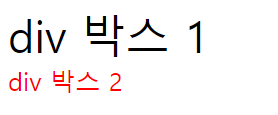

# CSS

## 1. CSS란?
**Cascading Style Sheet** 의 줄임말로, 우리말로는 내림차순 스타일 시트라고 번역합니다.   
건물을 지을 때도 철근으로 뼈대를 세워놓고 겉에 콘트리트를 바르듯이, 건물을 짓는 것에 비유하자면 HTML은 뼈대고, CSS는 살입니다.  
한 번 더 사람에 비유해보면, HTML이 사람의 몸이라고 했을 때, CSS는 옷이라고 할 수 있습니다.   
정리하자면, HTML로 페이지의 뼈대와 들어갈 내용을 구성하고 CSS로는 그 뼈대와 내용을 어떻게 꾸며줄 것인지에 대해 정해주는 것입니다.
  
처음 HTML이 개발되었을 때에는 단순 정보 전달용으로 웹 문서를 만들고 공유했습니다.  
얼마 안 가 사람들은 자신들의 페이지가 좀더 매력적으로 보일 필요성을 느꼈습니다.  
그들에게는 2가지 선택지가 있었는데요,  
1. 디자인적인 요소를 담당하는 태그를 만드는 것
2. 새로운 디자인 전용 언어를 만드는 것  

처음에는 1번을 선택했습니다. 
이에 따라 `<strong>`, `<bold>`, `<red>` 등의 태그들이 생겨났습니다.  
하지만 사람들은 곧 이 방식이 코드를 난잡하게 만들고 오히려 웹페이지를 작성할 때 효율을  
떨어뜨린다는 사실을 깨닫게 되었습니다.  
그래서 처음의 방향을 바꾸어 새로운 디자인 전용 언어인 __CSS__ 를 만들어   
디자인적인 부분을 담당하도록 만들었습니다.

## 2. CSS 알아보기
### 2-1. CSS 속성
위에서 CSS를 내림차순 스타일 시트라고 번역했는데, 이는 CSS의 속성을 나타내는 것입니다.   
늦게 선언된 스타일일수록 우선순위가 위에 있다는 뜻입니다! 다음 html 코드를 살펴 봅시다.

```html
<style>

  p {
    color: red;
  }

  p {
    color:blue;
  }

</style>

<div>

  <p>Hello Haedal!</p>
  
</div>
```

위와 같은 코드에서, 글자 색을 지정하는 태그가 처음에 빨강, 그 다음에 파랑입니다.  
파랑이 늦게 선언되었기 때문에 글자 색은 파랑이 됩니다.  
뒤에 있는 것이 우선순위가 높기 때문에 내림차순이라고 할 수 있는것입니다.

```css
a{                              #선택자 : 무엇에 효과를 줄 것인지
    color : black;              #선언 : 어떤 효과를 줄 것인가 ( 속성 : 값; )으로 이루어짐.
    text-decoration : none;
}
```  
이처럼 선택자를 통해 _무엇에 효과를 줄 것_ 인지 정한 뒤,  
선언부에서 속성의 값을 지정해 _어떤 효과를 줄 것_ 인지 설정합니다.  
여러가지 속성이 있으니 전부 외우진 않더라도 이번 강의에서 대표적으로 어떤 것이 자주사용 되는지 알아볼 것입니다.  
또, 추가적으로 어떤 속성들이 있는지 한번은 스스로 찾아보기 바랍니다.  

### 2-2. CSS 선언
HTML에서 CSS를 사용하는 방법에는

- inline 방식
- internal 방식
- external 방식   

세 가지가 있습니다. inline 방식부터 살펴봅시다.

#### inline 방식

HTML 문서의 `태그` 안에 `style` 속성을 직접 기술하는 방식입니다.  
한 두 장짜리 페이지를 만들 때는 편하겠지만, 페이지가 많아질수록,  
그리고 중복되는 서식이나 구조가 많아질수록 같은 내용을 계속해서 써 줘야 하기 때문에 귀찮아집니다.  
```html
<div style="color: blue">야호!</div>   
```

#### internal(style tag) 방식

HTML 문서 head 태그 안에 style 태그를 사용하여, 내용과 스타일을 분리한 형식입니다.  
inline 형식보다 코드가 훨씬 간결합니다.
```html
<style>
   div{
       color: blue;
   }
</style>
```
#### external 방식

CSS를 별도의 파일로 분리하여 HTML 문서에 링크하는 방식입니다.  
문법적으로는 style tag와 동일하지만, 연결된 CSS파일만 교체해주면 스타일을 변경할 수 있어 유지보수가 편리합니다.
```html
<link rel="stylesheet" href="style.css">
```

### 2-3. CSS 선택자
#### 선택자?
위의 예시에서 여러분은 CSS의 선택자 부분에 HTML의 태그가 올 수 있음을 알게 되었습니다.  
그런데 만약 같은 태그를 여러번 썼는데, 각 다른 효과를 주고 싶으면 어떻게 해야할까요?  
혹은 같은 태그들을 그룹으로 나누어 효과를 주고 싶은 경우는 어떻게 해야할까요?  
답은 tag에 __class__ 와 __id__ 를 지정해 선택자로 사용하면 됩니다.  
```html
<div class="black" id="alpha">div 박스 1</div> 
<div class="red" id="omega">div 박스 2</div>
```  
위와 같이 태그 별로 class와 id를 설정 할 수 있습니다.  
class의 경우 한 문서에 여러번 등장할 수 있지만,   
id의 경우 하나의 고유한 이름을 한 문서에 오직 한 번만 쓸 수 있습니다.   
이들의 이름은 자유롭게 지을 수 있지만 숫자로 시작하면 안됩니다.  
  
CSS는 다음과 같이 적용합니다.  
선택자에서 class는 `.(class 이름)`, id는 `#(id 이름)`과 같이 지정합니다.  
위의 코드 블럭을 이용해 예시를 들면,  
```css
.black{
    color: black;
}

.red{
    color: red;
}

#alpha{
    font-size: 35px;
}

#omega{
    font-size: 20px;
}
```   
이렇게 설정할 수 있습니다.  
  

위에 있는 `div`태그는 `class="black"`이고 `id="alpha"`이므로 검정색에 35px의 글씨가 나타나고,  
아래는 빨간색에 20px의 글씨가 나타나게 됩니다.


#### CSS 선택자의 종류
- 기본 선택자
    + *(전체 선택자)
    + type(요소 선택자)
    + id
    + class
- 조합 선택자
    + 자식 선택자
    + 자손 선택자
    
등이 있습니다.

**기본 선택자**
- 전체 선택자와 요소 선택자
```CSS 
/*css*/
* { margin: 0; text-decoration: none; }
h2 { font-size: 50px; }
p { font-family: "궁서체"; color: #ccc; }

<!-- HTML -->  
<p>p태그 선택자(Type Selector)</p>
<h2>h2태그 선택자(Type Selector)</div>
<div>div태그 선택자(Type Selector)</div>
```
전체 선택자는 HTML문서 내부의 모든 요소에 대해 같은 속성을 적용하기 때문에,  
`margin`, `padding` 등의 기본값을 설정해줄 때 유용합니다.   
하지만, 문서 내의 모든 요소를 읽어들여야 하기 때문에 남용하게 되면 문서의 로딩 속도가 느려지는 등의 문제가 생길 수 있습니다.   
요소 선택자는 HTML 요소를 직접 지정한는 가장 간단한 선택자입니다.  
위의 예제 코드에서, `h2` 태그와 `p` 태그에 대한 스타일이 지정이 되어 있으므로  
해당 요소들은 각각 `font size`와 `font family`, `color`에 대한 속성을 지니게 됩니다.  
하지만 div 태그에 대해서는 지정된 바가 없기 때문에 전체 선택자의 속성을 따릅니다.    
또한, 태그 선택자, type 선택자 등 여러 가지 이름이 있는데 다 같은 것을 지칭하는 말입니다.

- id 선택자 -> `#myID { 속성; }`
```
/* CSS */
#id1 { background: yellowgreen; color: darkgreen; }
div#id2 { background: darkgreen; color: yellowgreen; }

<!-- HTML -->
<p id="id1">ID 선택자(ID Selector)</p>
<p id="id2">ID 선택자(ID Selector)</p>
<div id="id2">ID 선택자(ID Selector)</div>
```

- class 선택자 -> `.myClass { 속성; }`
```
/* CSS */
.class1 { background: yellowgreen; color: darkgreen; }
div.class2 { background: darkgreen; color: yellowgreen; }

<!-- HTML -->  
<p class="class1">클래스 선택자(Class Selector)</p>
<p class="class2">클래스 선택자(Class Selector)</p>
<div class="class1 class2">클래스 선택자(Class Selector)</div>
```

생긴것도 비슷하게 생겼고, 실제로 위의 id선택자와 class선택자는 같은 결과를 출력합니다.  
그렇다면 언제 id 선택자를 사용하고 언제 class 선택자를 사용할까요?   
class 선택자는 속성값을 두 개 이상 지정해 줄 수 있습니다. 즉, 하나의 태그가 두개의 클래스를 가질 수 있습니다.  
한 페이지 내에서 여러 번 반복될 필요가 있는 스타일은 class 선택자를 사용하고,  
단 한번 유일하게 적용될 스타일은 id 선택자를 사용하는 것이 좋습니다.   
보통 class 선택자는 글자색이나 글자 굵기 등 나중에 다른 곳에도 적용할 수 있는 스타일을 지정하고,  
id 선택자는 웹 문서 안에서 요소의 배치 방법을 지정할 때 자주 사용합니다.    
웹 개발자들이 알아보기 쉽도록 id 선택자와 class 선택자의 이름을 생성할 때 몇 가지 규칙이 있는데요.
1. 영문자와 숫자로 작성
2. 첫 글자에는 숫자 사용 불가
3. 특수문자는 `"_"와 "%"` 두 가지만 사용("_" 권장)

**조합 선택자** 

조합 선택자는 두 개 이상의 선택자 요소가 모인 선택자입니다.

- 하위 선택자 -> `상위요소 하위요소 {속성;}`   
상위 요소에 포함된 하위 요소 모두에 스타일이 적용되는 것으로 자손 선택자라고도 합니다.

- 자식 선택자 -> `부모요소 > 자식요소 {속성;}`   
자식 요소에만 스타일을 적용하는것입니다.

CSS 우선순위 
1. `!important`
2. `css inline`선언
3. `id`
4. `class`
5. `tag`
6. `parent`에 의해 상속 -> 자식 요소에서 별도로 스타일을 지정하지 않으면 부모 요소에 스타일 속성들이 자식 요소로 전달됩니다.    
스타일의 모든 속성이 부모 요소에서 자식 요소로 상속되지는 않는데 배경색이나 이미지는 상속되지 않습니다.

같은 요소에 동일한 선택자로 서로 다른 값이 적용될 경우 가장 마지막에 적용된 값이 우선시됩니다.

```css
/* CSS comment */
/* 1.tag name */
header {
  color: red;
  font-size: 20px;
}
/* 2. select all */
* {
  margin: 0;
  padding: 0;
}
/* 3. id selector */
#foot {
  background-color: black;
  color: white;
}
/* 4. class selector */
.art {
  font-size: 30px;
  color: green;
}
/* 5. parent child */
ol > li {
  color: yellow;
}
p > b {
  color: gray;
}
```

  
```html
<!DOCTYPE html>
<html lang="en">
<head>
  <meta charset="UTF-8">
  <meta name="viewport" content="width=device-width, initial-scale=1.0">
  <meta http-equiv="X-UA-Compatible" content="ie=edge">
  <title>Document</title>
  <style>
    /* CSS의 우선순위를 파악하자*/
    /* 6.상위 객체에 의해 상속된 속성 */
    div {
      color: red;
    }
    /* 5.태그 이름으로 지정한 속성 */
    h1{
      color: blue;
    }
    /* 4.클래스 이름으로 지정한 속성 */
    .hello{
      color: brown;
    }
    /* 3. id로 지정한 속성 */
    #mulcam{
      color: yellow;
    }
    /* 2. HTML에서 style을 직접 지정한 속성 */
    /* 1. 속성값 위에 !important를 붙인 속성 */
    h1{
      color: black !important;
    }
  </style>
</head>
<body>
  <div>
    <h1 id="mulcam" class="hello" style="color: green;">Hello, Haedal!</h1>
  </div>
</body>
</html>
```  
위 코드를 확인해보면 하나의 태그에 여러개의 색상 속성이 적용되었으나, 결국 검은색으로 나타나는것이 보입니다.  
```html
h1{
      color: black !important;
    }
```
이는 `!important`속성 때문인데요,  
검은색에 이 속성을 부여함으로써 아래에 있는 스타일을 무시하고 무조건 검은색이 우선적으로 적용됩니다.
### 2-4. 스타일 지정하기
여기까지 CSS 선택자에 대해 알아보았습니다. 이제 우리가 실제로 읽는 글을 어떻게 꾸미는지 알아봅시다. 먼저 글꼴과 관련된 스타일입니다.
#### 글꼴 관련 스타일
  - font-size
  - font-style
  - font-weight
  - font-family
  
위 네 가지 기본적인 속성에 대해 알아봅시다.

##### font-size
말그대로 글자의 크기를 결정합니다.
```CSS
h1 { font-size: 250%; }
h2 { font-size: 20px; }
p { font-size: 2em; }
```
1. % : 부모 요소의 크기에 비례
2. px : 폰트 크기를 고정
3. em : 부모 요소에서 지정한 폰트의 대문자 M의 너비를 1em으로 놓고 상대적 값을 계산해 다른 요소들의 글자 크기를 조절합니다.   
ex) 부모가 16px일때 자식이 3em이면 자식의 글자 크기는 48px이 됩니다.

##### font-style
글자의 모양을 결정합니다.
```CSS 
p.normal {font-style:normal;}
p.italic {font-style:italic;}
p.oblique {font-style:oblique;}
```
###### 속성값
* normal(기본값)
* italic(이탤릭)
* oblique(비스듬한 모양)
* inherit(부모 요소로부터 상속)

##### font-weight
글자의 두께를 결정합니다.
```CSS 
p.normal {font-weight:normal;}
p.thick {font-weight:bold;}
p.thicker {font-weight:900;}
```
###### 속성값
* normal(기본값)
* bold(굵은 글꼴 지정)
* bolder(더 굵은 글꼴 지정)
* lighter(기본값보다 얇게 지정)
* 100, 200, …, 900(400이 normal, 700이 bold)

##### font-family
글꼴 종류를 지정하며 값이 상속됩니다.
```CSS 
body { font-family :'나눔고딕', 'Malgun Gothic', sans-serif;}
```
콤마로 글꼴을 구별하며 맨 앞에 지정한 것 부터 브라우저가 글꼴을 탐색하고, 있다면 그 글꼴을 적용시키고 없다면 뒤로 넘어갑니다.

###### 속성값
* 글꼴 이름
* inherit(부모 요소로부터 상속)

#### GOOGLE FONT
구글에서는 많은 종류의 웹폰트를 지원하고 있고, 우리는 그것을 가져다 쓸 수 있습니다. [여기](https://fonts.google.com/)에서 마음에 드는 폰트를 골라봅시다.(Language에서 Korean을 선택하면 한글 폰트가 있다)

```html
<!DOCTYPE html>
<html lang="en">
<head>
  <meta charset="UTF-8">
  <meta name="viewport" content="width=device-width, initial-scale=1.0">
  <meta http-equiv="X-UA-Compatible" content="ie=edge">
  <title>Document</title>
  <link href="https://fonts.googleapis.com/css?family=Nanum+Myeongjo|Ubuntu&display=swap" rel="stylesheet">
  <style>
    .font{
      font-size: 40px;
      font-style: italic;
      font-weight: 400;
      /* font-family: 'Times New Roman', Times, serif; */
      font-family: 'Ubuntu', 'Nanum Myeongjo', serif;
    }
  </style>
</head>
<body>
  <p class="font">Lorem ipsum dolor sit amet consectetur adipisicing elit. Dolorum incidunt excepturi vel velit explicabo illo. Perferendis dolor animi consequuntur dolorem culpa est non corrupti libero quibusdam eveniet magni rem, odio nesciunt consectetur, repellendus at eius expedita ad aliquam quo amet molestiae? Deserunt veritatis voluptatibus, ut dolore soluta natus porro nulla similique assumenda numquam exercitationem ratione unde accusamus quis corporis quos. Possimus, at libero! Harum molestias magni cum nam itaque magnam quibusdam dolorem! Assumenda, voluptatem non blanditiis inventore error cupiditate expedita modi quidem tempora officia aut dicta accusamus, nihil, vero vel. Nesciunt dignissimos similique odio quidem quibusdam hic reiciendis, totam quis!</p>
  <p class="font">Lorem ipsum, dolor sit amet consectetur adipisicing elit. Earum dignissimos illum pariatur repudiandae assumenda tempore facilis necessitatibus, perspiciatis minus beatae non ipsa nesciunt suscipit id, molestiae iste neque deleniti ex excepturi ipsam officiis sunt? Fugit, debitis animi numquam placeat sint harum, quidem sequi ad obcaecati quis maiores voluptatem alias temporibus.</p>
</body>
</html>
```
코딩 결과는 다음과 같습니다.  
  
덧붙이자면 IE에서는 기본적으로 구글 웹폰트를 사용할 수 없습니다. IE에서 구글 웹폰트를 사용하고 싶다면 [이 글](https://www.codingfactory.net/10453)을 참고하도록 합시다.

---
#### 다른 스타일 
##### color
글자의 색을 지정합니다. -> red,yellow등 css에서 정해진 색상의 이름 / rgb값 / hex코드를 사용할 수 있습니다.

##### text-decoration
텍스트에 줄을 표시하거나 없애 줍니다.-> none,underline,line-through(취소선)

##### text-align
텍스트를 정렬해줍니다. ->start,end,left,right,center,justify (text-align:center; 중앙정렬을 아주 자주 사용합니다!)

##### background-color
배경 색을 지정해줍니다.

##### margin, padding
여백을 조절해 줍니다. 

##### border
테두리 관련 속성입니다.
1. border-style: 테두리 스타일 지정하기   
none, dashed, dotted, solid...

2. border-width: 테두리 두께 지정하기

3. border-color: 테두리 색깔 지정하기

4. border-radius: 박스 모서리 둥글게 만들기. 크기,백분율로 지정

