# BootStrap + GithubPages
부트스트랩을 사용해 웹을 꾸미고, Github Pages를 이용해 호스팅하자  

## Bootstrap

이전시간까지 우리가 직접 CSS를 만들어서 `HTML`을 꾸며봤다.  
하지만 솔직히 말해서! 우리가 만든 웹페이지들은 전문가들이 만든 페이지들에 비해서 부족할 수 밖에 없다.  
이번시간에는 `Bootstrap`을 통해 전문가들이 만들어놓은 페이지 템플릿을 사용해서 더 완성도 있는 페이지를 만들어 보도록 하자.  

### Bootstrap?
그럼 과연 부트스트랩은 뭘까?  
부트스트랩은 웹사이트를 쉽게 만들 수 있게 돕는 프론트엔드 프레임워크들 중 하나이다.  
하나의 CSS로 휴대폰, 태블릿, 데스크탑까지 다양한 기기에서 작동하며  
다양한 기능을 제공하여 우리가 쉽게 웹사이트를 제작, 유지, 보수할 수 있도록 도와준다.  

부트스트랩이 뭔지 대충 알았으니 실제로 적용해보면서 배워보자!  
부트스트랩을 사용하는 다양한 방법이 있지만 우리는 CDN을 통해서 부트스트랩을 사용할 것이다.  
CDN은 멀리 있는 사용자에게 컨텐츠를 더 빠르게 제공할 수 있는 기술인데, 사용자가 Origin Server로부터  
Content를 다운받는 대신, 사용자와 가까운 곳에 있는 Cache Server로부터 Content를 가져오는 방법이다.
아래의 코드를 `html`파일의 `<head>`태그 안에 추가하면 부트스트랩이 제공하는 CSS를 사용할 준비가 되었다.  
```html
<link rel="stylesheet" href="https://maxcdn.bootstrapcdn.com/bootstrap/3.3.2/css/bootstrap.min.css">
```  

  
### Navbar 만들기
먼저 navbar부터 만들어 보자.
`div`의 `class`를 `navbar navbar-default`, `navbar navbar-inverse`등으로 설정하여 navbar의  
형태를 잡을 수 있다. 그리고 내부에 `container`를 만들어 그 안에 우리가 넣고싶은 것들을 넣을 수 있다.  
`container`는 부트스트랩에서 사이트 콘텐츠를 감싸고 반응형 레이아웃을 만들기 위한 요소이므로 지정해주는게 좋다.  
```html
<body>
    <div class="navbar navbar-inverse">
        <div class="container">
        
        </div>
    </div>
</body>
```  
  
`container` 안에 로고를 넣을 `navbar-header`를 `div` 태그로, 메뉴를 나타낼 부분을 `ul` 태그로 지정한다.      
```html
<body>
    <div class="navbar navbar-inverse">
        <div class="container">
            <div class="navbar-header"></div>
            <ul class="nav navbar-nav"></ul>
        </div>
    </div>
</body>
```  
  
`<a>`태그를 이용해서 로고를 누르면 다른 홈페이지로 이동하게 만들어보자.  
로고는 부트스트랩에서 제공하는 아이콘을 사용할 것이다.  
더 다양한 아이콘을 [여기](http://bootstrapk.com/components/#glyphicons)를 참고해서 사용하자  
메뉴는 `<ul>` 태그 안에 `<li>`와 `<a>`를 조합해서 만들어 준다.  
하나의 `<li>`에는 `active`를 클래스로 주어 현재 해당 메뉴에 들어와 있는 것처럼 보이게 해주자.
```html
<body>
    <div class="navbar navbar-inverse">
        <div class="container">
            <div class="navbar-header">
                <a href="http://haedal.io/" class="navbar-brand">
                    Haedal Programming
                    <i class="glyphicon glyphicon-cloud"></i>
                </a>
            </div>
            <ul class="nav navbar-nav">
                <li class="active"><a href="#">메뉴1</a></li>
                <li><a href="#">메뉴2</a></li>
                <li><a href="#">메뉴3</a></li>
                <li><a href="#">메뉴4</a></li>
            </ul>
        </div>
    </div>
</body>
```  

### 메뉴 만들기
페이지의 윗 부분에 `Navigationbar`가 있다면, 페이지의 옆부분에는 메뉴바가 있어야 한다.  
메뉴바를 만들어보자. 먼저 메뉴바를 감싸는 `menu-wrapper`를 하나 만들어주자.  
```html
    <div class="menu-wrapper" style="float:left; width: 15%; text-align:center">
    </div>
```  
그 다음 메뉴의 내용을 채워보자  
```html
    <div class="menu-wrapper" style="float:left; width: 15%; text-align:center">
        <ul class="list-group">
            <li class="list-group-item"><a href="#">상의</a></li>
            <li class="list-group-item"><a href="#">하의</a></li>
            <li class="list-group-item"><a href="#">신발</a></li>
            <li class="list-group-item"><a href="#">모자</a></li>
            <li class="list-group-item"><a href="#">양말</a></li>
        </ul>
    </div>
```  
이렇게 코드를 작성하고 확인해보자.  

이제 다음으로 본문이 들어갈 공간을 만들어보자.  
본문은 `contents`로 감싸서 구성해보자.  
```html
    <div class="contents" style="font-size:5em;">
        <div class="container" style="padding-left:1em;">
            <p>여기는 메인페이지 입니다. </p>
            <button class="btn btn-primary">버튼1</button>
            <button class="btn btn-secondary">버튼2</button>
            <button class="btn btn-danger">버튼3</button>
            <button class="btn btn-success">버튼4</button>
        </div>
    </div>
```  
다양한 버튼들을 통해 부트스트랩에서 제공하는 색들을 확인할 수 있다.  
`primary`는 파랑, `danger`는 빨강 등과 같이 여러가지 색을 이름을 통해 사용할 수 있다.  
지금까지 부트스트랩에서 제공하는 외부 CSS를 통해 웹페이지를 꾸며보는 방법을 배웠다.  
이 강의에서 나오는 것 말고도 훨씬 많은 기능들이 있으니 [여기](http://bootstrapk.com/)에서 찾아보길 바란다.  

이렇게 부트스트랩을 사용해서 조금 더 깔끔한 페이지를 만들 수 있게 되었으나,  
아직 전문적인 홈페이지들과는 거리가 멀다.  
이번에는 많은 사람들이 만들어놓은 템플릿을 이용해보자.  

## 템플릿을 이용해서 홈페이지 만들기

인터넷 상에는 전문가들이 부트스트랩을 이용해서 만든 무료(혹은 유료)템플릿들이 많이 있다.  
이번 시간에는 이 템플릿을 이용해서 나를 소개하는 페이지를 만들고, github page에 호스팅해보자!  

### 템플릿 찾기  
구글에 `Free bootstrap template`을 검색해보자.   

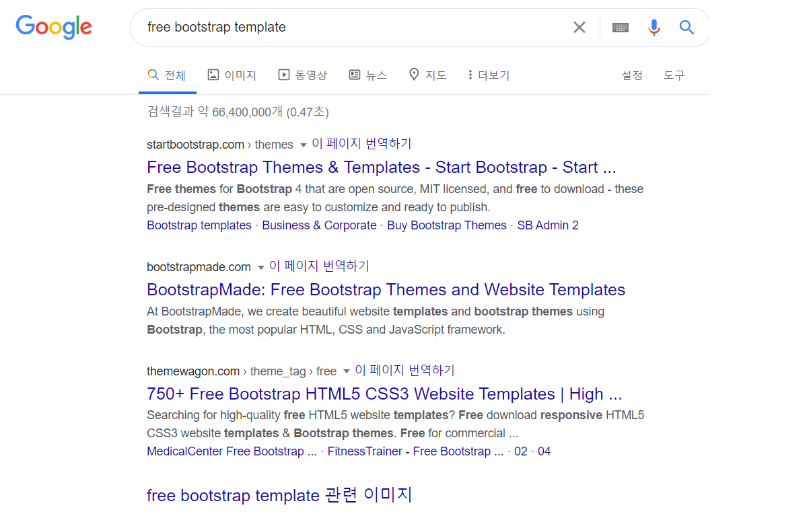  

이번 강의에서는 `750+ Bootstrap ... `사이트에 들어가보자.  
이곳에서 우리가 이번시간에 사용해볼 템플릿은 `browny`라는 템플릿이다.  

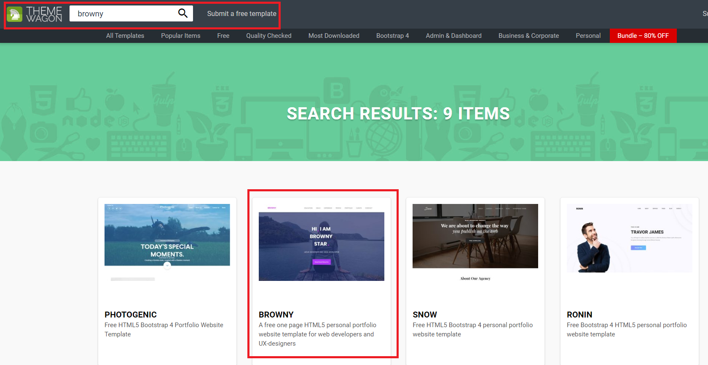  

`Download Free`버튼을 눌러서 `.zip`파일을 다운로드 받도록 하자.  
이번 시간에는 자기소개페이지를 만들 것이므로 `username.github.io`프로젝트를 열어서  
`.zip`안의 파일을 모두 프로젝트 안으로 옮겨준다.  

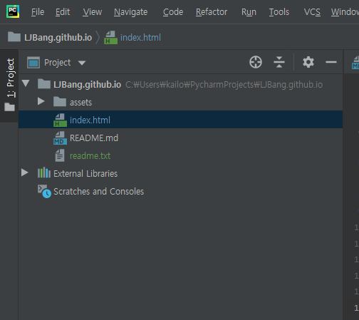  

자 그럼 `index.html`파일을 열어보자.  
그러면 페이지가 나타나는데, 앞으로 우리는 이 파일을 바꾸어서 자기소개 페이지를 만들 것이다.  
그러면 우리가 파일의 어떤 부분을 바꾸어야 페이지가 바뀔까? 구글을 기준으로 `F12`를 눌러보자.  

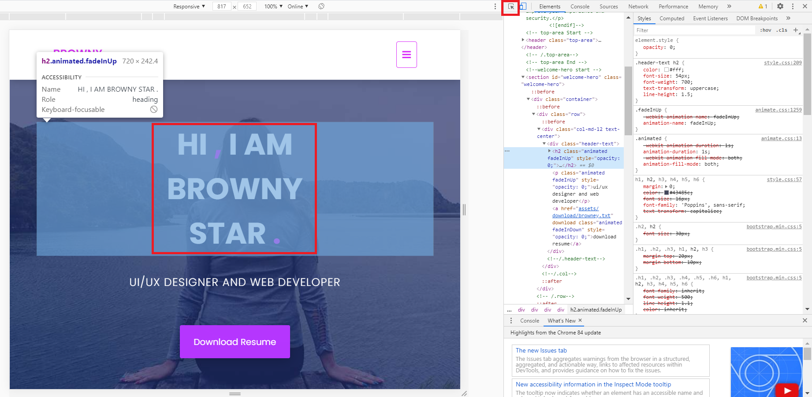  

그러면 위와 같은 창이 나타날텐데, 오른쪽 위에 표시된 것과 같이 사각형에 커서가 있는 아이콘을 누른 후,  
우리가 바꾸고 싶은 영역을 클릭해보자. `HI, I AM ...`부분을 바꿀 것이므로 이 영역을 눌러보도록 하겠다.
그러면 오른쪽에 선택한 영역에 대한 코드가 나타난다. 이부분을 바꾸면, 우리가 선택한 영역을 바꿀 수 있다.  

영역을 확인했다면 `index.html`로 돌아와서 우리가 확인한 영역을 바꿔보자.  

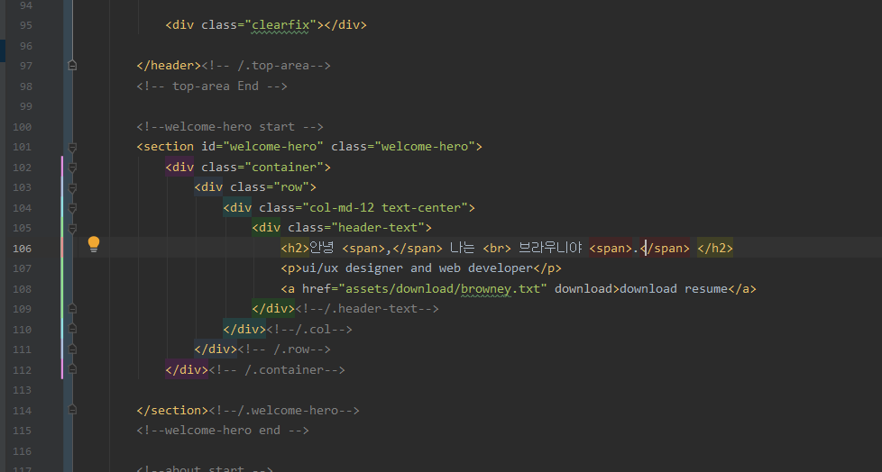  
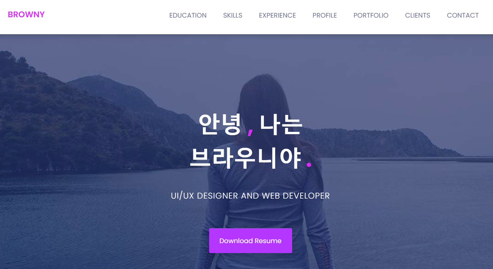  

글자를 바꾸었다면, 이번에는 사진도 바꾸어보자.  

그런데, 사진을 바꾸려고 `F12`를 눌러서 확인해봤더니, `index.html`파일에는 관련 코드가 없다.  
대신 `html`코드 옆에 보니 아래와 같이 사진에 대한 정보가 나타난다.  

  

이 부분은 `html`파일에 적용된 `CSS`를 확인할 수 있는 부분인데, 이 부분은 사진을 `html`파일이 아닌 `css`파일에서 적용했음을 알 수 있다.  
이 부분을 다른 사진으로 바꿔보자.  
먼저 위에서 확인한 대로 `assets/css/style.css`파일을 열어보자.  
상당히 긴 `css`코드가 나오는데 우리는 `welcome-banner.jpg`파일을 바꿀 것이므로, `ctrl+f`를 눌러서 바꿀 파일을 검색하자.  
우리가 넣고 싶은 사진 파일은 `assets/images/about`폴더 안에 넣고, `style.css`파일에서 참조해주자.  
여기서는 `intro.jpg`파일을 임의로 구해서 넣어보겠다.

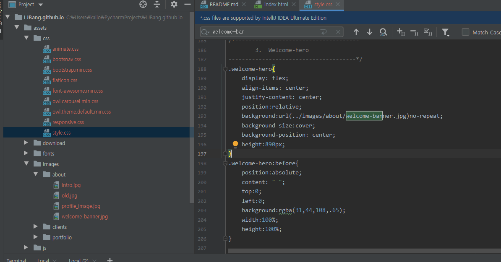  

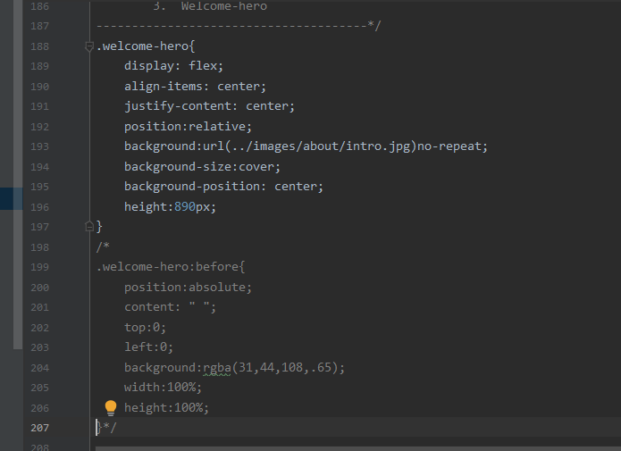  

사진을 `intro.jpg`사진으로 바꾸고, 사진을 덮고있는 투명한 보라색 레이어를 주석처리하였다.  
결과는 아래와 같이 투명한 레이어가 없어진 사진이 배경으로 바뀌었다.  

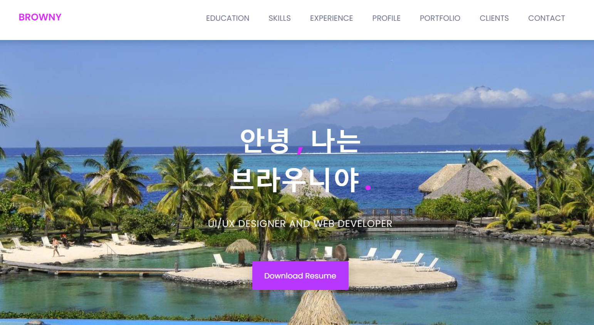  

물론 사진이 `.css`파일이 아니라 `.html`파일에서 지정되어 있을 수도 있다. 그럴때는 `.html`파일을 바꿔주면 된다.  

자, 우리는 이제 글도 바꿀 수 있고, 사진도 바꿀 수 있다. 
그런데 스크롤을 조금만 내려보면, 여러가지 아이콘들이 나온다. 이 아이콘들을 한번 바꿔보자.  

먼저 이 아이콘들이 `.html`코드 중 어디에 있는지 확인해보자.  

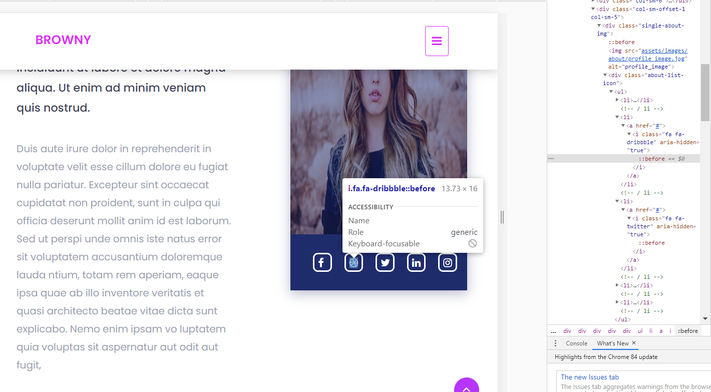  

```html
<i class="fa fa-dribbble" aria-hidden="true"></i>
```  
위 코드로 구성되어 있음을 알 수 있다. 여기서 `fa`란 `font-awesome`의 약자인데 웹 폰트나 아이콘을 제공해주는 툴킷이다.  
이 글을 쓰는 현재 6버전까지 나와있고, 이 부트스트랩 템플릿에서는 4.7버전을 사용하고 있다.  
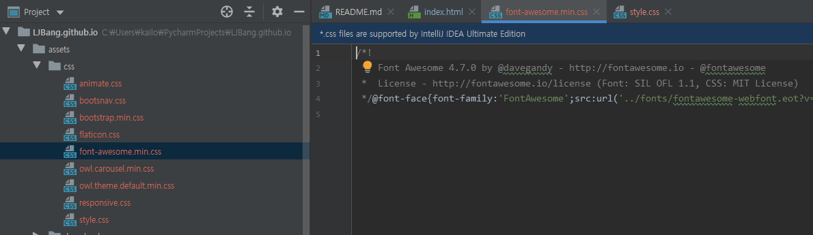  

4.7버전에서 사용할 수 있는 아이콘들을 구글에 검색해보자.  

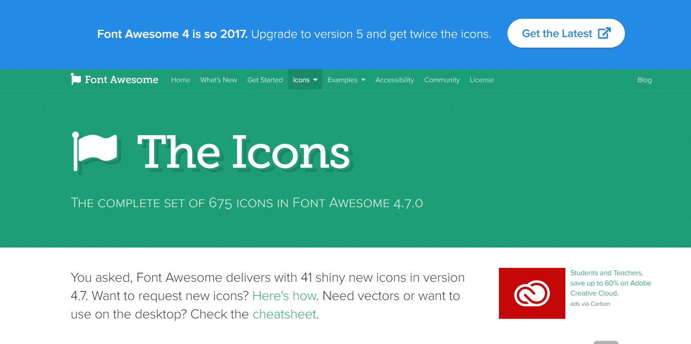  

Font Awesome 4.7버전의 홈페이지다. 여기서 `icons`를 클릭해서 원하는 아이콘을 검색해보자.  
원래 아이콘이 농구공 모양이었으므로 이번에는 별모양으로 바꾸기 위해 `star`를 검색해서 아이콘을 찾았다.  

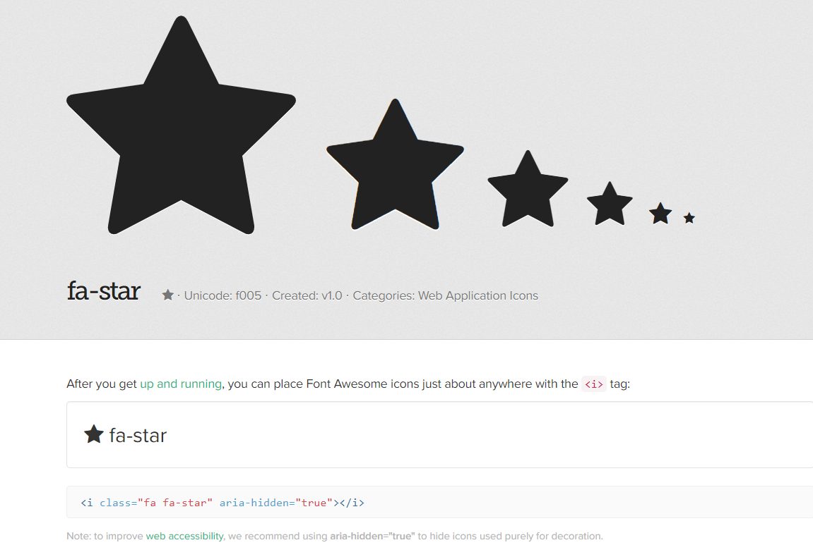  

밑에 이 아이콘을 출력할 수 있는 코드가 보일 것이다.  
이 코드를 아까 확인했던 `fa-dribbble`코드와 바꾸어 주자.  

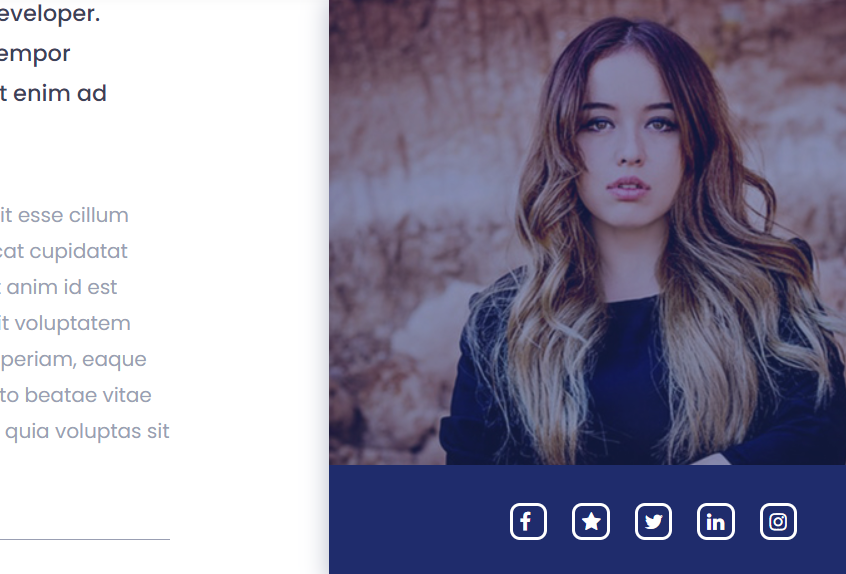  

농구공 모양의 아이콘이 별모양으로 바뀌었음을 확인할 수 있다.  
이 템플릿에서는 `Flaticon`도 사용하고 있는데 이에 대한 사용법은 [여기](https://www.flaticon.com/iconfonts)를 참조바란다.  

이제 우리는 내용물은 대부분 바꿀 수 있게 되었다. 그러면 마지막으로 글꼴을 한번 바꿔보자.  
글꼴은 `css`를 사용해서 바꿀 수 있는데, 이번에는 여러가지 무료 웹 폰트를 제공하는 `눈누`에서 폰트를 다운받아 사용해보자.  

먼저 구글에 눈누를 검색해서 홈페이지에 들어간다.  
검색등을 사용해서 원하는 폰트를 찾는다.  

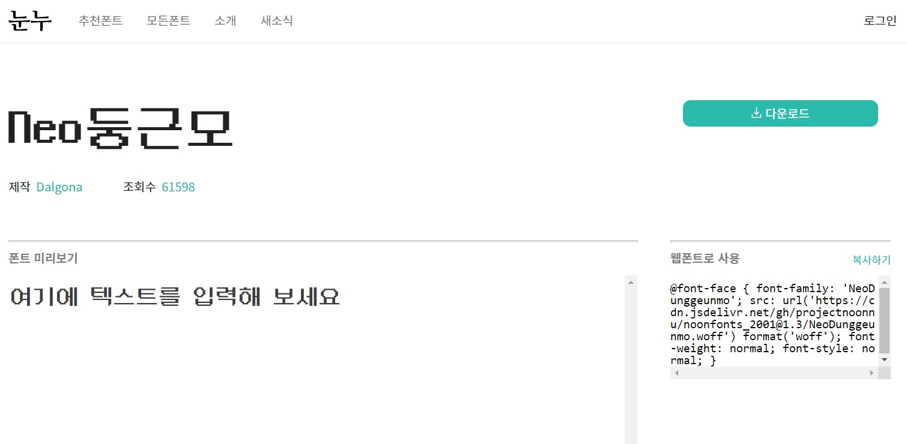  

여기서 다운로드가 아닌 그 아래에 `웹폰트로 사용`부분에 있는 `복사하기`버튼을 눌러 코드를 복사한다.  
복사한 코드를 `style.css`의 코드가 시작하는 부분 위쪽에 붙여넣기한다.  

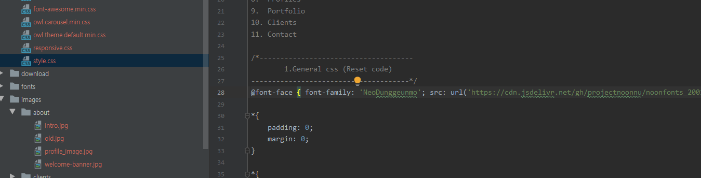  

그럼 글씨체가 `css`에 추가가 되었고, 적용할 부분을 찾아서 적용시켜주어야 한다.  
위에서 바꾼 제목부분의 글씨체를 바꿔보자.  
제목 부분은 `header-text`클래스 안의 `<h2>`태그이다. `.css`파일에서 이 부분을 찾아서 바꿔보자.  

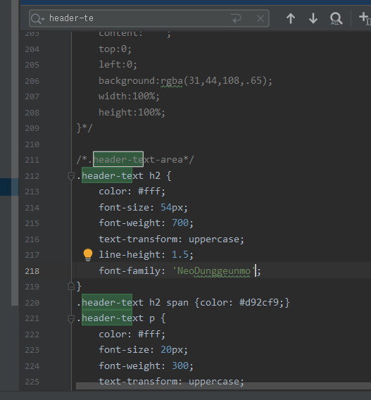  
```css
font-family: 'font_name';
```
위 형태의 코드를 추가해주면 된다. 폰트의 이름은 눈누에서 가져온 코드에 명시되어 있다.  

이제 `index.html`파일을 새로고침 해보면 폰트가 바뀌었음을 확인할 수 있다.  

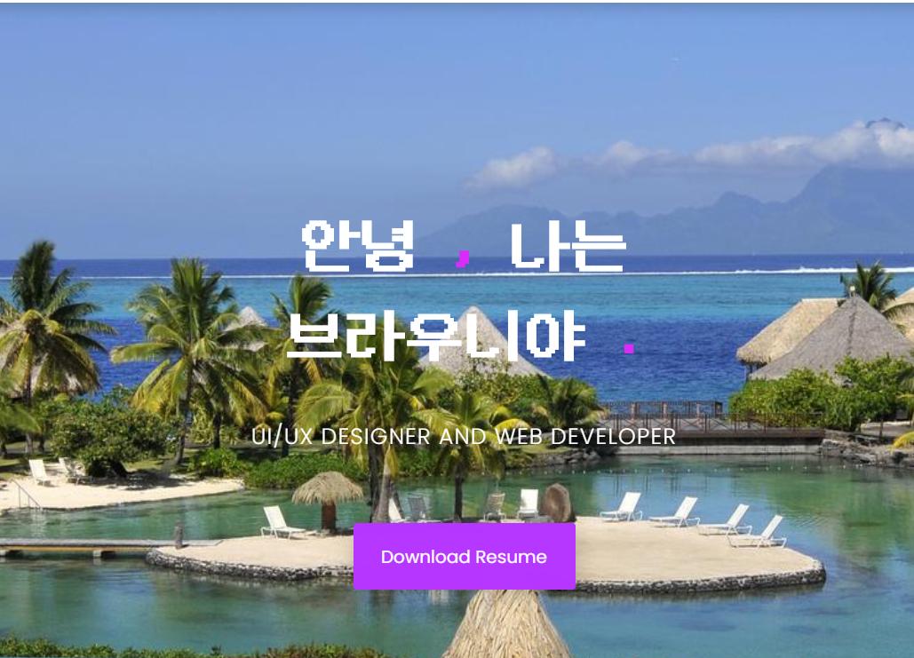  

지금까지 부트스트랩이 무엇인지, 어떻게 사용하는지를 배웠고,  
사람들이 만들어 놓은 템플릿을 이용해 자기소개 페이지를 꾸며보는 시간을 가졌다.  
이제 이 파일들을 github에 업로드 해서 `username.github.io`를 통해서 호스팅해보자!

## Github Pages

웹페이지를 호스팅하려면 서버용 컴퓨터를 사서 켜놓거나, 클라우드 서버를 돈내고 사용해야한다.    
그런데, 우리가 작은 프로젝트를 하는데 컴퓨터 한대를 계속 켜놓거나, 돈을 내고 웹 서버를 빌릴 수는 없다.(ㅠㅠ)  
그런 우리를 위해서 github에서 서버를 무료로 빌려준다!  
물론 공짜로 빌려주는 것이라 데이터를 저장한다거나 할 수는 없지만 연습용이나 간단한 포트폴리오를 만들어서 저장할 수 있다.  
지금부터 한번 서버를 공개해보자! ~~이번에는 쉬울 것이다..~~  

먼저 `github`에 접속해서 새 레포지토리를 만든다.  
여기서 주의할 점은 레포지토리의 이름을 `username.github.io`의 형태로 만들어야 한다.

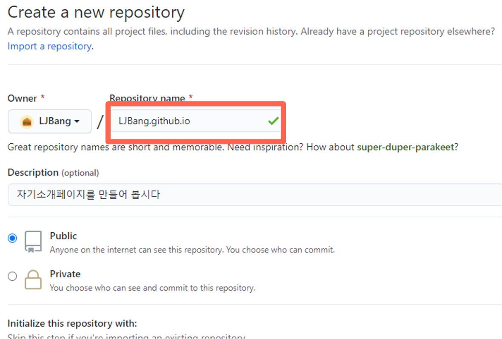  

레포지토리를 만들었다면 방금 만든 `assets` 폴더와 `index.html` 파일을 넣어보자!  
여기서 주의할 점은 `HTML`파일의 이름은 `index.html`로 통일해주어야 `github`에서 인식해서 `html`을 적용해준다.  
파일을 넣었다면 이제 `add commit push`를 해서 깃에 넣어주자!  

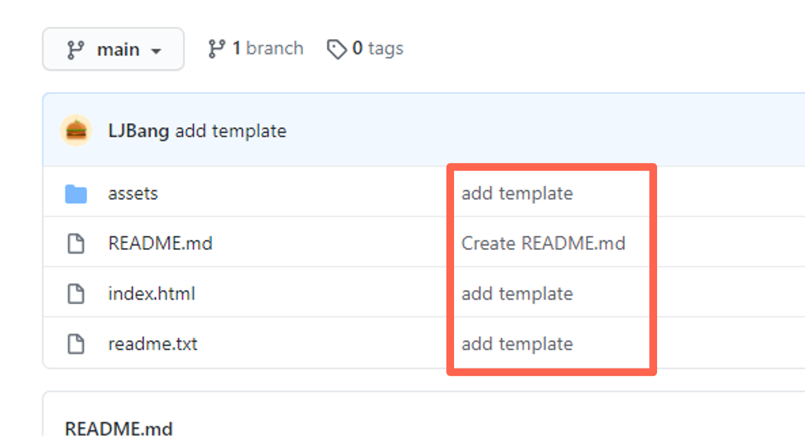  

깃에 올라간 것을 확인 후 주소창에 `username.github.io`를 타이핑해주면  
우리가 만든 페이지가 나타나는걸 확인할 수 있다.  

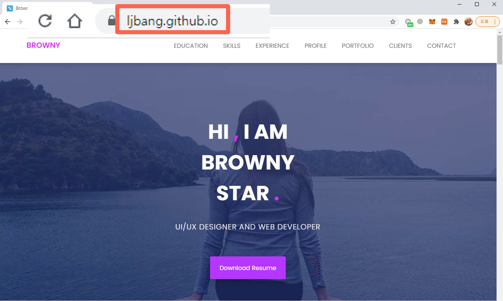  