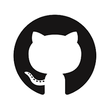
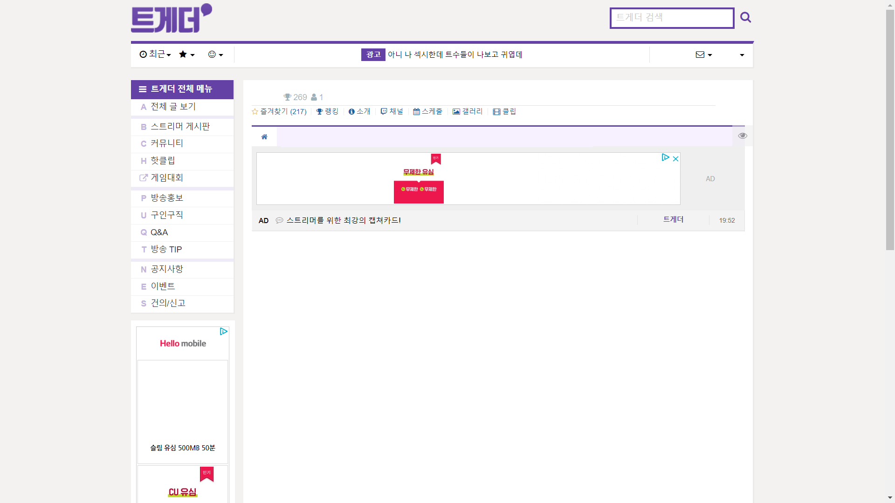
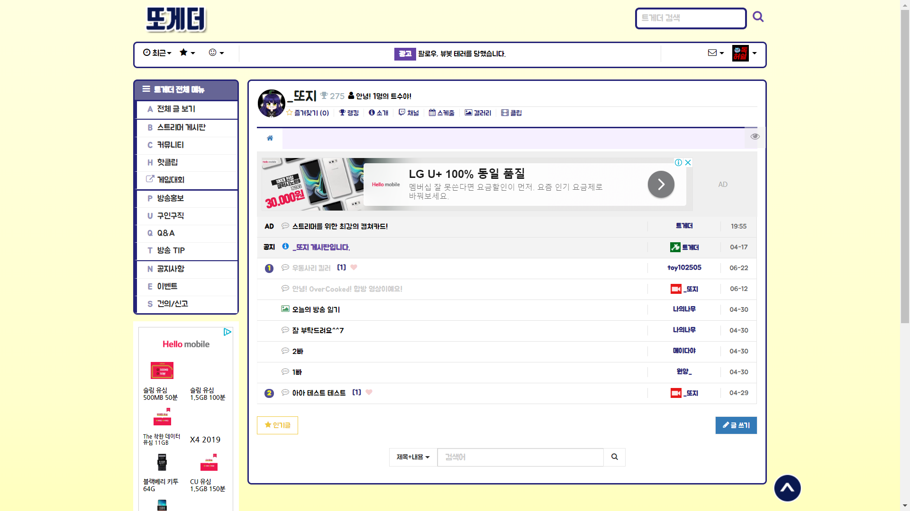

# 1일차
## Github이란?
  
GitHub 마스코트 octocat. 고양이와 문어를 합쳐놨다. 상당히 유명한 무료 Git 저장소로, 현재 해달프로그래밍에서 프로젝트를 진행할 때는 이 Guthub을 꼭 사용한다고 봐도 무방하다.    
  
파이참 로고. 사실 무슨 뜻인지 잘 모르겠고 다운로드와 설치 및 세팅법은 [여기](./etc/how_to_install_pycharm.md)서 할 수 있다.

## HTML, CSS, (JavaScript)
### HTML
**H**yper**T**ext **M**arkup **L**anguage  

웹 페이지를 출력하기 위해 기본이 되는 규약이다. 프로그래밍 언어가 아닌 마크업 언어이다! 마크업 언어가 뭔지 잘 모르겠다면, 한글의 수식 입력기를 생각해보면 된다. 위쪽에서 클릭 클릭 하면서 수식을 입력할 수도 있지만, 아래쪽에서 규칙에 맞추어 타이핑하면서 적절한 수식을 적을 수도 있잖아? 그래서 마크업 언어다 이마리야

HTML 코드 예시  
  
이따위로 생겼지만(규약) 실제로 출력되는 모습은 다음과 같다.

이 수업을 듣는 당신도 멋들어진 페이지를 제작할 수 있게 될 것이다.

## CSS
**C**asacding **S**tyle **S**heet  
Cascading : 오름차순

HTML : 뼈대  
CSS : 겉에 붙이는 벽돌, 기왓장, 식물, 쇠창살(?)

  
스트리밍 사이트 '트위치'의 서드파티 커뮤니티인 '트게더'의 스트리머 페이지 메인. 커스텀 CSS가 적용되지 않고, 기본 디자인이 적용된 모습이다.

 
커스텀 CSS가 적용된 모습이다. CSS는 화장이다!

### [HTML 문서](./classdata/1day/HTML.md)

### ~~JavaScript를 제가 하고 싶을까요?~~