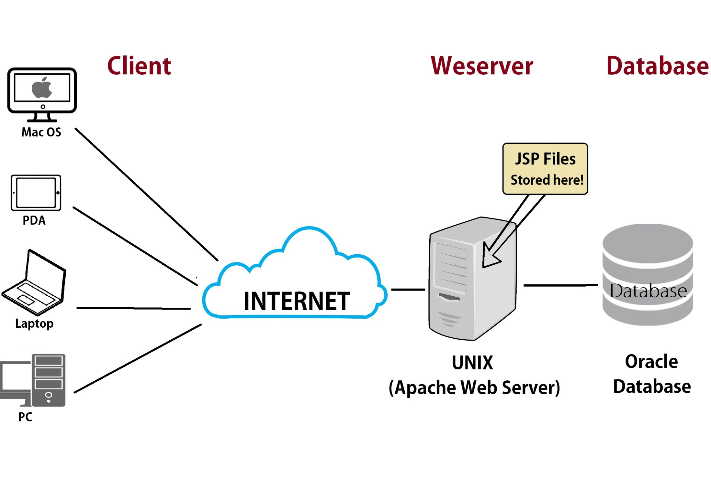
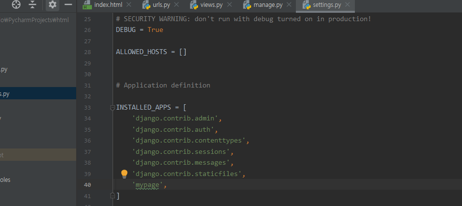
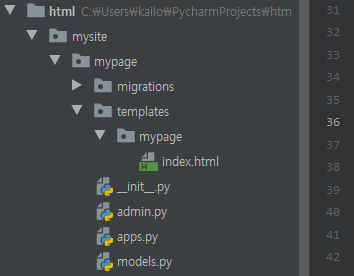
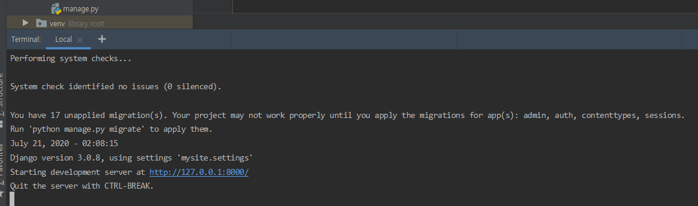
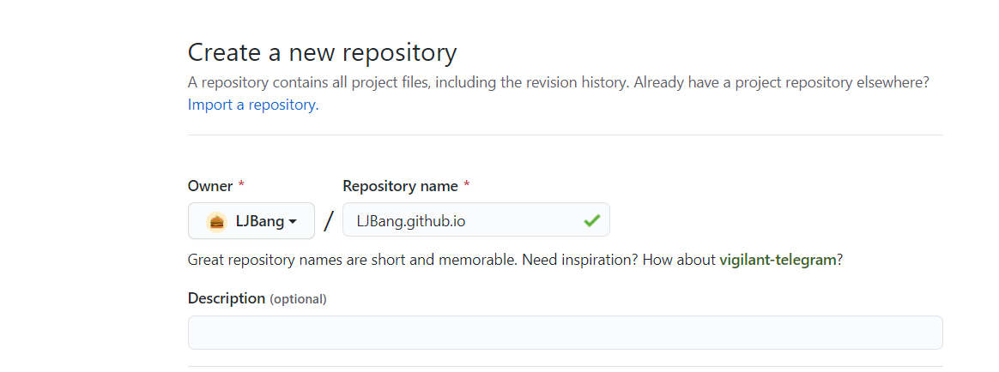
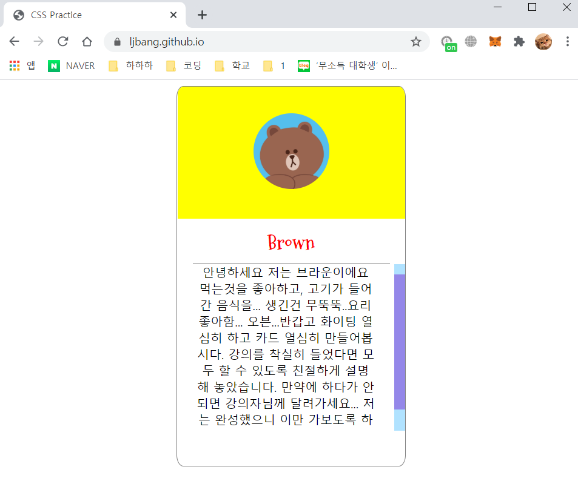
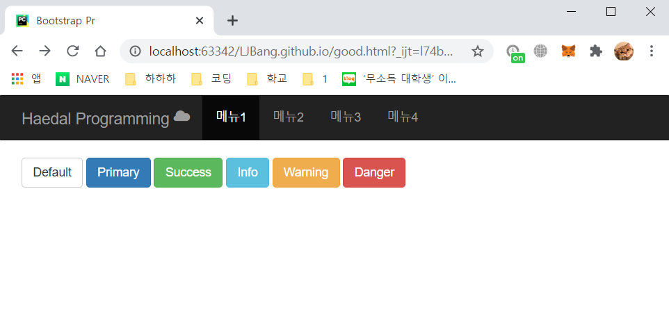

# 3일차

자, 2일차까지 우리는 html파일만 만들었다.    
하지만 웹페이지는 인터넷에서 모두 다 같이 볼 수 있어야 한다. 어떻게 할 수 있을까?  
  
우리가 사용하고, 보는 웹사이트들은 모두 서버가 존재한다.  

  

페이지를 띄워주는 서버가 있고, 사용자(클라이언트)들이 접속 요청을 보내면 허락을 해주는 방식인데,  
그렇다면 서버는 어디에 있을까?   
서버는 개인용 컴퓨터일수도 있고, 아마존 같은 대형 회사에서 빌려주는 웹 서버일 수도 있다.  
이번시간에서 `Python Django`를 사용해서 우리가 만든 서버를 호스팅해보자.  

## Django?

`Django`를 사용한다고 했는데 과연 `Django`가 뭘까?  
Django는 파이썬으로 제작된 웹 프레임워크이다.  
모르는 단어가 계속 나온다. 프레임워크란? 틀이라고 생각하면 편하다.  

  

위 사진을 보면 자동차의 프레임이 있다. 여기에 다른 부품들을 장착하면 자동차가 되듯이,  
Django라는 프레임에 우리가 여러가지 부품들을 붙이기만 하면 손쉽게 웹사이트를 구성할 수 있도록 도와주는 라이브러리이다.  

일단 django 라이브러리를 다운받아보자 파이참 터미널에 아래와 같이 명령어를 입력한다.   
```shell script
$ pip install django
```  
설치가 완료되면 프로젝트를 시작해야한다. `mysite`라는 프로젝트를 새로 하나 만들어주자.  
```shell script
$ django-admin startproject mysite
```  
프로젝트를 만들었다면, 프로젝트 폴더로 들어가서 우리가 실행할 앱을 하나 만들어야 한다.  
```shell script
$ cd mysite
$ python manage.py startapp mypage
```  
앱을 만들었다면 등록해주어야 한다.  
`mysite/settings.py`의 약 40번째 줄에 아래와 같이 추가해준다.  

  

여기까지 했다면 기초공사가 완료된 것이다!  
이제 `mysite/mypage/templates/mypage`폴더를 하나 만들어,  
그 안에 우리가 지난 시간에 실습으로 작성한 `index.html`파일을 넣어주자.  

  

이제 우리가 만들 `html`파일을 인코딩해서 웹에 띄우는 작업을 해야한다.  
`mypage/views.py`파일을 열어 다음 코드를 추가해준다.  

```python
from django.shortcuts import render

# Create your views here.
def index(request):
    return render(request,'mypage/index.html')
```  
이제 마지막으로 우리의 `view`와 `url`을 연결만 해주면 된다.  
`mypage/urls.py`파일을 하나 새로 만들어 아래의 코드를 추가해준다.  
```python
from django.urls import path

from . import views


urlpatterns = [
    path('', views.index, name='index'),
]
```  
이 앱의 `url`과 프로젝트의 `url`을 연결해주자
`mysite/urls.py`에 들어가서 아래와 같이 바꿔준다.  

```python
from django.contrib import admin
from django.urls import path, include

urlpatterns = [
    path('admin/', admin.site.urls),
    path('', include('mypage.urls')),
]
```  
그러면 끝이 났다. 터미널에 아래 명령어를 입력해 우리가 만든 페이지를 호스팅해보자.  

```shell script
$ python manage.py runserver
```

  
위에 적힌 주소를 인터넷에 치면 우리가 만든 페이지가 나타날 것이다!  

이렇게 python django를 사용해서 서버를 호스팅해봤다.  
물론 옆의 친구들이 접속할 수 있도록 하기위해서는 추가적인 작업이 필요하지만  
이렇게 개발환경에서 서버를 호스팅하면 굉장히 불안정하기 때문에 전문 서버프로그램을 사용해야한다.  

갑자기 백엔드 수업으로 넘어온 것 같지만 사실 프론트엔드 개발자도  
백엔드에 대한 이해가 높으면 좋기 때문에 한번쯤 공부해보길 바란다.  

## Github Pages

파이썬 장고라는 라이브러리를 사용해서 서버를 켜보았다.  
그런데, 우리가 작은 프로젝트를 하는데 컴퓨터 한대를 계속 켜놓거나, 돈을 내고 웹 서버를 빌릴 수는 없다.(ㅠㅠ)  
그런 우리를 위해서 github에서 서버를 무료로 빌려준다!  
물론 공짜로 빌려주는 것이라 데이터를 저장한다거나 할수는 없지만 연습용이나 간단한 포트폴리오를 만들어서 저장할 수 있다.  
지금부터 한번 서버를 공개해보자! ~~이번에는 쉬울 것이다..~~  

먼저 `github`에 접속해서 새 레포지토리를 만든다.  
여기서 주의할 점은 레포지토리의 이름을 `username.github.io`의 형태로 만들어야 한다.  

  

레포지토리를 만들었다면 이제 이전시간에 만든 `HTML`파일과 `CSS`파일을 넣어보자!  
여기서 주의할 점은 `HTML`파일의 이름은 `index.html`로 통일해주어야 `github`에서 인식해서 `html`을 적용해준다.  
파일을 넣었다면 이제 완성입니다! 주소창에 `username.github.io`를 타이핑해주면  
우리가 만든 페이지가 나타나는걸 확인할 수 있다.  


## Bootstrap

이전시간까지 우리가 직접 웹페이지를 만들어서 github pages를 이용해 웹상에서 호스팅 해봤다.  
하지만 솔직히 말해서! 우리가 만든 웹페이지들은 전문가들이 만든 페이지들에 비해서 부족할 수 밖에 없다.  
이번시간에는 `Bootstrap`을 통해 전문가들이 만들어놓은 페이지 템플릿을 사용해서 더 완성도 있는 페이지를 만들어 보도록 하자.  

### Bootstrap?
그럼 과연 부트스트랩은 뭘까?  
부트스트랩은 웹사이트를 쉽게 만들 수 있게 돕는 프론트엔드 프레임워크들 중 하나이다.  
하나의 CSS로 휴대폰, 태블릿, 데스크탑까지 다양한 기기에서 작동하며  
다양한 기능을 제공하여 우리가 쉽게 웹사이트를 제작, 유지, 보수할 수 있도록 도와준다.  

부트스트랩이 뭔지 대충 알았으니 실제로 적용해보면서 배워보자!  
부트스트랩을 사용하는 다양한 방법이 있지만 우리는 CDN을 통해서 부트스트랩을 사용할 것이다.  
CDN은 멀리 있는 사용자에게 컨텐츠를 더 빠르게 제공할 수 있는 기술인데, 사용자가 Origin Server로부터  
Content를 다운받는 대신, 사용자와 가까운 곳에 있는 Cache Server로부터 Content를 가져오는 방법이다.
아래의 코드를 `html`파일의 `<head>`태그 안에 추가하면 부트스트랩이 제공하는 CSS를 사용할 준비가 되었다.  
```html
<link rel="stylesheet" href="https://maxcdn.bootstrapcdn.com/bootstrap/3.3.2/css/bootstrap.min.css">
```  

  
### Navbar 만들기
먼저 navbar부터 만들어 보자.
`div`의 `class`를 `navbar navbar-default`, `navbar navbar-inverse`등으로 설정하여 navbar의  
형태를 잡을 수 있다. 그리고 내부에 `container`를 만들어 그 안에 우리가 넣고싶은 것들을 넣을 수 있다.  
`container`는 부트스트랩에서 사이트 콘텐츠를 감싸고 반응형 레이아웃을 만들기 위한 요소이므로 지정해주는게 좋다.  
```html
<body>
    <div class="navbar navbar-inverse">
        <div class="container">
        
        </div>
    </div>
</body>
```  
  
`container` 안에 로고를 넣을 `navbar-header`를 `div` 태그로, 메뉴를 나타낼 부분을 `ul` 태그로 지정한다.      
```html
<body>
    <div class="navbar navbar-inverse">
        <div class="container">
            <div class="navbar-header"></div>
            <ul class="nav navbar-nav"></ul>
        </div>
    </div>
</body>
```  
  
`<a>`태그를 이용해서 로고를 누르면 다른 홈페이지로 이동하게 만들어보자.  
로고는 부트스트랩에서 제공하는 아이콘을 사용할 것이다.  
더 다양한 아이콘을 [여기](http://bootstrapk.com/components/#glyphicons)를 참고해서 사용하자  
메뉴는 `<ul>` 태그 안에 `<li>`와 `<a>`를 조합해서 만들어 준다.  
하나의 `<li>`에는 `active`를 클래스로 주어 현재 해당 메뉴에 들어와 있는 것처럼 보이게 해주자.
```html
<body>
    <div class="navbar navbar-inverse">
        <div class="container">
            <div class="navbar-header">
                <a href="http://haedal.io/" class="navbar-brand">
                    Haedal Programming
                    <i class="glyphicon glyphicon-cloud"></i>
                </a>
            </div>
            <ul class="nav navbar-nav">
                <li class="active"><a href="#">메뉴1</a></li>
                <li><a href="#">메뉴2</a></li>
                <li><a href="#">메뉴3</a></li>
                <li><a href="#">메뉴4</a></li>
            </ul>
        </div>
    </div>
</body>
```  

### Button 만들기
navbar 밑에 여러가지 버튼들을 구현해보자.
마찬가지로 `container`를 하나 만들고 그 안에 버튼들을 만든다.
Bootstrap에서 제공하는 버튼들은 class를 통해 `btn btn-default`등의 형태로 구현 가능하다.  
```html
<div class="container">
    <button class="btn btn-default">Default</button>
    <button class="btn btn-primary">Primary</button>
    <button class="btn btn-success">Success</button>
    <button class="btn btn-info">Info</button>
    <button class="btn btn-warning">Warning</button>
    <button class="btn btn-danger">Danger</button>
</div>
```  

위 코드들을 모두 적용한 페이지의 모습은 아래와 같다.  
  

부트스트랩에서 제공하는 색들을 확인할 수 있다.  
`primary`는 파랑, `danger`는 빨강 등과 같이 여러가지 색을 이름을 통해 사용할 수 있다.  
지금까지 부트스트랩에서 제공하는 외부 CSS를 통해 웹페이지를 꾸며보는 방법을 배웠다.  
이 강의에서 나오는 것 말고도 훨씬 많은 기능들이 있으니 [여기](http://bootstrapk.com/)에서 찾아보길 바란다.  

이렇게 부트스트랩을 사용해서 조금 더 깔끔한 페이지를 만들 수 있게 되었으나,  
아직 전문적인 홈페이지들과는 거리가 멀다.  
이번에는 많은 사람들이 만들어놓은 템플릿을 이용해보자.  
[템플릿 이용하기](./classdata/Bootstrap.md)  
