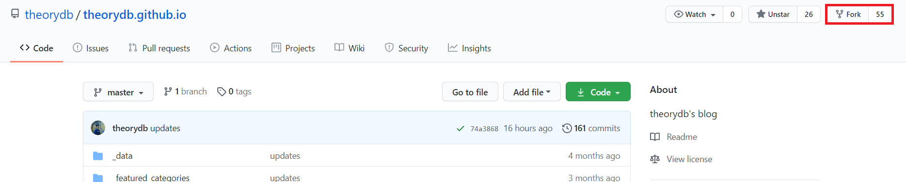
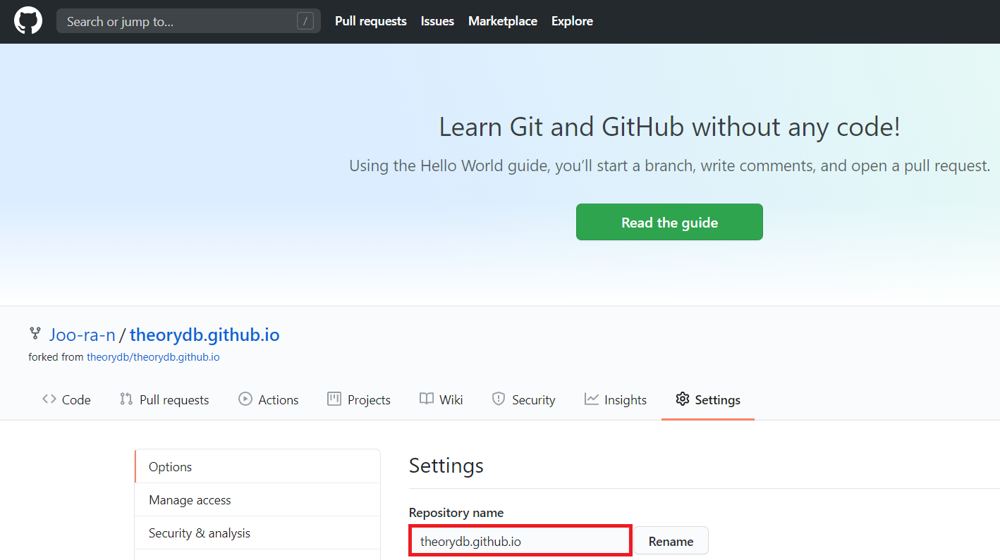
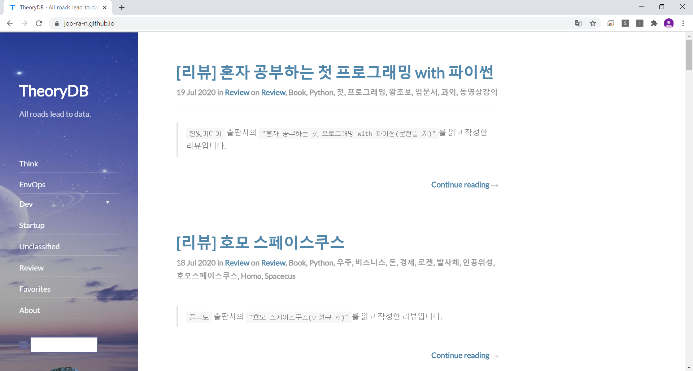
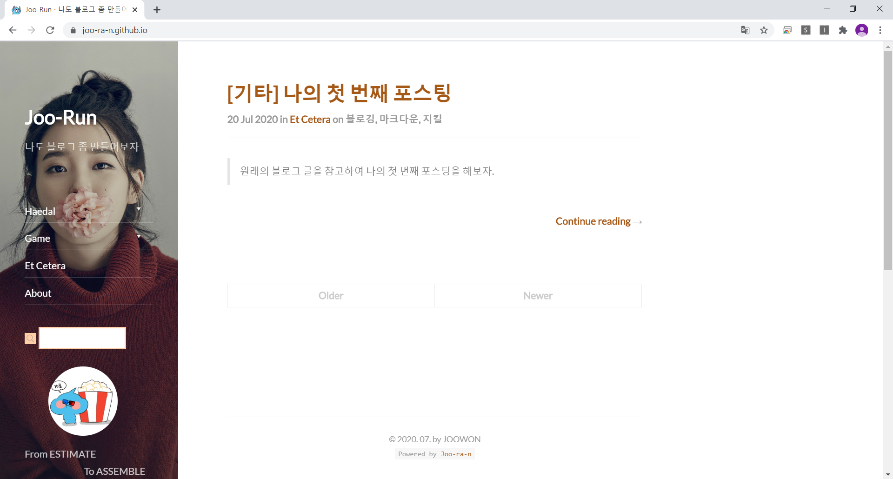

# 4일차
## Jekyll을 활용한 블로그 만들기

### Jekyll이란?
`Jekyll`은 우리가 이때까지 이용한 `github`에서 개발한 툴이다. 또다른 개발 툴인 `Wordpress`와의 가장 큰 차이점이라고 한다면, `Jekyll`은 `정적 웹사이트(Static website)`라는 것이다.
HTML 또는 Markdown으로 글을 작성하면 미리 정의해 놓은 규칙에 따라 겨로가 페이지를 내놓게 된다. 이 때 사용자는 내부 파일인 `_config.yml` 파일이나 `_posts` 폴더의 수정을 통해 원하는 기능을 구현할 수 있다.

아까 `Jekyll`이 `정적 웹사이트`라고 했는데, 당신은 `정적 웹사이트`에 대해 들어본 적이 있는가? 있다고? 거짓말 치지 마라. `정적 웹사이트`가 뭔지 모르는 당신을 위해 설명해 주겠다.  
~~안녕! 내 이름은 스피드왜건! 정적 웹사이트를 설명해 주기 위해 런던빈민가에서부터 널 따라왔지!~~

  
그림을 보면, 사용자는 web을 통해 서버에 페이지를 요청하고, 페이지를 요청받은 서버는 html 파일을 그대로 전달한다. 이것이 `정적 웹 페이지`라는 것이다. 그렇다면 `동적 웹 페이지`라는 것도 있을까?

물론 있다.  
  
위 그림에서는 사용자가 web을 통해 서버에 페이지를 요청했을 때, 서버 내부에서 데이터들을 스크립트에 의해 가공처리 한 후 html 파일을 전달하게 된다.

이러한 구조적 차이로 인해 `정적 웹 페이지`와 `동적 웹 페이지`의 장단점이 발생하는데,

#### `정적 웹 페이지`
- 장점
    + 로딩 속도가 빠르다(따로 뭔가 처리할 필요 없이 요청한 페이지만 보여주면 됨).
    + 유지비가 적게 든다(웹 서버만 구축하면 됨).
    
- 단점
    + 비전문가가 사용하기 어렵다.
    + 서비스가 한정적이다(이미 저장된 정보만 보여줄 수 있음).
    
#### `동적 웹 페이지`
- 장점
    + 서버 안에 저장된 데이터들을 통해 여러 서비스를 할 수 있다.
    + 비전문가가 사용하기 편리하다(네이버, 다음 블로그 등).
    + 유지보수에 용이하다.

- 단점
    + 느리다(사용자가 요청하면 서버에서 데이터를 가공해야 함).
    + 비싸다(추가적으로 애플리케이션 서버를 두어야 함).

돌고 돌아 다시 `Jekyll`로 돌아가보자. 시작부터 약간의 문제가 발생하는데, 우리는 이때까지 파이썬을 사용해서 무언가 작업을 했다. 하지만 지금 시작할 때 잠깐 필요한 언어가 있는데, 그것은 바로 `Ruby`이다. 하나 다행스러운 것은 `Ruby`를 설치만 하면 우리가 설정해놓은 `git bash`에서 자동으로 루비 명령어를 사용할 수 있다는 점이다. 일단 `Ruby` 설치부터 진행해 보자

#### Ruby 설치하기
[Ruby Installer 공식 페이지](https://rubyinstaller.org/)  
일단 위의 페이지로 들어가서 빨갛고 커다란 Download를 누르면 다음과 같은 창이 뜰 것이다.  
  
우리가 사용할 버전은 2.6.6-1이고, 대단히 친절하게도 두꺼운 글씨로 되어 있다. 혹여 그럴 사람은 없겠지만 32비트 윈도우를 사용 중이라면 바로 아래에 있는 x86을 받아서 설치하면 된다. 설치파일을 다운로드 받은 후 실행시켜 보자.

  
  
설치 중 위의 사진처럼 체크해주고 설치를 진행하면 된다. 두 번째 사진의 경우 딱히 쓸 일은 없지만, 혹시를 위해 설치해둔다고 생각하면 편하다. 설치에 시간이 좀 소요되는데, 물이라도 한 잔 마시면서 기다리도록 하자.

모두 설치가 되었다면, 다음과 같은 창이 뜰 것이다.  
  
여기서 Finish를 눌러주면

  
위와 같은 창이 뜨는데, unsure하기 때문에 1,3 을 치고 Enter를 눌러주면 파일이 설치가 되고, 다 됐을 때 엔터를 한 번 더 누르면 터미널 창이 꺼지게 된다. 그리고 파이참을 재시작 후, 터미널 창에서
```
ruby -v
```
를 치면 현재 설치된 `ruby`의 버전이 나오게 된다. 현재 설치된 버전을 확인해보면
```
ruby -v
ruby 2.6.6p146 (2020-03-31 revision 67876) [x64-mingw32]
```
라고 나올 것이다. 위처럼 나오지 않았다면 뭔가 잘못 설치했을 확률이 높기 때문에 다시 찬찬히 확인해 보도록 하자.

일단 `jekyll` 및 기타 라이브러리들을 사용하기 위해 몇 가지를 Terminal 창에서 install 해주자.
```
gem install jekyll
gem install jekyll-feed
gem install bundle
gem install github-pages
gem install tzinfo-data
``` 
처음부터 블로그를 만들기는 대단히 어려운 작업이기 때문에, 다음 사이트들을 참고하여 마음에 드는 테마를 구하자. 하지만 이번 수업에서는 편의를 위해 완성되어 있는 블로그를 사용할 것이다.  

[https://github.com/topics/jekyll-theme](https://github.com/topics/jekyll-theme)  
[http://jekyllthemes.org/](http://jekyllthemes.org/)  
[https://jekyllthemes.io/free](https://jekyllthemes.io/free)  
[http://themes.jekyllrc.org/](http://themes.jekyllrc.org/)  
Minima, Clean Blog 등 유명한 테마들이 포함되어 있다. Jekyll은 구글에 자료가 많은 편이므로, 구글링을 통해 각 테마를 사용하는 법을 익히도록 하자.

#### 완성된 블로그 베끼기(!)
우리가 참고할 [블로그 주소](https://theorydb.github.io/)이고,  
[블로그 깃헙 주소](https://github.com/theorydb/theorydb.github.io)를 눌러보자.

  
fork를 누르고, 나의 repository를 선택해주면 나의 repository에 fork된다. 그 후, fork한 나의 repository에 들어가서 톱니바퀴 모양을 눌러 설정 창으로 들어가자. 다음과 같은 창이 나올 것이다.  
  
빨간색 네모 친 부분(repository name)을 `username.github.io`로 바꿔주자. 본인의 username은 Joo-ra-n 이기 때문에
```
Joo-ran.github.io
```
로 설정해주었다. 그 후 오른쪽의 `Rename` 버튼을 클릭해주면 repository name이 성공적으로 변경할 수 있다. 아래쪽의 Issue 부분에만 체크해 주고, 주소창에
```
https://username.github.io
```
를 입력하면...  
  
404 에러가 뜬다! Github Pages에 리얼타임으로는 반영이 되지 않으므로 잠시 기다려 주도록 하자. 잠시 기다린 후 다시 주소를 쳐보면..

  
원래의 블로그를 잘 베껴온 모습이다. 이로써 내용물은 남의 것이지만, 어쨌든 내 username으로 된 블로그가 하나 생겼다. 이제 이 블로그를 내 입맛에 맞게 조금씩 바꾸어나가는 작업을 하게 될 것이다.. 

이제 이 베껴온 블로그를 로컬에서 편집하기 위해 Pycharm을 켜고, terminal에 다음과 같이 입력해주자.
```
git clone https://github.com/"username".github.io // 본인 repository를 로컬로 clone
...
cd "username".github.io                           // "username".github.io로 경로 변경
bundle install                                    // ???
bundle exec jekyll serve                          // jekyll 블로그 로컬서버 오픈
```
이렇게 하면 localhost 주소인 `127.0.0.1:4000`으로 아까 github pages에서 보았던 것과 같은 페이지가 열리게 된다.
앞으로 우리는 pycharm에서 파일들을 수정한 뒤, 로컬 서버에서 확인해 보고 문제가 없으면 github에 push하는 식으로 블로깅을 진행할 것이다.

ctrl+c를 눌러 일단 서버를 닫고, 무엇을 수정해야 하는 지 알아보자.

##### 1. 변경해야 하는 것
+ _featured_tags/ : 블로그 포스팅 게시판 대분류
+ _featured_categories/ : 블로그 포스팅 게시판 소분류
+ _data/ : 개발자 및 기타 정보 폴더(author.yml 파일 또한 수정 필요)
+ _config.yml : 블로그의 환경변수를 설정하는 파일. 기본적인 블로그 세팅 담당
+ README.md : github 소스 페이지에 뜨는 문서이자, About 메뉴 클릭 시 나타나는 블로그 소개글

##### 2. 변경하면 좋은 것
+ assets/ : 이미지, CSS 등을 저장한 폴더(여기에서 검색 이미지도 바꿀 수 있음)
+ _layouts/ : 포스트 외부의 틀을 정하는 폴더(페이지, 구성요소 등 UXUI 변경 시 수정 필요)
+ _includes/ : 기본 페이지 폴더(여기에선 footer를 바꿀 수 있다)
+ Gemfile.lock : Gemfile에 기록한 라이브러리를 설치 후 기록하는 파일(중복 설치 방지)
+ .gitignore : github에 올리고 싶지 않은 파일들을 적어 놓은 리스트
+ sitemap.xml : 테마의 사이트맵
+ robots.xml : 검색엔진 수집 등에 대한 정책을 명시하는 설정 파일
+ posts.md : 포스트 작성 관련 설정 파일

##### 3. 뭐가 있는지 확인만 하자
+ _posts. : 실제 글을 쓰는 폴더
+ index.html : 블로그의 메인 페이지(최초 접속 시 뜨는 페이지)
+ 404.md : 404 Not Found Error가 떴을 때 페이지

[지킬 한글화 공식 페이지](http://jekyllrb-ko.github.io/docs/structure/)를 참고해서 뭐가 있는지 보면 된다.

일단 `_featured_categories/`, `_featured_tags` 파일들을 수정해서 전체적인 블로그의 틀을 잡는 것이 좋다.
내가 블로그를 어떤 식으로 운영할 지 생각해 보고 기존의 게시판들을 갈아엎은 후에 나의 입맛에 맞게 게시판 구조를 바꾸자.
그 후 `_posts` 폴더의 포스트들을 한 개(참고용)을 제외하고 전부 삭제한 후, 일단 나만의 게시물을 하나 쓰면 된다.
다음은 본인이 시험삼아 한 번 작성해 본 것이다.
```
2020-07-20-etcetera-myfirstpost.markdown

---  
layout: post  
title: "[기타] 나의 첫 번째 포스팅"  
subtitle: "내 블로그에 첫 번째 글을 써보자"  
categories: etcetera  
tags: 블로깅 마크다운 지킬
comments: true  
---  
  
> 원래의 블로그 글을 참고하여 나의 첫 번째 포스팅을 해보자.  

---
나의 첫 번째 블로그 글

TEST 중

```
그러면 기존의 글(남의 것)이 다 사라지고, 일단 내가 방금 쓴 글만 블로그에 있게 된다.
이제 뭔가 나만의 블로그같은 느낌이 들지 않는가? ~~아님 말고...~~

또 `_data/authors.yml` 파일을 확인해보면 내부에 social 탭이 있는데, 여기를 참조해주면 좌측 목차가 있는 곳 하단에 내 SNS를 삽입할 수도 있다.
그리고 이제 좌측 목차의 배경, 전체 배경, favicon, logo, footer 정도를 바꿔주면 꽤 그럴듯해 보이게 되는데, 이것들은 `_config.yml` 파일과, `assets` 폴더에서 관리할 수 있다.
`_config.yml` 파일을 열어보면 뭔가 주루루루루룩 나오는데 여기에 있는 영어로 된 설명을 잘 읽어보고 하나하나 바꿔보면 된다.
세세하게 설명을 해 주고 싶지만.. 개인마다 원하는 바가 조금씩 다르기 때문에 보이는 부분(프론트엔드)와 코드 부분(백엔드)를 비교해 가면서 바꿔 보는 게 가장 좋다고 생각하는 바이다.  
  
(내가 만든 블로그 예시)

### `markdown` 문법
헌데 이때까지 배웠던 `.html` 말고 웬 이상한 `.md` 파일을 작성해야 한다는 것을 느꼈을 것이다.
못 느꼈다고? 거짓말하지 마라. 다 알고 있다... 뭔가 이상했다고 해줘..

아무튼 `markdown`이란.. 현재 이 문서도 `markdown`으로 작성하고 있는데, `html`과 마찬가지로 페이지를 나타내주는 마크업 문서이다.
~~마크down은 마크up 깔깔쓰~~ `html`은 태그도 많고, 구조도 직관적으로 알기 힘들지만, `markdown`은 읽기도 쓰기도 쉽고, 숙달되면 키보드만 가지고 모든 것을 할 수 있기 때문에 편리하다.

###### 마크다운의 장점
+ 배우기가 쉽고 직관적이다.
+ `html`로의 변환이 가능하다(Jekyll도 이런 식이다. markdown으로 작성 후 html로 변환하는..)
+ 텍스트로 작성 및 관리하기 때문에 git을 통한 버전관리가 가능하고, 가볍다.
+ `jupyter notebook` 등 다른 기술에서도 활용이 용이하다.

###### 마크다운의 단점
+ 표준이 없기 때문에 핵심 문법을 제외하고는 편집기에 따라 다른 결과물을 출력할 수도 있다.

뭐 처음엔 한글 쓰는 것 보다 어려울 순 있어도, 익숙해지고 나면 꽤 편하다. 실제로 주는 효과도 몇 없고.. 이미지와 볼드 처리 정도만 할 줄 알면 꽤나 훌륭한 문서를 적을 수 있게 될 것이다.
이제 주로 사용하는 문법들을 가지고 실습해보자.

#### Markdown 실습

##### 글머리(Headers)
문서를 만들 땐, 제목이 필요하겠죠? 제목 앞에는 #을 붙이면 된다. #의 개수를 늘려갈수록 하위 번호가 된다. 또한, #은 6개까지 사용가능하다.
```
# 이렇게 말이죠
## 샵 두개는 이렇게
### 샵 세개는 이렇게
```
# 이렇게 말이죠
## 샵 두개는 이렇게
### 샵 세개는 이렇게
#은 6개까지 사용가능하다.

##### 2.2. 인용구(BlockQuote)
꺾쇠를 사용하면 된다.(>)
```
>안녕 나는 인용구야
>줄을 바꾸려면 줄 마지막에 스페이스바를 두번 치고 엔터를 치고 다시 꺾쇠를 넣어주면 돼.
>근데 꺾쇠가 맞냐 꺽쇠가 맞냐?
>>꺾쇠가 맞아 바보야.

```
>안녕 나는 인용구야  
>줄을 바꾸려면 줄 마지막에 스페이스바를 두번 치고 엔터를 치고 다시 꺾쇠를 넣어주면 돼.  
>근데 꺾쇠가 맞냐 꺽쇠가 맞냐?
>>꺾쇠가 맞아 바보야.

##### 2.3. 목록

###### 순서있는 목록
숫자와 점을 사용해 표현한다.
```
1. 일번
2. 이번
6. 육번 같지만 삼번이라구~
5. 오번 같지만 사번이라구~
5. 오번
```
1. 일번
2. 이번
6. 육번 같지만 삼번이라구~
5. 오번 같지만 사번이라구~
5. 오번

###### 순서없는 목록
*, -, +를 사용해 나타낸다. (섞어서 사용도 가능)
```
* 데헷
- 데헷
+ 데헷
 * 쿵쾅쿵쾅
   * 쪼륵쪼륵
```

* 데헷
- 데헷
+ 데헷
 * 쿵쾅쿵쾅
   * 쪼륵쪼륵
   
##### 2.4. 강조
취소선, 기울임(이탤릭), 굵게(볼드) 등이 있다.
```
*별 하나*
_밑줄 하나_
**별 둘**
__밑줄 둘__
***별 셋***
___밑줄 셋___
_기울여서 쓰다가 **볼드로 쓰다가** 다시 기울여서 쓰기_
~~물결표 둘~~
`박스쳐서 강조`
```
*별 하나*  
_밑줄 하나_  
**별 둘**  
__밑줄 둘__  
***별 셋***  
___밑줄 셋___  
_기울여서 쓰다가 **볼드로 쓰다가** 다시 기울여서 쓰기_  
~~물결표 둘~~  
`박스쳐서 강조`

##### 2.5. 링크 삽입
```
[링크 이름](링크 주소)
[구글!](https://www.google.com)
```
[구글!](https://www.google.com)

##### 2.6. 이미지 삽입
```


```

