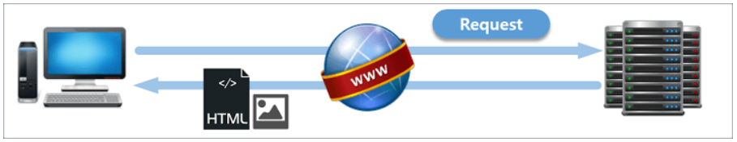
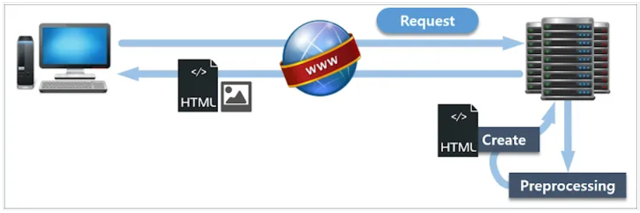
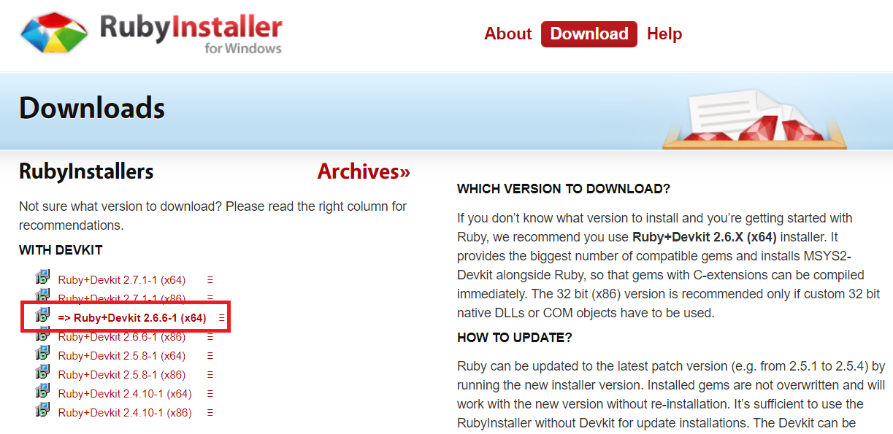
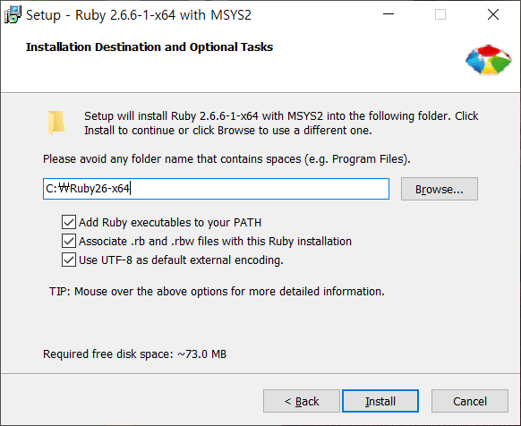
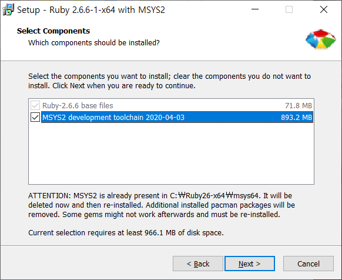
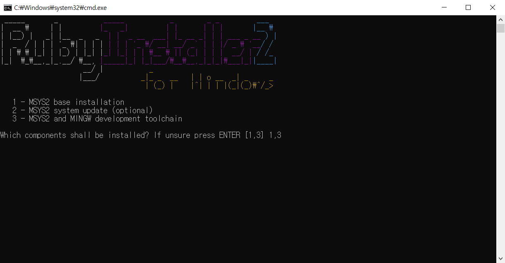

# 4일차
## Jekyll을 활용한 블로그 만들기

### Jekyll이란?
`Jekyll`은 우리가 이때까지 이용한 `github`에서 개발한 툴이다. 또다른 개발 툴인 `Wordpress`와의 가장 큰 차이점이라고 한다면, `Jekyll`은 `정적 웹사이트(Static website)`라는 것이다.
HTML 또는 Markdown으로 글을 작성하면 미리 정의해 놓은 규칙에 따라 겨로가 페이지를 내놓게 된다. 이 때 사용자는 내부 파일인 `_config.yml` 파일이나 `_posts` 폴더의 수정을 통해 원하는 기능을 구현할 수 있다.

아까 `Jekyll`이 `정적 웹사이트`라고 했는데, 당신은 `정적 웹사이트`에 대해 들어본 적이 있는가? 있다고? 거짓말 치지 마라. `정적 웹사이트`가 뭔지 모르는 당신을 위해 설명해 주겠다.  
~~안녕! 내 이름은 스피드왜건! 정적 웹사이트를 설명해 주기 위해 런던빈민가에서부터 널 따라왔지!~~

  
그림을 보면, 사용자는 web을 통해 서버에 페이지를 요청하고, 페이지를 요청받은 서버는 html 파일을 그대로 전달한다. 이것이 `정적 웹 페이지`라는 것이다. 그렇다면 `동적 웹 페이지`라는 것도 있을까?

물론 있다.  
  
위 그림에서는 사용자가 web을 통해 서버에 페이지를 요청했을 때, 서버 내부에서 데이터들을 스크립트에 의해 가공처리 한 후 html 파일을 전달하게 된다.

이러한 구조적 차이로 인해 `정적 웹 페이지`와 `동적 웹 페이지`의 장단점이 발생하는데,

#### `정적 웹 페이지`
- 장점
    + 로딩 속도가 빠르다(따로 뭔가 처리할 필요 없이 요청한 페이지만 보여주면 됨).
    + 유지비가 적게 든다(웹 서버만 구축하면 됨).
    
- 단점
    + 비전문가가 사용하기 어렵다.
    + 서비스가 한정적이다(이미 저장된 정보만 보여줄 수 있음).
    
#### `동적 웹 페이지`
- 장점
    + 서버 안에 저장된 데이터들을 통해 여러 서비스를 할 수 있다.
    + 비전문가가 사용하기 편리하다(네이버, 다음 블로그 등).
    + 유지보수에 용이하다.

- 단점
    + 느리다(사용자가 요청하면 서버에서 데이터를 가공해야 함).
    + 비싸다(추가적으로 애플리케이션 서버를 두어야 함).

돌고 돌아 다시 `Jekyll`로 돌아가보자. 시작부터 약간의 문제가 발생하는데, 우리는 이때까지 파이썬을 사용해서 무언가 작업을 했다. 하지만 지금 시작할 때 잠깐 필요한 언어가 있는데, 그것은 바로 `Ruby`이다. 하나 다행스러운 것은 `Ruby`를 설치만 하면 우리가 설정해놓은 `git bash`에서 자동으로 루비 명령어를 사용할 수 있다는 점이다. 일단 `Ruby` 설치부터 진행해 보자

#### Ruby 설치하기
[Ruby Installer 공식 페이지](https://rubyinstaller.org/)  
일단 위의 페이지로 들어가서 빨갛고 커다란 Download를 누르면 다음과 같은 창이 뜰 것이다.  
  
우리가 사용할 버전은 2.6.6-1이고, 대단히 친절하게도 두꺼운 글씨로 되어 있다. 혹여 그럴 사람은 없겠지만 32비트 윈도우를 사용 중이라면 바로 아래에 있는 x86을 받아서 설치하면 된다. 설치파일을 다운로드 받은 후 실행시켜 보자.

  
  
설치 중 위의 사진처럼 체크해주고 설치를 진행하면 된다. 두 번째 사진의 경우 딱히 쓸 일은 없지만, 혹시를 위해 설치해둔다고 생각하면 편하다. 설치에 시간이 좀 소요되는데, 물이라도 한 잔 마시면서 기다리도록 하자.

모두 설치가 되었다면, 다음과 같은 창이 뜰 것이다.  
  
여기서 Finish를 눌러주면

  
위와 같은 창이 뜨는데, unsure하기 때문에 1,3 을 치고 Enter를 눌러주면 파일이 설치가 되고, 다 됐을 때 엔터를 한 번 더 누르면 터미널 창이 꺼지게 된다. 그리고 파이참을 재시작 후, 터미널 창에서
```
ruby -v
```
를 치면 현재 설치된 `ruby`의 버전이 나오게 된다.