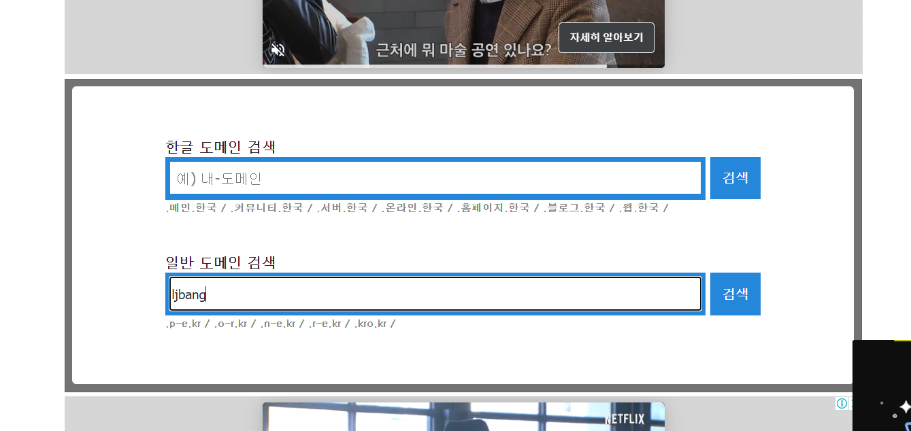
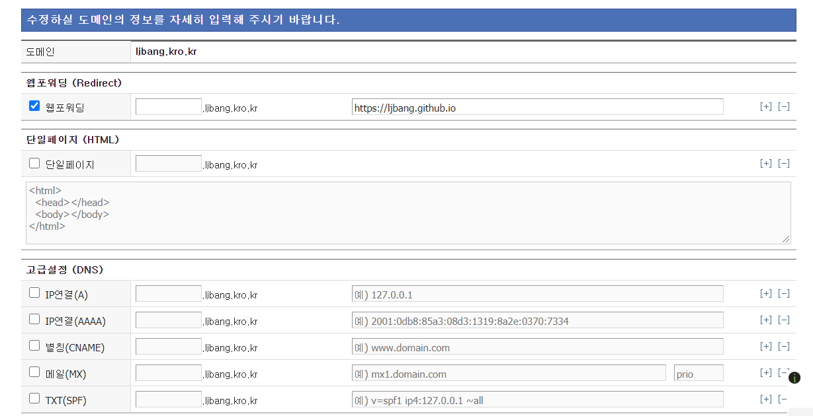
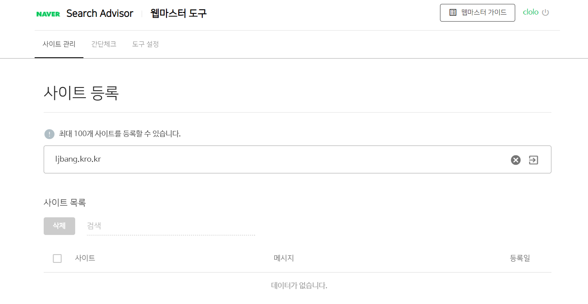
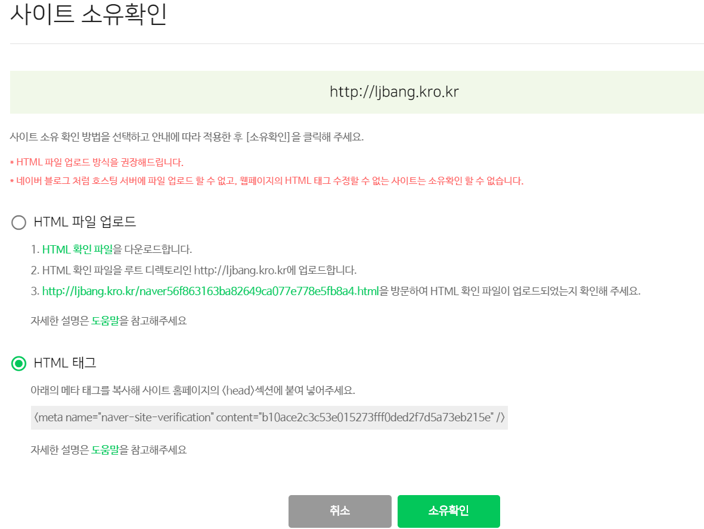
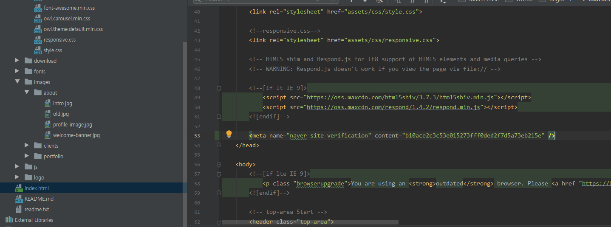

# 5일차

마지막 강의입니다.  
지금까지 우리는 HTML로 페이지를 작성하고, CSS로 꾸미고, Github을 통해서 페이지를 호스팅해봤습니다.  
그런데, `username.github.io`라는 주소는 아직 너무 불편합니다. `DNS`를 배우면서 우리가 원하는 주소로 바꿔봅시다.  

### DNS?  

DNS란 `Domain Name System`의 약자로, 쉽게 말해서 도메인 주소와 네트워크주소를 연결해주는 시스템이라고 생각하면 된다.  
지금은 우리가 `Github`을 통해서 호스팅을 했지만 실제 사이트를 호스팅 할 때에는 처음에는 서버컴퓨터의 IP주소를 이용해서 호스팅 하게된다.  
예를 들어 주소창에 `125.209.222.141`을 검색하면 곧바로 네이버로 연결된다.  
네이버를 호스팅해주는 서버의 IP주소`(125.209.222.141)`과 도메인`(naver.com)`이 연결된 상태이다.  
그러면 우리도 주소를 받아서 우리가 만든 자기소개페이지와 연결해주자.  

#### 도메인 받기

우리가 자주 보는 도메인들을 생각해보자.  
`.com`, `.net`, `.co.kr`등으로 끝나는 주소들이 떠오를 것이다.  
우리도 이런 도메인들을 사용하고 싶지만 이런 도메인들은 돈을 내고 사용해야하는 고급 도메인들이다.  
무료도메인들은 유료 서비스에 비해 속도가 느리거나, 호스팅이 불안정하다는 단점이 있지만, 연습이니까 무료로 사용할 것이다.  

구글에 `무료도메인`을 검색하면 여러가지가 나올텐데, 이번 강의에서는 `내도메인.한국`이라는 사이트를 사용해보자.  
위 사이트에 접속해 회원가입과 로그인을 하자.  
로그인을 했다면 두 개의 검색창이 보일텐데, 위쪽은 한글 도메인을 받는 검색창이고, 아래쪽은 영어도메인을 받는 검색창이다.  
취향이지만 강의는 영어 도메인을 받는 것으로 진행하겠다.  

  

이렇게 원하는 도메인을 검색해보면 사용할 수 있는 도메인의 목록이 나온다!  
물론 무료도메인이기 때문에 예쁜것은 없다... 맘에 드는 것을 선택하자.  
선택한 후 보안코드를 입력하고 등록을 하면 아래와 같은 페이지가 나온다.  

  

여기서 위 그림과 같이 웹포워딩을 체크한 후 자기소개페이지의 주소`username.github.io`를 넣으면 된다.  
만약 깃헙 페이지가 아닌 일반 서버를 통해 호스팅해서 주소를 연결해야 하는 경우라면 `IP연결`을 체크한 후  
IP주소를 입력하면 된다.  

모든 작업을 완료 했다면, `ljbang.kro.kr`의 형태로 주소창에 입력하면 내가 만든 페이지가 나타남을 확인할 수 있다!  

### 검색엔진에 사이트 등록 하기

홈페이지를 만들었다고 끝이 아니다!  
홈페이지를 만들었으면 우리가 홈페이지를 만들었다고 검색엔진에 알려줘야한다.  
대표적인 검색엔진인 `네이버`와 `구글`에 우리 사이트를 알려보자.  

먼저 국민 사이트 네이버부터 등록해보자  
[네이버 서치 어드바이저](https://searchadvisor.naver.com/)  
위 사이트에 접속한 후 먼저 오른쪽 위에 로그인을 눌러 네이버 아이디로 로그인하고 정보이용 동의를 체크한다.  
정보이용 동의를 체크했다면, 스크롤을 조금 아래로 내려서 `웹마스터 도구 사용하기`버튼을 클릭한다.  

  

그 다음 나오는 창에서 우리가 만든 사이트 도메인을 입력한다.  

  

등록을 하면 본인이 소유한 사이트인지 확인절차를 가지는데,  
두가지 방법 모두 사용할 수 있지만 간편한 방법인 `HTML 태그`를 통해서 등록해보자.  

  

`<meta>`태그의 내용을 복사해서 우리가 가진 `index.html`의 `<head>`태그의 아랫부분에 붙여넣는다.  

  

붙여넣었다면 다시 Github으로 `push`해준다.  
우리가 호스팅하는 페이지에서 `F12`를 눌러서 `<head>`태그에서 `<meta naver ...>`태그가 정상적으로 추가되었는지 확인한다.  
확인되었다면, `소유확인`을 눌러 등록을 완료한다!  
이제 우리는 네이버에서 검색어를 통해 우리가 호스팅하는 페이지를 찾을 수 있다!  
물론 등록하는데에 시간이 조금 걸릴 수 는 있으니 차분히 기다려보자...  

이번에는 구글이다.  
구글도 마찬가지로 ‘구글 웹마스터 도구’라는 웹사이트 관리툴을 제공한다.  
[구글 웹마스터 도구](https://search.google.com/search-console/about?hl=ko)   
위 사이트에서 `시작하기`를 누르면 도메인주소를 넣는 공간이 나온다.  
 

사이트를 등록하면 구글 검색결과에 사이트가 노출된다.
사이트를 등록하면 검색 시 사이트의 내용을 가져다 검색결과에 보여 준다.  
사이트의 내용은 사이트를 구성하는 여러 개의 웹페이지를 말하는데,  
웹페이지에 있는 제목, 소제목, 본문, 멀티미디어 등을 모두 수집하여 색인화 한 후  
연관성 있는 키워드의 검색결과에 노출시킨다.

구글에서는 웹페이지의 내용이 잘 작성될 경우 상위노출에 의한 홍보효과를 가져오게 된다.  
웹페이지를 상위노출에 유리하게 작성하는 작업을 ‘검색엔진최적화’라고 한다.

구글 웹마스터도구는 사이트 등록 외에 사이트 관리에 유용한 여러가지 도구들을 제공합니다.  
사이트의 오류나 기능에 대한 점검, 검색 순위, 노출 현황, 검색어, 모바일 적합성, 사이트 통계 등 다양한 분석 도구들을 활용할 수 있는데,  
이런 도구들을 활용하면 상위노출에 유리하도록 사이트를 개선할 수 있다.