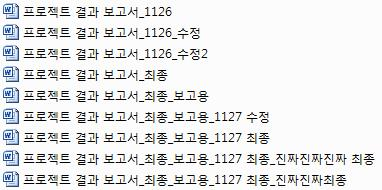

# FRONT-END
## 들어가기 전에..
### Github 그리고 파이참
  
GitHub 마스코트 octocat. 고양이와 문어를 합쳐놨다. 상당히 유명한 무료 Git 저장소로,
현재 해달프로그래밍에서 프로젝트를 진행할 때는 이 Guthub을 꼭 사용한다고 봐도 무방하다.
이제 간단한 git 명령어와 github 사용법을 알아보도록 하자.


##### [Github](https://github.com)  
`깃헙` 또는 `깃허브` 라고 읽는, 위 사이트에 들어가서 가장 먼저 무엇을 해야할 지 생각해보자. 모르겠다고?  
　  
　    
　   
　      


...
일단 Sign up(회원가입ㅎ) 부터 하도록 하자.
username은 깃헙에서 앞으로 계속 쓰게 될 이름이고,
추후 만들 `Github Pages`의 주소와 직결되는 부분이기 때문에 간단하고도 예쁘게 지어주도록 하자.
~~그걸 어떻게 하는 거냐고? 멍청한 놈!~~

일단 가입을 완료했다면, VCS에 대해 알아보자.
#### VCS?
> 버전 관리 시스템, Version Control System

**버전 관리, 소스 관리, 소스코드 관리**라 함은 동일한 정보에 대해 여러 버전을 관리하는 것을 말한다. 다음과 같은 경험이 있는가? ~~없다고? 멍청한 놈!~~  
  
위 사진이 바로 **같은 정보**에 대한 **여러 버전**의 대표적인 예라고 할 수 있다. 팀 단위로 개발할 때 소스코드의 관리를 위해 주로 사용한다.

#### 버전 관리를 해야 하는 이유
+ 잘 못 되었을 때(삭제 등) 복구하기 위해서
+ 변경 사항을 추적하기 위해서

등이 있다고 할 수 있다. Git은 대표적인 VCS라고 할 수 있다.

#### Github의 사용
Github의 repository 생성, 다른 사용자의 repository fork 등 Github의 사용법과,
터미널에서 사용 가능한 Git 명령어에 대해 알아보자.
#### Repository
##### Repository의 종류
`GIT Repository`는 말 그대로 파일이나 폴더의 저장소를 의미한다!
GIT은 두 종류의 저장소를 제공하는데,
* 원격 저장소(Remote Repository) : 파일이 원격 저장소 전용 서버에서 관리되며 여러 사람이 함께 공유하기 위한 저장소  

* 로컬 저장소(Local Repository) : PC에 파일이 저장되는 개인 전용 저장소

##### Repository 생성
* __기존 디렉토리를 Git 저장소로 이용__  
기존의 로컬 디렉토리를 Git 저장소로 이용하고 싶은 경우 해당 디렉토리에서 다음과 같은 명령어를 실행하면 된다.
```
git init
```
이 명령어는 .git 이라는 하위 디렉토리를 만들며 내부에 저장소에 필요한 기본 파일들을 담고 있다.

* __기존 저장소를 Clone__  
`Clone`이란 누군가가 만들어 놓은 저장소의 내용을 웹으로부터 모두 다운로드하는 것을 의미한다. 이 작업을 통해 복제한 저장소를 로컬 저장소로 사용할 수 있게 된다.
쉽게 말해 남의 것 빌려~~훔쳐~~ 오는 것이라고 생각하면 된다.
```
git clone [url]
```

#### 작업의 흐름
 Git은 파일을 `Committed`, `Modified`, `Staged` 이렇게 세 가지 상태로 관리한다.
 Committed란 데이터가 로컬 저장소에 안전하게 저장되었다는 것을 의미하고,
 Modified는 수정한 파일을 아직 로컬 저장소에 commit하지 않은 것을 말한다.
 Staged란 현재 수정한 파일을 곧 commit할 것이라고 표시한 상태를 의미한다.   
 
이 세 가지 상태는 Git 프로젝트의 세 구성 단계인 `Git 디렉토리`, `워킹 디렉토리`, `Staging Area(Index)`와 관련이 있다!
아래 그림을 보자.


 * Git 디렉토리는 Git이 프로젝트의 데이터를 저장하는 곳이다.
 * 워킹 디렉토리는 프로젝트의 특정 버전을 가져온 것이다.
 * Staging Area는 Git 디렉토리에 있으며, 단순한 파일이고 곧 커밋할 파일에 대한 정보를 저장한다. Index라고도 한다.
 
대략적인 흐름은 다음과 같다.
1. 워킹디렉토리에서 파일 수정
2. Staging area에 파일을 `stage`해서 commit할 스냅샷 생성
3. Staging area의 파일들을 `commit`해서 Git 디렉토리에 영구적 스냅샷으로 저장
4. `Push`를 통해 원격 저장소에 전송

##### Add
파일이나 폴더의 변경사항을 저장소에 기록하려면 `commit`을 해 주어야 한다. 하지만 막무가내로 commit 명령어를 입력한다고 해서 모든 변경사항들이 스냅샷으로 저장되지는 않는다.
우선 `add` 명령어를 이용해 변경한 파일들을 스냅샷에 추가할 것이라고 알려주어야 한다. 달리 말해 파일들을 Staging area로 stage하는 것을 의미한다.
```
git add .
```
위의 명령어를 통해 모든 하위디렉토리의 파일을 stage할 수 있다.
`add .`에서  .대신 파일이름을 기입함으로 특정 파일만을 stage할 수도 있다.
##### Commit
파일이나 폴더의 변경사항을 저장소에 기록하려면 `commit`을 해 주어야 한다.   
Staging area의 파일들을 Git 디렉토리에 영구적 스냅샷으로 저장하는 것이다.
```
git commit -m "간단한 설명"
```


##### Push
`Push`란 GIT에서 웹 상의 원격 저장소로 변경된 파일을 업로드하는 것을 의미한다. 
앞서 commit을 통해 로컬저장소에 저장한 변경사항들을 원격 저장소에 업로드하는 것이다.
내 PC의 로컬 저장소에서 변경된 이력을 원격 저장소에 공유하려면,
반드시 Push를 통해 로컬 저장소의 변경 이력을 원격 저장소에 업로드해야 한다.
```
git push origin master
```
위 명령어를 통해 master branch로 데이터를 전송할 수 있다.

##### Pull
`Pull`은 프로젝트 내용을 원격 저장소에서 로컬 저장소로 업데이트하는 작업을 의미한다.
pull 을 실행하면, 원격 저장소에서 최신 변경 이력을 다운로드하여 내 로컬 저장소에 그 내용을 적용한다.  
여러명이 하나의 원격 저장소를 이용해 공동작업을 수행하는 경우 각 인원이 같은 원격 저장소에 Push를 할 것이다.
그럼 이로 인해 발생하는 변경내용을 나의 로컬저장소에도 적용할 필요가 있다.
이 때 Pull 명령어를 이용해 최신사항을 업데이트한다.
```
git pull
```

__참고문헌__
* [ihoneymon의 마크다운 작성법](https://gist.github.com/ihoneymon/652be052a0727ad59601)
* [누구나 쉽게 이해할 수 있는 Git 입문](https://backlog.com/git-tutorial/kr/)

* [https://git-scm.com/](https://git-scm.com/)
* [git 간편안내서](https://rogerdudler.github.io/git-guide/index.ko.html)
  
파이참 로고. 사실 무슨 뜻인지 잘 모르겠고 다운로드와 설치 및 세팅법은 [여기](./etc/how_to_install_pycharm.md)서 할 수 있다.
