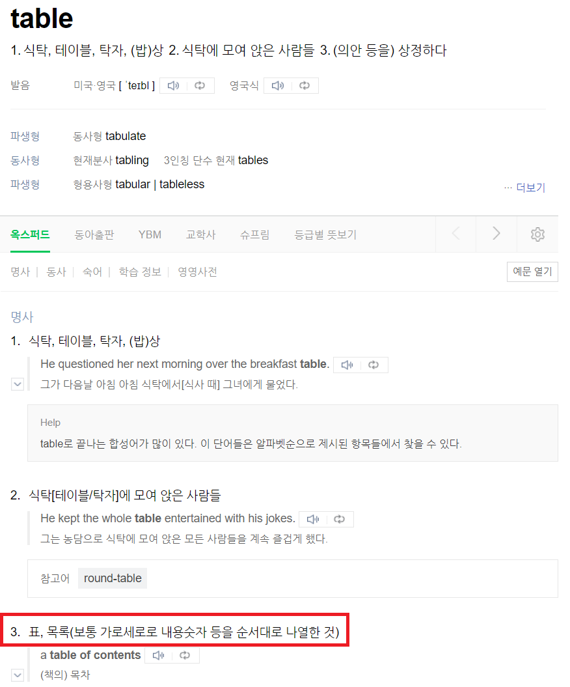
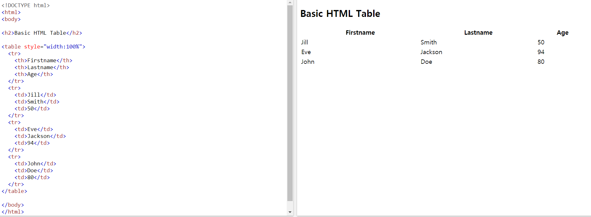
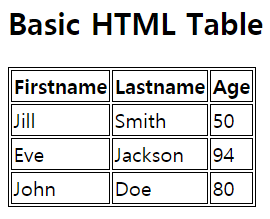
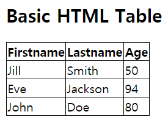
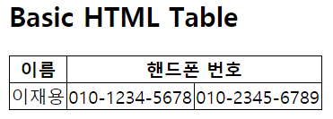
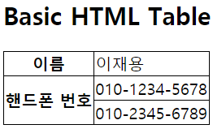
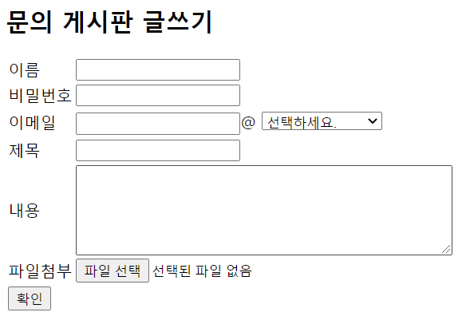
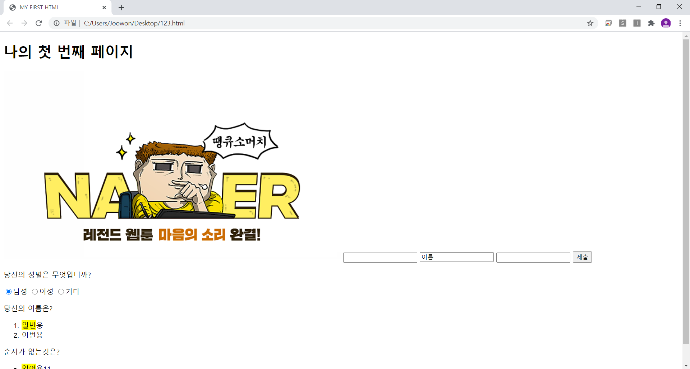

# HTML
  
**H**yper**T**ext **M**arkup **L**anguage  

웹 페이지를 출력하기 위해 기본이 되는 규약이다. 프로그래밍 언어가 아닌 마크업 언어이다! 마크업 언어가 뭔지 잘 모르겠다면, 한글의 수식 입력기를 생각해보면 된다. 위쪽에서 클릭 클릭 하면서 수식을 입력할 수도 있지만, 아래쪽에서 규칙에 맞추어 타이핑하면서 적절한 수식을 적을 수도 있잖아? 그래서 마크업 언어다 이마리야

HTML 코드 예시  
  
이따위로 생겼지만(규약) 실제로 출력되는 모습은 다음과 같다.


이 수업을 듣는 당신도 멋들어진 페이지를 제작할 수 있게 될 것이다.


~~프로그래머를 괴롭히는 방법~~

### 무작정 따라해보기!
일단 메모장을 켜자. 그리고 아래의 코드를 복사(ctrl+c), 붙여넣기(ctrl+v) 해보자!
```
<!DOCTYPE html>
<html>
    <head>
        <title>HELLO HTML</title>
        <meta charset='utf-8'>
    </head>
    <body>
        <h3>대충 제목이 들어갈 자리</h3>
        <p>대충 내용이 들어갈 자리입니다.</p>
        <p>대충 내용이 들어가는 중입니다. 간장 공장 공장장입니다.</p>
    </body>
</html>
```
실행해보면 아래와 같이 나올 것이다.
 
  
보면 우리가 입력했던 코드 중 &lt;title&gt;, &lt;h3&gt;, &lt;p&gt;들을 `태그`라고 하는데, 아까 경북대학교 총학의 예시를 봐도 그렇고 html 문서는 이 태그들로 이루어져 있다. 
처음 웹이 나왔을 때는 20개 정도의 태그들이 있었다고 하는데, 현재는 약 150개 이상의 태그들이 있다고 한다.
하지만 우리가 그 태그들을 다 알아야 할 필요는 없고,  
  
  
위 그래프들을 참조해 보면, 위쪽 그래프는 페이지당 평균 태그 수를, 아래쪽 그래프는 가장 많이 사용되는 25개 태그를 나타낸 것이다. 우리가 무작정 따라해봤던 태그 중 &lt;html&gt;, &lt;head&gt;, &lt;body&gt;, &lt;title&gt; 태그 등이 포함되어 있다! 아래로 걸출한 태그들이 나와 있는데,
이 태그및 다른 태그들을 알아보고, 이를 활용해 간단한 예제 페이지들을 만들어 보자.

#### 대표적인 HTML 태그들
`<a>`  
anchor의 약자로, 하이퍼링크를 걸 때 사용한다.
```
<a href="https://www.naver.com" target="_blank" title="네이버로 이동">네이버</a>
```

``  
image의 약자로, 이미지를 넣을 때 사용한다.
```

```
width는 폭, height는 높이, alt는 이미지 대체 속성이다. 스크린 리더 프로그램을 활용할 때에 alt 속성을 활용하기 때문에 꼭 넣어주는 편이 좋다.

`<h1> ~ <h6>`  
제목 태그이다. `<h1>`은 크고, `<h6>`은 작다.
```
<h1>h1 태그입니다.</h1>
<h2>h2 태그입니다.</h2>
<h3>h3 태그입니다.</h3>
<h4>h4 태그입니다.</h4>
<h5>h5 태그입니다.</h5>
<h6>h6 태그입니다.</h6>
```
`<p>`
```
<p>안녕 이것은 문단 태그야.</p>
```
본문에 해당하는 내용을 적을 때 주로 사용하는 태그로, paragraph 즉 단락을 표현할 때 사용한다.

`<span>`  
```
<p>안녕 이것은 문단 태그야.<span>span태그</span>를 설명하기 위해 잠깐 가져왔지.</p>
```
그냥 봤을 때는 일반 텍스트와 동일하게 출력되기 때문에 CSS 언어와 함께 사용한다.
```
<p>안녕 이것은 문단 태그야. <span style="color: red;">span태그</span>를 설명하기 위해 잠깐 가져왔지.</p>
```
이런 식으로 말이지...

`<mark>`  
```
<p><mark>대구소프트웨어고등학교</mark>는 대구광역시 달성군 구지면에 있는 고등학교이다.</p>
```
형광펜을 칠한다고 생각하면 쉬울려나?

`<ol>, <ul>, <li>`  
ol 태그는 ordered list(번호 있음)  
ul 태그는 unordered list(번호 없음)  
li 태그는 listed item의 약자로 뭔가 아이템 앞에 적어줄 때 사용한다.
```
<ol>
    <li>번호가 있는 ol태그 1</li>
    <li>번호가 있는 ol태그 2</li>
    <li>번호가 있는 ol태그 3</li>
</ol>
<ul>
    <li>번호가 없는 ul태그 1</li>
    <li>번호가 없는 ul태그 2</li>
    <li>번호가 없는 ul태그 3</li>
</ul>
```

`<br>`  
```
br태그는 강<br>제개행을 할 때 쓰입니다. 개행은<br>엔터라고 생각하면 편합니다.
```

`<input>`  
```
        <input type="text">
        <input type="text" value="이름">
        <input type="password">
        <input type="submit" value="제출">
        <p>당신의 성별은 무엇입니까?</p>
        <input type="radio" name="gender" value="남성">남성
        <input type="radio" name="gender" value="여성">여성
        <input type="radio" name="gender" value="기타">기타
```
input 태그의 활용은 정말로 정말로 무궁무진하기 때문에 여기서 모두 설명할 수 없고, radio나 password submit 등 굵직굵직한 type들만 보여주었다. 사실 모든 type을 어떻게 쓰는지 세세하게 알고 있을 필요는 딱히 없고,
아! 이런 type도 있었지.. 정도만 기억하고 있다가 실제로 사용할 때 구글링해서 쓰시면 됩니다.

[w3schools에서 설명하는 input type 속성값 종류](https://www.w3schools.com/html/html_form_input_types.asp)  
[HTML - input태그와 그 속성 type, value, name - 입력태그 (1)](https://yangbari.tistory.com/28)  
[HTML - input태그의 추가된 속성과 type 속성에 추가된 값 - 입력태그 (2)](https://yangbari.tistory.com/29)

`<table>`  
html 강의를 하다가, 가르쳐주지 않은 태그 중에 상당히 중요한 태그가 있는데, 그것은 바로 `<table>` 태그다.
그런데 잠깐, **table**?  
  
표라는 뜻이다! `<table>` 태그를 활용해서 html 문법으로 표를 표현할 수 있다(물론 어제 배웠던 `markdown`으로도 가능하다.).
일단 표현된 모습을 보자.  
  
```
소스코드
<!DOCTYPE html>
<html>
<body>

<h2>Basic HTML Table</h2>

<table>
    <tr>
        <th>Firstname</th>
        <th>Lastname</th> 
        <th>Age</th>
    </tr>
    <tr>
        <td>Jill</td>
        <td>Smith</td>
        <td>50</td>
    </tr>
    <tr>
        <td>Eve</td>
        <td>Jackson</td>
        <td>94</td>
    </tr>
    <tr>
        <td>John</td>
        <td>Doe</td>
        <td>80</td>
    </tr>
</table>

</body>
</html>
```
표의 가로 행을 생성하는 태그는 `<tr>`이고, 표의 제목을 나타내는 태그는 `<th>`이다.
그리고 표의 내용을 나타내는 태그는 `<td>`인데, 각각 `table row`, `table head`, `table data`를 의미한다.
기본적인 속성으로, `<th>`는 굵은 글씨체에 중앙 정렬, `<tr>`과 `<td>`는 보통 글씨체에 왼쪽 정렬이다.

위 예시에서는 `<table>`태그에 `border`속성을 지정해 주지 않았기 때문에 테두리 선이 표시되지 않는다.
HTML5부터는 공식적으로 태그에서 `border`속성을 지원하지 않기 때문에 CSS로 테두리를 나타내 보자.

```
<head>
    <style>
    table, td, tr{
    border: 1px solid black;
}
    </style>
</head>
```
그러면 다음처럼 뭔가 답답해 보이는 표가 나올 것이다. 안답답하다고? 저는 답답해 보이..보입니다..  
  
저것을 이제 선을 하나만 나타내주기 위해서는 `border-collapse` 속성을 사용하면 되는데, 사용법은 다음과 같다.
```
<style>
    table, td, tr{
    border: 1px solid black;
    border-collapse: collapse;
}
    </style>
```

  
깔끔하게 나온 모양이다. 또 테이블간 행 및 열 병합을 해 줄수가 있는데, 이것은 HTML 선에서 처리한다.
문법은 다음과 같다.

```
<table>
    <tr>
        <th>이름</th>
        <th colspan="2">핸드폰 번호</th>
    </tr>
    <tr>
        <td>이재용</td>
        <td>010-1234-5678</td>
        <td>010-2345-6789</td>
    </tr>
</table>

```  
  
마찬가지로 행간 병합도 수행해 줄 수 있는데, 문법은 다음과 같다.

```
<table>
  <tr>
    <th>이름</th>
    <td>이재용</td>
  </tr>
  <tr>
    <th rowspan="2">핸드폰 번호</th>
    <td>010-1234-5678</td>
  </tr>
  <tr>
    <td>010-2345-6789</td>
  </tr>
</table>
```
  
위처럼 위아래로 행이 병합된 모습을 볼 수 있다. 이제 `<table>`의 거의 모든 속성을 다 배웠다! 다음 예제를 풀어보자.

#### Example - table
  
위처럼 만들어보자!  
Hint
 + 이름 ~ 이메일 부분까지 `<table>` 하나 작성 후 아랫부분도 `<table>`을 이용하여 작성
 + 사용 태그: `<h3>`, `<table>`, `<tr>`, `<td>`, `<input>`, `<select>`, `<option>`, `<textarea>`
 + 틀 먼저 잡고, 채울 내용 생각

### 무작정 섞어보기
이때까지 배운 것들을 죄다 한군데 넣어서 써보자! 아래는 그냥 예시일 뿐이다! 복사 붙여넣기 하지 말고 귀찮더라도 직접 해보자!
```
<!DOCTYPE html>
<html>
    <head>
    <meta charset='utf-8'>
    <title>MY FIRST HTML</title>
    </head>

    <body>
    <h1>나의 첫 번째 페이지</h1>
    <a href="https://www.naver.com" target="_blank"></a>
    <input type="text">
    <input type="text" value="이름">
    <input type="password">
    <input type="submit" value="제출">
    <p>당신의 성별은 무엇입니까?</p>
    <input type="radio" name="gender" value="남성">남성
    <input type="radio" name="gender" value="여성">여성
    <input type="radio" name="gender" value="기타">기타<br>
    
    <p>당신의 이름은?</p>
    <ol>
        <li><mark>일번</mark>용</li>
        <li>이번용</li>
    </ol>
    <p>순서가 없는것은?</p>
    <ul>
        <li><mark>없어</mark>용11</li>
        <li>없어용22</li>
    </ul>
    
    </body>
</html>
```

#### 실행 화면


### HTML의 시맨틱 태그
HTML 문서에 대체적으로 적용되는 구조가 있다. 아직 `CSS`를 배우진 않았지만 `CSS`를 적용하여 문서의 구조를 한 눈에 알아보기 쉽도록 하여서 구조를 나타내면 다음과 같다.
```
<!DOCTYPE html>
<html lang="ko">
<head>
    <title>haedal</title>
    <style type="text/css">
    body{width:440px;}
    header, nav, section, article, aside, footer{display:block; width:400px; margin:4px; padding:4px; background-color:#dbdbdb; text-align:center; border-radius: 5px}
    section{float:left; width:280px; height:200px;}
    article{width:264px; background-color:#efefef; height:164px; line-height: 164px; border-radius: 5px}
    aside{float:left; width:104px; height:200px; line-height: 200px}
    footer{overflow:hidden;}
    </style>
</head>
<body>
    <header>header</header>
    <nav>nav</nav>
    <section>
    section
        <article>article</article>
    </section>
<aside>aside</aside>
<footer>footer</footer>
</body>
</html>
```
  
대충 위와 같은 구조로 body가 이루어져 있다는 사실을 알 수 있을 것이다.