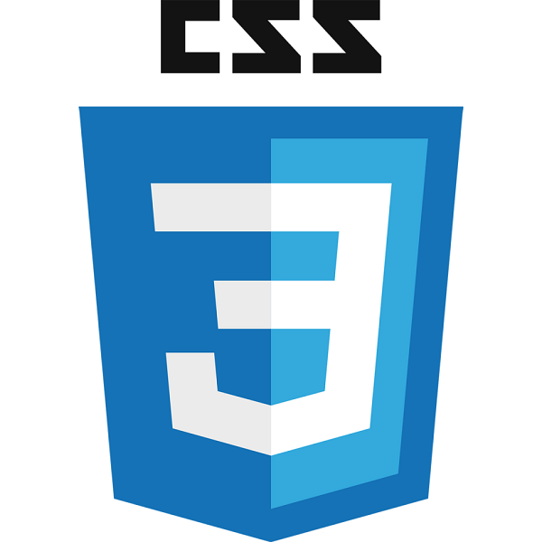
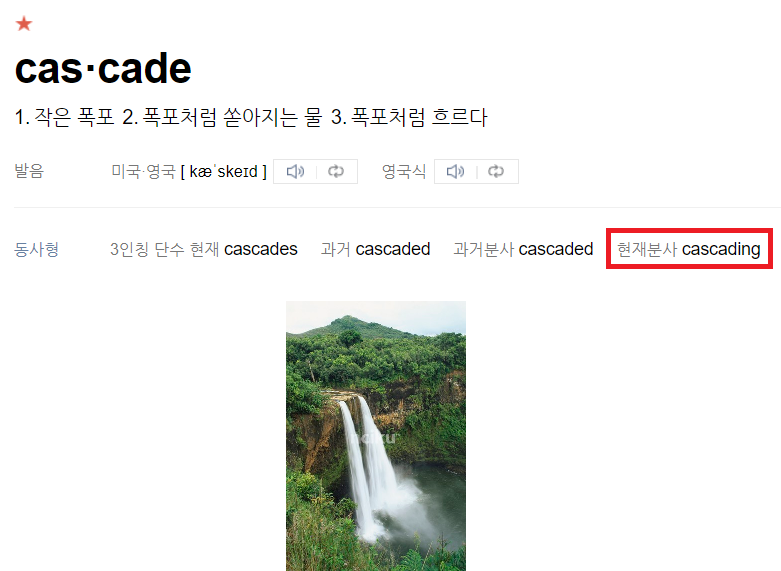
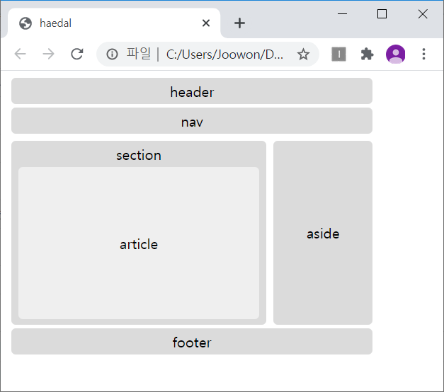
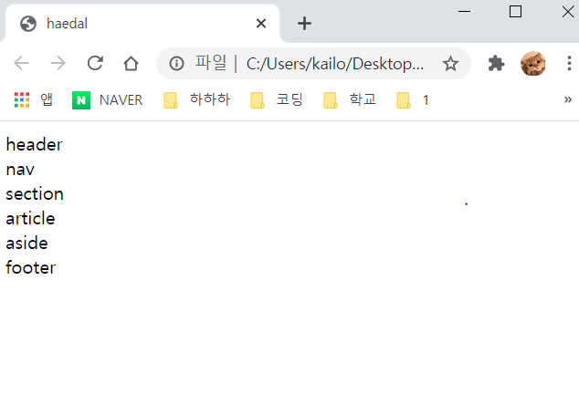

# CSS
  
**C**asacding **S**tyle **S**heet  
지난 시간에 우리는 HTML을 활용해 기본적인 페이지를 만들어 보았다.
하지만 당신은 네이버나 유튜브처럼 뭔가 삐까뻔쩍한 것을 기대했을 것이다(아니면 말고).
이를 타파하기 위해 CSS가 필요한 것이다! 아래와 같이 이해하면 편할 것이다. 

HTML : 뼈대  
CSS : 겉에 붙이는 벽돌, 기왓장, 식물, 쇠창살(?)

  
스트리밍 사이트 '트위치'의 서드파티 커뮤니티인 '트게더'의 스트리머 페이지 메인. 커스텀 CSS가 적용되지 않고, 기본 디자인이 적용된 모습이다.

 
커스텀 CSS가 적용된 모습이다. CSS는 화장이다!

이제 우리가 만든 페이지를 어떻게 꾸며줄 수 있는 지 알아보도록 하자.

## **CASCADING** STYLE SHEET
잠깐, Cascading?  
  
폭포처럼 속성이 위에서 아래로 떨어지는데(상속).. 이렇게 들어서는 전혀 알 수가 없다! 그러면 이번에도 다시한번 무작정 따라해보자!

### 따라하기 전에
한때 HTML에는 대단히 많은 태그들이 있었다. `<bgcolor>` 태그라던가, `<marquee>` 태그라던가, 표를 나타내기 위한 `<table>` 태그가 레이아웃을 위해 사용된다던가.. 결국 HTML 문서 안에 뼈대와 꾸밈이 모두 들어가 있던 것이었다.
이 구조를 HTMl과 CSS로 분리하여 직관적으로 웹 디자인과 웹 프로그래밍을 나누기 위해 CSS가 도입되었다고 생각하면 된다. 

### 무작정 따라해보기
```
a{                            # 선택자: 무엇에 효과를 줄 것인가?
    color : black;
    text-decoration :none;    # 선언: 어떤 효과를 줄 것인가?(속성: 값)의 형태를 띄고 있다.
}
```
위의 예시처럼 선택자를 통해 *무엇에* 효과를 줄 것인지 정한 후에  
선언부에서 속성의 값을 지정해 *어떤* 효과를 줄 것인지 설정한다.  
한 줄이 끝날 때 마다 세미콜론`(;)`을 붙여서 마무리해준다.  
여러가지 속성이 많이 있으니 전부 외우진 않더라도(사실 거의 불가능하기도 하고) 어떤 종류가 있는 것인지 한 번 알아보도록 하자.

#### 선택자
위의 예시에서 CSS의 선택자 부분에 태그가 올 수 있다는 걸 알게 되었을 것이다. 하지만 `<div>` 태그 같은 경우 정말 많이 쓰이게 되는데, 이 때 각각 다른 효과를 주고 싶을 때라거나,
같은 태그들을 그룹으로 나누어 효과를 주고 싶을 때 사용하는 것이 `선택자`이다.

선택자에는 `class`와 `id`가 있는데, 일단 예시로 확인해보자.

```
<div class="black" id="alpha">div박스 1</div>
<div class="red" id="omega">div박스 2</div>
```
위와 같이 태그별로 class와 id를 설정할 수 있다. class의 경우에는 한 문서에 여러 번 등장할 수 있지만, id는 하나의 고유한 이름을 한 문서에 오직 한 번만 사용할 수 있다.  
class와 id의 이름은 자유롭게 지을 수 있지만, 숫자로 시작하면 안 된다.

### 어떻게 사용하나요?
class는 `.(class명)`, id는 `#(id명)` 으로 지정할 수 있다. 위 코드블럭의 경우 css파일을 뜯어보면 다음처럼 되어 있을 것이다.
```
.black{
    color: black;
}

.red{
    color: red;
}

#alpha{
    font-size: 35px;
}

#omega{
    font-size: 20px;
}
```

### 그럼 어떻게 적용하나요?
HTML문서에 CSS를 적용하는 방법에는 크게 3가지의 방법이 있는데, 
1. Inline Style Sheet(태그 내부에 삽입)
```
<div style="color: blue">깔깔쓰</div>
```
2. Internal Style Sheet(html 문서 `<head>`내부에 `<style>`태그를 삽입)
```
...
<head>
...
<style>
    div{
        color: blue;
    }
</style>
...
```
3. External Style Sheet / Linking Style Sheet(외부의 CSS파일을 별도로 만들어 관리)
```
index.html
...
<head>
...
<link rel=:"stylesheet" href="style.css">
...


style.css
div{
    color: blue;
}
```

본인이 생각하기에 적당한 방법을 사용하면 되지만.. 보통은 3번이 재사용이 가능하고 유지보수가 용이한 연유로 많이 사용된다.

자, 그럼 기본 내용은 알았으니 직접 실습해보면서 배워보자!

## 실습하기
  
우리는 앞에서 위와같은 코드를 한번 따라해봤다.
지금부터 실습을 통해서 이 코드가 어떻게 구성되어 있는지 알아보자!

### HTML
먼저 HTML파일을 하나 만들어서 살펴보자.

```
<!DOCTYPE html>
<html lang="ko">
<head>
    <title>haedal</title>
</head>
<body>
    <header>header</header>
    <nav>nav</nav>
    <section>
    section
        <article id="article">article1</article>
        <article class="article">article2</article>
    </section>
<aside>aside</aside>
<footer>footer</footer>
</body>
</html>
```  

HTML 부분만 보기 위해서 `<head>`안의 `<style>` 부분은 삭제했다.  
위 코드를 실행 시키면 아래와 같이 단지 글만 나오게 된다.  
   
이제 이것을 `CSS`를 통해서 맨 위 그림처럼 꾸며보자

### 외부 파일에서 CSS 연결하기
이전의 `HTML`시간에서는 `<head>`태그안에 `<style>`을 넣는 방법을 통해 `CSS`를 적용했었는데,  
이번에는 `style.css`파일을 만들고 `html`문서에서 불러오는 방법으로 해볼 것이다.  
먼저 `style.css`파일을 HTML파일과 같은 디렉토리에 만들어 아래의 내용을 넣는다.  
```
body{
width:440px;
}
header, nav, section, article, aside, footer{
display:block; 
width:400px; 
margin:4px; 
padding:4px; 
background-color:#dbdbdb; 
text-align:center; 
border-radius: 5px;
}
section{
float:left; 
width:280px; 
height:200px;
}
article{
width:264px; 
height:77px; 
line-height: 77px; 
border-radius: 5px;
}
.article{
    background-color:skyblue;
}
#article{
    background-color:hotpink;
}
aside{
float:left; 
width:104px; 
height:200px; 
line-height: 200px;
}
footer{
overflow:hidden;
}
```  

우리는 아까 선택자와 속성 선언에 대해서 배웠다. 위에서부터 차근차근 읽어보자.  
먼저 선택자 `body`가 나온다. `html`내부의 `<body>`태그를 수정함을 알 수 있다.  
`body`안의 내용에는 `width:440px;`이 있다. `<body>`태그가 차지하는 공간의 너비를 `440px`로 지정하라는 뜻이다.  
이번엔 그 아래를 살펴보자. 선택자가 `(,)`로 구분되어 여러개를 가리키고 있는것이 보이는데,  
여러개의 태그에 같은 속성을 지정하고 싶을때 사용 할 수 있다.  
여기에 사용된 속성들은 너무 많아서 모두 설명할 수는 없고 [여기](http://web.simmons.edu/~grabiner/comm244/weekthree/css-basic-properties.html)에서 기본 속성들을 확인하거나 추가적으로 검색해서 알아보자.  
마지막으로 살펴볼 것은 `article`부분이다. 위 코드에서 `article`, `.article`, `#article`이 있다.  
이전 시간에 배웠던 것처럼 선택자에는 `class`와 `id`를 사용해 세부 스타일을 지정할 수 있다.  
위 코드에서는 모두 `article`처럼 보이지만 `id=article`인 부분은 `hotpink`색으로 지정되고,  
`class=article`인 부분은 `skyblue`색으로 지정된다.  

### 적용
 `CSS`파일과 `HTML`파일을 모두 만들었으므로 두 파일을 연결해보자!  
 방법은 아주 간단한데 `HTML`파일에 한줄만 추가해주면 된다.  
 ```
<head>
    <title>haedal</title>
    <link rel="stylesheet" href="style.css">
</head>
```  
`<head>`태그 안에 한줄만 추가해주면 된다.  
이때, `style.css`파일이 있는 곳의 주소를 잘 적어주어야 한다.  
이번 예제에서는 두 파일이 같은 디렉토리에 있으므로 쉽게 나타낼 수 있었다.  


위 코드를 모두 따라했다면 최종적으로는 아래와 같이 나타남을 확인할 수 있다!  
  


#### 지금까지 따라해본 내용을 바탕으로 아래 실습 과제를 해보자!
[자기소개카드 만들기](https://github.com/haedal-with-knu/instuctorTraining/blob/master/challenge/A.HTML_CSS_mycard.md)

## GITHUB PAGES와 BOOTSTRAP
### Github Pages

python의 django와, Flask 라이브러리를 사용해서 서버를 켜보았다.  
그런데, 우리가 작은 프로젝트를 하는데 컴퓨터 한대를 계속 켜놓거나, 돈을 내고 웹 서버를 빌릴 수는 없다.(ㅠㅠ)  
그런 우리를 위해서 github에서 서버를 무료로 빌려준다!  
물론 공짜로 빌려주는 것이라 데이터를 저장한다거나 할 수는 없지만 연습용이나 간단한 포트폴리오를 만들어서 저장할 수 있다.  
지금부터 한번 서버를 공개해보자! ~~이번에는 쉬울 것이다..~~  

먼저 `github`에 접속해서 새 레포지토리를 만든다.  
여기서 주의할 점은 레포지토리의 이름을 `username.github.io`의 형태로 만들어야 한다.  

  

레포지토리를 만들었다면 이제 이전시간에 만든 `HTML`파일과 `CSS`파일을 넣어보자!  
여기서 주의할 점은 `HTML`파일의 이름은 `index.html`로 통일해주어야 `github`에서 인식해서 `html`을 적용해준다.  
파일을 넣었다면 이제 완성입니다! 주소창에 `username.github.io`를 타이핑해주면  
우리가 만든 페이지가 나타나는걸 확인할 수 있다.  


### Bootstrap

이전시간까지 우리가 직접 웹페이지를 만들어서 github pages를 이용해 웹상에서 호스팅 해봤다.  
하지만 솔직히 말해서! 우리가 만든 웹페이지들은 전문가들이 만든 페이지들에 비해서 부족할 수 밖에 없다.  
이번시간에는 `Bootstrap`을 통해 전문가들이 만들어놓은 페이지 템플릿을 사용해서 더 완성도 있는 페이지를 만들어 보도록 하자.  

#### Bootstrap?
그럼 과연 부트스트랩은 뭘까?  
부트스트랩은 웹사이트를 쉽게 만들 수 있게 돕는 프론트엔드 프레임워크들 중 하나이다.  
하나의 CSS로 휴대폰, 태블릿, 데스크탑까지 다양한 기기에서 작동하며  
다양한 기능을 제공하여 우리가 쉽게 웹사이트를 제작, 유지, 보수할 수 있도록 도와준다.  

부트스트랩이 뭔지 대충 알았으니 실제로 적용해보면서 배워보자!  
부트스트랩을 사용하는 다양한 방법이 있지만 우리는 CDN을 통해서 부트스트랩을 사용할 것이다.  
CDN은 멀리 있는 사용자에게 컨텐츠를 더 빠르게 제공할 수 있는 기술인데, 사용자가 Origin Server로부터  
Content를 다운받는 대신, 사용자와 가까운 곳에 있는 Cache Server로부터 Content를 가져오는 방법이다.
아래의 코드를 `html`파일의 `<head>`태그 안에 추가하면 부트스트랩이 제공하는 CSS를 사용할 준비가 되었다.  
```html
<link rel="stylesheet" href="https://maxcdn.bootstrapcdn.com/bootstrap/3.3.2/css/bootstrap.min.css">
```  

  
#### Navbar 만들기
먼저 navbar부터 만들어 보자.
`div`의 `class`를 `navbar navbar-default`, `navbar navbar-inverse`등으로 설정하여 navbar의  
형태를 잡을 수 있다. 그리고 내부에 `container`를 만들어 그 안에 우리가 넣고싶은 것들을 넣을 수 있다.  
`container`는 부트스트랩에서 사이트 콘텐츠를 감싸고 반응형 레이아웃을 만들기 위한 요소이므로 지정해주는게 좋다.  
```html
<body>
    <div class="navbar navbar-inverse">
        <div class="container">
        
        </div>
    </div>
</body>
```  
  
`container` 안에 로고를 넣을 `navbar-header`를 `div` 태그로, 메뉴를 나타낼 부분을 `ul` 태그로 지정한다.      
```html
<body>
    <div class="navbar navbar-inverse">
        <div class="container">
            <div class="navbar-header"></div>
            <ul class="nav navbar-nav"></ul>
        </div>
    </div>
</body>
```  
  
`<a>`태그를 이용해서 로고를 누르면 다른 홈페이지로 이동하게 만들어보자.  
로고는 부트스트랩에서 제공하는 아이콘을 사용할 것이다.  
더 다양한 아이콘을 [여기](http://bootstrapk.com/components/#glyphicons)를 참고해서 사용하자  
메뉴는 `<ul>` 태그 안에 `<li>`와 `<a>`를 조합해서 만들어 준다.  
하나의 `<li>`에는 `active`를 클래스로 주어 현재 해당 메뉴에 들어와 있는 것처럼 보이게 해주자.
```html
<body>
    <div class="navbar navbar-inverse">
        <div class="container">
            <div class="navbar-header">
                <a href="http://haedal.io/" class="navbar-brand">
                    Haedal Programming
                    <i class="glyphicon glyphicon-cloud"></i>
                </a>
            </div>
            <ul class="nav navbar-nav">
                <li class="active"><a href="#">메뉴1</a></li>
                <li><a href="#">메뉴2</a></li>
                <li><a href="#">메뉴3</a></li>
                <li><a href="#">메뉴4</a></li>
            </ul>
        </div>
    </div>
</body>
```  

#### 메뉴 만들기
페이지의 윗 부분에 `Navigationbar`가 있다면, 페이지의 옆부분에는 메뉴바가 있어야 한다.  
메뉴바를 만들어보자. 먼저 메뉴바를 감싸는 `menu-wrapper`를 하나 만들어주자.  
```html
    <div class="menu-wrapper" style="float:left; width: 15%; text-align:center">
    </div>
```  
그 다음 메뉴의 내용을 채워보자  
```html
    <div class="menu-wrapper" style="float:left; width: 15%; text-align:center">
        <ul class="list-group">
            <li class="list-group-item"><a href="#">상의</a></li>
            <li class="list-group-item"><a href="#">하의</a></li>
            <li class="list-group-item"><a href="#">신발</a></li>
            <li class="list-group-item"><a href="#">모자</a></li>
            <li class="list-group-item"><a href="#">양말</a></li>
        </ul>
    </div>
```  
이렇게 코드를 작성하고 확인해보자.  

이제 다음으로 본문이 들어갈 공간을 만들어보자.  
본문은 `contents`로 감싸서 구성해보자.  
```html
    <div class="contents" style="font-size:5em;">
        <div class="container" style="padding-left:1em;">
            <p>여기는 메인페이지 입니다. </p>
            <button class="btn btn-primary">버튼1</button>
            <button class="btn btn-secondary">버튼2</button>
            <button class="btn btn-danger">버튼3</button>
            <button class="btn btn-success">버튼4</button>
        </div>
    </div>
```  
다양한 버튼들을 통해 부트스트랩에서 제공하는 색들을 확인할 수 있다.  
`primary`는 파랑, `danger`는 빨강 등과 같이 여러가지 색을 이름을 통해 사용할 수 있다.  
지금까지 부트스트랩에서 제공하는 외부 CSS를 통해 웹페이지를 꾸며보는 방법을 배웠다.  
이 강의에서 나오는 것 말고도 훨씬 많은 기능들이 있으니 [여기](http://bootstrapk.com/)에서 찾아보길 바란다.  

이렇게 부트스트랩을 사용해서 조금 더 깔끔한 페이지를 만들 수 있게 되었으나,  
아직 전문적인 홈페이지들과는 거리가 멀다.  
이번에는 많은 사람들이 만들어놓은 템플릿을 이용해보자.  
[템플릿 이용하기](./classdata/Bootstrap.md)