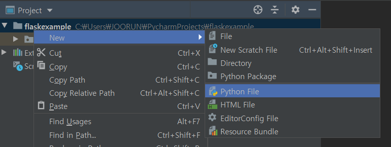
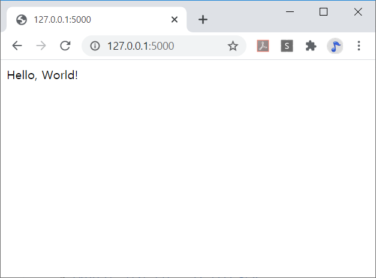

# FLASK & Django
> FLASK는 파이썬을 기반으로 한 `마이크로` 웹 프레임워크이고, 
>
> 장고는 파이썬을 기반으로 한 `풀` 웹 프레임워크이다.  

## 어려운 장고 하기 전 간단한 몸풀기
자, 2일차까지 우리는 html파일만 만들었다.    
하지만 웹페이지는 인터넷에서 모두 다 같이 볼 수 있어야 한다. 어떻게 할 수 있을까?  

우리가 사용하고, 보는 웹사이트들은 모두 서버가 존재한다.  

  

페이지를 띄워주는 서버가 있고, 사용자(클라이언트)들이 접속 요청을 보내면 허락을 해주는 방식인데,  
그렇다면 서버는 어디에 있을까?   
서버는 개인용 컴퓨터일수도 있고, 아마존 같은 대형 회사에서 빌려주는 웹 서버일 수도 있다.  
이번 시간에는 `Flask`를 사용해서 우리가 만든 서버를 간단하게 호스팅 해보자.  

### Flask!
일단 Flask 라이브러리를 받아야 하기 때문에, 임의의 프로젝트를 하나 생성한 후(이름은 Flaskexample 정도로 해두면 좋을 것이다) 파이참 터미널에 다음과 같이 입력해 보자.
```
pip install flask
```
뭔가가 쭉 깔리고, 얼마 걸리지 않아 설치가 완료된다. 이제 pycharm에서 새로운 python 파일을 하나 생성하자. 다음과..같이 말이다.  
  
파이썬 파일의 이름은 `init.py` 정도로 적당히 정해주도록 하자. 그리고 그 파일을 열어서 다음과 같이 코드를 입력하자.
```
init.py
---------
from flask import Flask

app = Flask(__name__)   # app이라는 이름을 가진 Flask 클래스의 객체 생성

@app.route('/')
def hello_world():
    return 'Hello, World!'

if __name__ == "__main__": 
    app.run()           # 객체의 run함수를 이용하여 로컬 서버에서 앱 실행
```
위와 같이 입력 후, 터미널에서 다음과 같이 입력해 주자.
```
python init.py
```
그러면 뭐시기 뭐시기 뜨면서.. 아래쪽에 주소가 하나 나올 것이다. 그 주소로 들어가면 다음과 같은 창이 나오게 된다.  
  
하지만 지금 상태로는 코드 변경을 바로바로 감지하지 못하므로(Debug 모드가 켜져있지 않으므로), Debug모드를 켜 주도록 하기 위해 `Ctrl+C`를 눌러 서버를 닫은 뒤 터미널에 다음과 같이 입력해보자.  
참고로 Debug 모드는 개발할 땐 편리하지만, 실제 서비스 중일 때는 꺼 두는 편이 낫다.
```
FLASK_DEBUG=1 FLASK_APP=init.py flask run
```
를 입력해 주면 터미널에 나오는 메세지가 조금 바뀌게 된다.
```
...
Debug mode: on  < ----- Debug 모드가 켜진 것을 확인할 수 있음
...
```
이제 F5를 클릭하여 창을 새로고침하는 것 만으로 코드의 변경점을 확인할 수 있다.
다음과 같이 코드를 변경해 보자.

```
from flask import Flask

app = Flask(__name__)

@app.route('/')
def hello_world():
    return '안녕, 세상!'

@app.route('/hello')
def hello_hello():
    return 'HELLO HELLO!'

if __name__ == "__main__":
    app.run(debug=True)
```
위의 코드로 변경한 후 F5를 누르면 기존의 `Hello World!` 메세지에서 `안녕, 세상!`으로 메세지가 바뀐 것을 확인할 수 있을 것이다.
또한 주소창에
```
http://127.0.0.1:5000/hello
```
라고 입력하면 `HELLO HELLO!`라는 메세지를 출력하는 것을 확인할 수 있을 것이다.
하지만 디버그 모드를 사용하더라도 서버를 켤 때마다
```
FLASK_DEBUG=1 FLASK_APP=init.py flask run
```
명령어를 사용하는 것은 상당히 귀찮은 일일 것이다. 그렇기 때문에 코드 마지막 부분을 다음과 같이 수정해 주자.
```
init.py
---------
...
if __name__ == "__main__":
    app.run(debug=True)
```
이렇게 코드를 변경하고, 터미널에 다시
```
python init.py
```

이렇게 python django와 Flask를 사용해서 서버를 로컬에서 호스팅해봤다.  
물론 옆의 친구들이 접속할 수 있도록 하기 위해서는(WWW에 붙여주려면) 추가적인 작업이 필요하지만.. 어쨌든 뭔가 띄워 보았다! 감격스럽지 않은가? ~~아니라고? 어쨌든 감격스럽다~~ 

### Flask로 점심 메뉴 정하기
#### 잠깐! 점심 먹기 전에!
주소창의 문자 및 숫자를 변수로 받아서 장난을 좀 쳐보자.
`<string:name>` 구문을 통해 문자열을 넘길 것이다.
`init.py`에 다음 코드를 추가해보자
```
@app.route("/greeting/<string:name>")
def greeting(name):
  return f'반갑습니다. {name}!'
```

`/greeting/"문자열"`의 주소로 접속하면 페이지에 `반갑습니다. 문자열!`이라고 출력되는 모습을 볼 수 있을 것이다.

문자열을 받아 보았으니, 숫자를 받아 봅시다. 수학에서 `cube`는 세제곱을 뜻한다.
문자열을 받은 것과 동일한 방식으로, `<int:num>` 구문을 통해 숫자를 넘겨받아 넘겨받은 숫자의 세제곱을 계산해 보자.
마찬가지로 `init.py`의 마지막 부분에 다음 코드를 추가하면 된다.
```
@app.route("/cube/<int:num>")
def cube(num):
  result = num ** 3 
  return f'{num}의 세제곱은 {result}'
``` 
`/cube/정수`의 페이지로 접속하면 세제곱이 잘 출력되는 모습을 볼 수 있을 것이다.

#### return 말고 render
점심 먹기 전에 할일이 참 많다. 이때까지는 함수의 return값을 통해 바로바로 출력하는 방식을 취했는데,
그러지 말고 html 파일을 출력하는 방식으로 해 보자.
`init.py`가 있는 경로에 `templates` 폴더를 하나 만들고, 안에 `index.html`파일을 하나 생성하자.
`index.html` 문서의 내부 내용은 다음과 같다.

```
index.html
<!doctype html>
<html>
<head>
    <title>HELLO</title>
</head>
<body>
    HELLO FLASK!
</body>
</html>
```
그리고 `init.py`의 내용을 다음과 같이 바꿔주자.
```
init.py
from flask import Flask, render_template
app = Flask(__name__)
 
@app.route('/')
def hello():
    return render_template('main.html')
    
if __name__ == '__main__':
    app.run(debug=1)
```
이제 Flask를 이용해서 `html` 파일을 출력할 수 있게 되었다!

#### 이제 진짜 점심 메뉴 고르기
사실 거창하게 점심 메뉴를 고른다고 했지만, 우리에게 선택지는 짜장면과 짬뽕밖에 없다.
`static` 폴더를 만들고, 구글에서 사진을 골라서 집어넣은 다음, 코드를 다음과 같이 변경하자.
```
init.py
from flask import Flask, render_template
from random import sample

app = Flask(__name__)

@app.route('/')
def main():
    return 'hello world'

# 사람 수 만큼 점심 메뉴 추천
@app.route("/lunch/<int:people>")
def lunch(people):
  menu = ["짜장면", "짬뽕", "라면", "브리또", "사과", "찜닭"]
  return f'{sample(menu, people)}'


@app.route("/show")
def show():
  # 음식 사진을 static 폴더에 추가하고 menu에 집어 넣습니다
  # 음식 메뉴 개수는 더 많아도 됩니다
  menu = ['짜장면.jpg', '짬뽕.jpg']
  # 음식 메뉴 1개를 뽑습니다
  pickme = ''.join(sample(menu,1))
  # index.html 파일에 이미지를 불러옵니다
  return render_template('index.html', food_img=pickme)


if __name__ == '__main__':
    app.run(debug=1)
```
```
index.html
<!doctype html>
<html>
<head>
    <title>show</title>
</head>
<body>
    
</body>
</html>
```

그러면 이제 `/"숫자"`로 접속하면 메뉴를 하나 추천해주고, `/show` 주소로 접속하면 짜장면 혹은 짬뽕 사진이 나오는 것을 확인할 수 있을 것이다.

## FLASK 끝! 장고를 위한 개발 환경 설정  
개발 과정에서 여러 라이브러리들이 충돌할 수 있기 때문에 우리는 가상환경에 라이브러리들을 설치하도록 하겠다.  

```
$ source venv/scripts/activate
```  

가상환경을 열었으면, 우리가 배울 `django` 라이브러리를 다운 받자.  

```shell script
$ pip install django
``` 

조금만 기다리면 `3.0.8`버젼의 `django`가 다운로드 될 것이다.  
그러면 준비는 모두 끝났지만 장고를 사용하기 위해서는 프로젝트를 시작해야 한다.  

### 장고 프로젝트 시작하기  
`web_study`라는 프로젝트를 하나 만들어 보자.    
```shell script
$ django-admin startproject web_study
```
장고(`django`)가 사용할 데이터베이스(`DB`)를 생성한다.(`migrate`)  
데이터 베이스를 생성하기 위해서는 방금 만든 장고 프로젝트 폴더로 들어가야한다.  
```console
$ cd web_study
$ python manage.py migrate
```  

### 장고 프로젝트 실행하기
이제 데이터 베이스도 만들었으니 프로젝트를 실행해서 서버를 한번 켜보자.  
```console
$ python manage.py runserver 
```  
로켓이 보인다면 서버가 켜진 것이다!  
아직 아무것도 없으니까 너무 좋아하지는 말자. 갈 길이 멀다.  

### 첫 페이지 만들기
프로젝트를 만들었지만 우리가 페이지를 추가하려면 앱(`App`)이라는 것을 만들어야 한다.  
장고의 모든 프로젝트는 여러개의 `HTML`과 `.py`파일로 이루어진 앱들이 여러개 모여서 만들어진다.  
`main`이라는 이름의 첫 번째 앱을 만들어보자.  
```shell script
$ python manage.py startapp main
```  
앱을 만들었으면 프로젝트에서 사용할 수 있도록 등록을 해야한다.  
`web_study/settings.py`의 약 40번째 줄인 `INSTALLED_APPS`에 아래와 같이 추가해준다.  
```python
INSTALLED_APPS = [
    'django.contrib.admin',
    'django.contrib.auth',
    'django.contrib.contenttypes',
    'django.contrib.sessions',
    'django.contrib.messages',
    'django.contrib.staticfiles',
    'main',
]
```  
여기까지 했다면 기초공사가 완료된 것이다!  
이제 `web_study/main/templates/main`폴더를 하나 만들어,  
그 안에 `index.html`파일을 만들어주자.  

이제 우리가 만들 `html`파일을 인코딩해서 웹에 띄우는 작업을 해야한다.  
`main/views.py`파일을 열어 다음 코드를 추가해준다.  

```python
from django.shortcuts import render

# Create your views here.
def index(request):
    return render(request,'main/index.html')
```  
이제 마지막으로 우리의 `view`와 `url`을 연결만 해주면 된다.  
`main/urls.py`파일을 하나 새로 만들어 아래의 코드를 추가해준다.  
```python
from django.urls import path

from . import views


urlpatterns = [
    path('', views.index, name='index'),
]
```  
이 앱의 `url`과 프로젝트의 `url`을 연결해주자
`main/urls.py`에 들어가서 아래와 같이 바꿔준다.  

```python
from django.contrib import admin
from django.urls import path, include

urlpatterns = [
    path('admin/', admin.site.urls),
    path('', include('main.urls')),
]
```  
그러면 끝이 났다. 터미널에 아까전에 서버를 호스팅하는데 사용했던  
명령어를 입력해 우리가 만든 페이지를 호스팅해보자.  

```shell script
$ python manage.py runserver
```

  
위에 적힌 주소를 클릭하면 우리가 만든 페이지가 나타날 것이다!  

# 게시판 만들기  
이제 모든 웹사이트에 있는 게시판기능을 만들어보자.  

## 목록 페이지 만들자
게시판의 글 목록이 있는 목록페이지를 만들어보자.  
아래의 경로처럼 `blog.html`파일을 만들어주자.  
`web_study/main/templates/main/blog.html`  
```html
<html>
    <head>
        <title>Blog List</title>
    </head>
    <body>
        <h1>게시판 페이지입니다</h1>
    </body>
</html>
```  

페이지를 만들었으면 `main`디렉토리 안의 `view.py`파일을 만들어  
우리가 만든 `html`템플릿을 함수로 렌더링 한다.  
즉, 아래의 `index`라는 함수는 서버에 요청이 들어왔을 시 `index.html`을 렌더링 해서 우리에게 보여주는 역할을 한다.  
`web_study/main/views.py`
```python
from django.shortcuts import render

# index.html 페이지를 부르는 index 함수
def index(request):
    return render(request, 'main/index.html')

# blog.html 페이지를 부르는 blog 함수
def blog(request):
    return render(request, 'main/blog.html')
```

이제 이 `views.py`에서 만든 함수와 우리가 사용할 `url`을 연결해주어야 한다.  
`main/urls.py`파일을 하나 만들어서 아래와 같이 연결해주자.  

```python
from django.urls import path
from .views import *

app_name='main'

urlpatterns=[
    path('',index),
    path('blog/',blog),
]
```

메인 앱 안에서의 url은 연결했지만 전체 프로젝트와 메인 앱 간에 url을 연결해주어야한다.  
`web_study/main/urls.py`  
```python
from django.contrib import admin
from django.urls import path

urlpatterns = [
    # admin 페이지
    path('admin/', admin.site.urls),
    path('', include('main.urls'), name='index'),
]
```  

이제 연결도 다 했으니, 다시 서버를 켜보자.  
```shell script
$ python manage.py runserver
```  
게시판 페이지가 뜨면 성공!  

## `Model` 만들기   

우리는 게시판을 만들고 싶은데 게시판에는 제목, 글 내용, 작성자 등의 여러가지 정보들이 저장된다.  
그러면 이 정보들을 어떻게 서버에 저장하고, 어떻게 이용할 수 있을까?  
장고에서는 `Model`을 지원해준다.  
이 모델을 이용해 게시판에서 각각의 게시글이 데이터베이스에 어떻게 저장될지를 정해준다.  
우리가 해볼것은 제목과 내용이 존재하는 간단한 게시물이다.  
`Post`(게시글) 마다 `postname`(제목), `contents`(내용)이 존재한다.  
이를 파이썬으로 구현해보자

`web_study/main/models.py`
```python
from django.db import models

# Create your models here.
# 게시글(Post)엔 제목(postname), 내용(contents)이 존재합니다
class Post(models.Model):
    postname = models.CharField(max_length=50)
    contents = models.TextField()
```  
모델을 만들었고 이제 이 모델을 데이터베이스에 넣어 장고가 저장할 수 있도록 해준다.  
즉, `django`의 db에 `migrate`해준다.  
게시글마다 제목과 내용을 저장한다.  

#### `Ctrl + C`를 눌러 웹서버를 종료 후 `migration`

```console
$ python manage.py makemigrations 
$ python manage.py migrate
```  

### `Admin`에 권한  
관리자(`admin`)가 게시글(`Post`)에 접근할 권한을 준다.  
게시글 게시, 삭제, 수정, 저장 등 여러 작업을 할 수 있게 해준다.  

`web_study/main/admin.py`
```python
from django.contrib import admin
# 게시글(Post) Model을 불러옵니다
from .models import Post

# Register your models here.
# 관리자(admin)가 게시글(Post)에 접근 가능
admin.site.register(Post)
```  
하지만 우리는 `admin`계정이 없어서 확인할 수가 없다. 관리자 계정을 만들어보자!  

### `Superuser` 만들기
`Superuser`는 `django` 프로젝트의 모든 `app` 및 `object`를 관리하는 계정이다.  
`manage.py`를 통해 `Superuser`계정이 생성되며  
`username`, `email address`, 그리고 강한 `password`가 필요하다.  

```shell script
& python3 manage.py createsuperuser
```  

아래와 같이 `Superuser` 계정을 생성한다.  
예측하기 쉬운 비밀번호의 경우 `django`가 확인해서 재설정 해줘야한다.  
  

서버를 키고 생성한 `Superuser` 계정을 확인한다.  

```shell script
$ python3 manage.py runserver
```
`http://자신의URL:8000/admin`으로 접속한다.  
`Superuser`의 아이디와 비밀번호를 입력해 관리자 페이지로 들어간다.  

### 게시글 작성하기
`add` 버튼을 눌러 게시글을 작성해보자.  

게시글을 하나 더 작성해서 2개의 게시글을 만들어보자.  
`postname`과 `contents`를 구분하기 위해 다른 내용으로 작성하자.   

현재 코드에서 게시글을 작성하면  
게시글 제목이 나오지 않고 `Post object(1), (2)`로 나온다.  
이를 `postname`이 `Post object` 대신 들어가도록 개선해보자.  
이땐 게시글(`Post`)의 `model`을 개선하자.  

`web_study/main/models.py`
```python
from django.db import models

# Create your models here.
# 게시글(Post)엔 제목(postname), 내용(contents)이 존재합니다
class Post(models.Model):
    postname = models.CharField(max_length=50)
    contents = models.TextField()
    
    # 게시글의 제목(postname)이 Post object 대신하기
    def __str__(self):
        return self.postname
```

안의 내용을 알 수 없는 `Post Object` 대신  
게시글(`Post`)의 제목(`postname`)으로 바꾸었다.  

### 목록(`blog`)페이지에 게시판 보여주자

입력한 게시글을 페이지에 띄워보자  

`mseb_study/main/views.py`  
`View`(`blog` 함수)가 `Model`(`Post` 게시글)을 가져온다.  
```python
from django.shortcuts import render
# View에 Model(Post 게시글) 가져오기
from .models import Post

# index.html 페이지를 부르는 index 함수
def index(request):
    return render(request, 'main/index.html')

# blog.html 페이지를 부르는 blog 함수
def blog(request):
    # 모든 Post를 가져와 postlist에 저장합니다
    postlist = Post.objects.all()
    # blog.html 페이지를 열 때, 모든 Post인 postlist도 같이 가져옵니다 
    return render(request, 'main/blog.html', {'postlist':postlist})
```

`web_study/main/templates/main/blog.html`  
`Template`(`index.html`)에 `Model`(`Post` 게시글)을 붙여주자.  
```html
<html>
    <head>
        <title>Blog List</title>
    </head>
    <body>
        <h1>게시판 페이지입니다</h1>
        <!-- 게시판(postlist)의 게시글(list)을 하나씩 보여줍니다 -->
        <!--  내부엔 파이썬이 사용됩니다 -->
        <table>
        
            <ul>
                <li>{{list.postname}}</li>
                <li>{{list.contents}}</li>
            </ul>
        
        </table>
    </body>
</html>
```

제목과 글 내용을 표시할 수 있게 되었지만 아직 게시판이라 하기엔 부족한게 많다.  
게시판에 있을 만한 요소들을 추가해보자.  

### 게시글 세부페이지  
게시글마다 `postdetails`세부페이지를 만들어보자.  
`mysite/main/views.py`  
`posting.html`게시글-세부페이지에 특정 `post` 1개만 가져오자.   
```python
from django.shortcuts import render
# View에 Model(Post 게시글) 가져오기
from .models import Post

# index.html 페이지를 부르는 index 함수
def index(request):
    return render(request, 'main/index.html')

# blog.html 페이지를 부르는 blog 함수
def blog(request):
    # 모든 Post를 가져와 postlist에 저장
    postlist = Post.objects.all()
    # blog.html 페이지를 열 때, 모든 Post인 postlist도 같이 가져옴 
    return render(request, 'main/blog.html', {'postlist':postlist})

# blog의 게시글(posting)을 부르는 posting 함수
def posting(request, pk):
    # 게시글(Post) 중 pk(primary_key)를 이용해 하나의 게시글(post)를 검색
    post = Post.objects.get(pk=pk)
    # posting.html 페이지를 열 때, 찾아낸 게시글(post)을 post라는 이름으로 가져옴
    return render(request, 'main/posting.html', {'post':post})
```


`mysite/djangobootcamp/urls.py`  

첫번째 게시글 세부페이지 들어가기  
```python
from django.contrib import admin
from django.urls import path
# index는 대문, blog는 게시판
from main.views import index, blog, posting

urlpatterns = [
    path('admin/', admin.site.urls),
    # 웹사이트의 첫화면은 index 페이지이다 + URL이름은 index이다
    path('', index, name='index'),
    # URL:80/blog에 접속하면 blog 페이지 + URL이름은 blog이다
    path('blog/', blog, name='blog'),
    # URL:80/blog/숫자로 접속하면 게시글-세부페이지(posting)
    path('blog/<ink:pk>',posting, name="posting"),
]
```

개별 게시글 상세 페이지를 보여준다.  

`mysite/main/templates/main/posting.html`  
```html
<html>
    <head>
        <title>Posting!</title>
    </head>
    <body>
        <h1>게시글 개별 페이지입니다</h1>
        <p>{{post.postname}}</p>
        <p>{{post.contents}}</p>
    </body>
</html>
```  

게시글-세부페이지 완성!

### `blog.html`에서 `posting.html` 링크
`blog` 게시판에서 게시글의 제목만 남기고,  
제목을 클릭하면 `posting` 세부페이지로 가도록 만들자.  
`web_study/mysite/main/templates/main/blog.html`  
`<li>`태그에 `<a>`태그를 넣어 이동할 수 있도록 하자.  

```html
<html>
    <head>
        <title>Blog List</title>
    </head>
    <body>
        <h1>게시판 페이지입니다</h1>
        <!-- 게시판(postlist)의 게시글(list)을 하나씩 보여줍니다 -->
        <!-- {와 %로 이루어진 구문 내부엔 파이썬이 사용됩니다 -->
        <table>
        
            <!-- 게시글 클릭시 세부페이지로 넘어갑니다-->
            <ul>
                <li><a href="{{list.pk}}/">{{list.postname}}</a></li>
            </ul>
        
        </table>
    </body>
</html>
```
### `posting` 페이지에서 `blog`페이지로 링크

##### `mysite/main/templates/main/posting.html`
`<a href="/blog/">목록</a>`를 추가한다.  
`web_study/main/templates/main/posting.html`
```html
<html>
    <head>
        <title>Posting!</title>
    </head>
    <body>
        <h1>게시글 개별 페이지입니다</h1>
        <p>{{post.postname}}</p>
        <p>{{post.contents}}</p>
        <a href="/blog/">목록</a>
    </body>
</html>
```
`blog`로 가는 링크 추가!  

기본적인 게시판을 만들어봤다.  
앞에서 배웠던 프론트엔드 속성을 이용해서 예쁘게 꾸민다면  
진짜 게시판처럼 사용할 수 있을것이다.

# 게시글 업그레이드 하기
이전 시간까지 우리는 장고의 `model`을 사용해서 제목과 내용이 있는  
기본 게시판과 게시글을 만들었다.  

하지만 실제 게시판들에서는 게시글과 함께 이미지가 올라간다.  
이를 구현해보자.  

## 이미지 업로드
우리가 만들었던 `Post`모델에 사진이 들어갈 부분을 추가하자  

`mainphoto = models.ImageField(blank=True, null=True)`  
위 코드에서 `null=True`는 데이터베이스 상에서 `null`값을 허용한다는 뜻이고,  
`blank=True`는 입력을 받을 때에 입력이 없어도 된다는 뜻이다.  
둘다 똑같이 들리겠지만 코드가 작동하는 위치가 다르기 때문에 엄연히 다른 코드이다.  

##### `mysite/main/models.py`
```python
from django.db import models

class Post(models.Model):
    postname = models.CharField(max_length=50)
    # 게시글 Post에 이미지 추가
    mainphoto = models.ImageField(blank=True, null=True)
    contents = models.TextField()
    
    # postname이 Post object 대신 나오기
    def __str__(self):
        return self.postname
```

장고는 많은걸 할 수 있지만 모든것을 할 수 있지는 않다.  
모델을 수정한 후 사진을 처리할 수 있는 라이브러리를 설치해야 한다.  
`Pillow`를 사용하며 아래와 같이 설치할 수 있다.  

```console
$ pip install pillow

$ python3 manage.py makemigrations

$ python3 manage.py migrate

$ python manage.py runserver
```

#### 사진이 저장될 공간 설정
글에 사진이 들어갈 자리는 만들었는데, 아직 할게 더 남았다!  
글에 들어간 사진이 데이터베이스에 저장되어야 하는데 이 공간을 설정해주자.  
##### `web_study/settings.py`
`setting.py`파일 제일 아래에 다음과 같이 추가한다.
```python
MEDIA_ROOT = os.path.join(BASE_DIR, 'media')
MEDIA_URL = '/media/'
```

파일이 저장되는 공간을 추가했지만 아직 `django`가 파일 경로를 찾지 못한다.  
이미지의 경로를 설정해서 가져오자.  

##### `web_study/main/urls.py`

```python
from django.contrib import admin
from django.urls import path
# index는 대문, blog는 게시판
from main.views import index, blog, posting

# 이미지를 업로드하자
from django.conf.urls.static import static
from django.conf import settings

urlpatterns = [
    path('admin/', admin.site.urls),
    # 웹사이트의 첫화면은 index 페이지이다 + URL이름은 index이다
    path('', index, name='index'),
    # URL:80/blog에 접속하면 blog 페이지 + URL이름은 blog이다
    path('blog/', blog, name='blog'),
    # URL:80/blog/숫자로 접속하면 게시글-세부페이지(posting)
    path('blog/<int:pk>/', posting, name='posting'),
]

# 이미지 URL 설정
urlpatterns += static(settings.MEDIA_URL, document_root=settings.MEDIA_ROOT)
```

이제 업로드한 사진이 뜬다.  
  
##### `web_study/main/templates/main/posting.html`
이미지는 저장됐지만, 아직 html파일에 추가하지 않았으므로 나타나지 않는다.  
게시글마다 이미지를 나타내 보자.  
```html
<html>
    <head>
        <title>Posting!</title>
    </head>
    <body>
        <h1>게시글 개별 페이지입니다</h1>
        <p>{{post.postname}}</p>
        <p>{{post.contents}}</p>
        <!-- 이미지 보여주기 -->
        
            
            <br>
        
        <a href="/blog/">목록</a>
    </body>
</html>
```
이미지가 뜬 걸 확인할 수 있다!  

## 글쓰기페이지
이제 게시판을 완성했지만 중요한 기능이 남아있다.  
글쓰기 페이지를 만들어 관리자페이지에 들어가지 않고도 글을 써보자.  

글쓰기 페이지를 위한 새로운 파일 `new_post.html`을 만들어보자.

```html
<!DOCTYPE html>
<html lang="en">
<head>
    <meta charset="UTF-8">
    <title>글쓰기 페이지</title>
</head>
<body>
    <h1>글쓰기 페이지</h1>
    <form method="POST">
        
        제목<br>
        <input type="text" name="postname"><br>
        내용<br>
        <textarea rows="10" cols="50" name="contents"></textarea><br>
        <input type="file" name="mainphoto"><br>
        <input type="submit" value="글쓰기">
    </form>
</body>
</html>
```  
갑자기 모르는게 많아졌을 것이다. form? POST? csrf?  

#### <form>
form부터 알아보자.  
`html`에서 `<form>`태그는 내부의 정보를 한번에 서버로 전송하는 역할을 한다.  
위 코드에서 보면 `<form>`태그 안에 3개의 `<input>`태그와 하나의 `<textarea>`태그가 있다.  
여기에 작성된 정보를 `type="submit"`버튼이 클릭되면 서버로 전송한다.  

이제 `<form>`태그의 속성 `method="POST"`에 대해서 알아보자.  
웹에서 정보를 서버에 전송할 때, 크게 두가지의 방식으로 통신한다.  
바로 `GET`방식과 `POST`방식이다.  
`GET`방식은 정보를 가져오는 방식이다. 즉, 원하는 데이터를 서버에 요청해서 받아온다고 생각하면 편하다.  
이 방식은 주소창에 가져올 정보가 모두 표시되기 때문에 중요한 정보는 `GET`방식을 사용하면 안된다.   
`POST`방식은 정보를 서버에 전송하여 서버 데이터베이스에 우리가 보낸 정보를 저장하는 방식이다.  
이 방법은 우리가 보낸 정보가 숨겨져 있다.  

#### csrf?
csrf란 사이트간 요청 위조 라는 뜻인데, 이름만 봐서는 잘 모르겠다!  
무엇인지 살펴보면 가해자와 피해자가있다고 하자.  
*가해자는 피해자가 자주 사용하는 사이트와 유사한 페이지를 만들고,  
피해자가 그에 속아 가해자가 만든 페이지에 접속하면 그 계정정보를 이용해  
가해자는 피해자의 권한을 얻어 사이트를 공격하는 방식이다.*  

너무 어렵다면 `django`에서는 이러한 공격에 대한 취약성을 보완하는 기능이 탑재되어있다고 생각하자...  

### 다시 django  
이제 글쓰기 페이지를 만들었으니 view를 연결해주자. 
`main/views.py`

```python
def new_post(request):
    if request.method == 'POST':
        if request.POST['mainphoto']:
            new_article=Post.objects.create(
                postname=request.POST['postname'],
                contents=request.POST['contents'],
                mainphoto=request.POST['mainphoto'],
            )
        else:
            new_article=Post.objects.create(
                postname=request.POST['postname'],
                contents=request.POST['contents'],
                mainphoto=request.POST['mainphoto'],
            )
        return redirect('/blog/')
    return render(request, 'main/new_post.html')
```  
`new_post`라는 view를 만들어 템플릿과 연결해주었다.  
`Post.objects.create`함수를 사용해서 새로운 `Post`모델을 하나 만들었다.  
이 함수는 사용자가 `POST`~~(둘다 post네;;)~~방식으로 전송한 정보(postname, contents, mainphoto)를  
바탕으로 새로운 글(post)모델을 만드는 함수이다.  
글이 생성되면 `redirect`함수를 사용해 게시판페이지로 돌아가고, 생성되지 않으면 글쓰기 페이지로 돌아간다.  

마지막으로 url을 연결하자.
`main/urls.py`
```python
    path('blog/new_post/', new_post),
```
위 경로로 추가해주면 된다!  

마지막으로 게시판 페이지에 글쓰기버튼만 추가해주자.  
`main/blog.html`
```html
<button><a href="new_post/">글쓰기</a></button>
```

## 글 삭제
마지막으로 글 삭제 기능만 구현하고 마치도록 하자!  
늘 하던대로 글 삭제 페이지부터 작성해보자.  
`templates/main/remove_post.html`
```html
<!DOCTYPE html>
<html lang="en">
<head>
    <meta charset="UTF-8">
    <title>글 삭제</title>
</head>
<body>
    <form method="POST">
        
        <h3>{{ Post.postname }} - 삭제하기</h3>
        <button>삭제</button>
    </form>
</body>
</html>
```  
삭제버튼을 누르면 글이 삭제되도록 views를 구현해보자.  
`main/views.py`
```python
def remove_post(request, pk):
    post = Post.objects.get(pk=pk)
    if request.method == 'POST':
        post.delete()
        return redirect('/blog/')
    return render(request, 'main/remove_post.html', {'Post': post})
```
마찬가지로 `POST`방식으로 요청이 들어왔다면 글을 삭제하고 목록으로 돌아가도록 구현했다.  

이제 `urls`를 연결해보자.  
`main/urls.py`
```python
    path('blog/<int:pk>/remove/', remove_post),
```  
글마다 가지고 있는 primary key를 주소로 받아 `remove_post`뷰를 연결했다.  

이제 글 상세페이지 `posting.html`에 삭제버튼을 만들어보자.  
```html
<a href="/blog/{{post.pk}}/remove">삭제</a>
```  
`<a>`태그를 이용해 삭제 버튼을 클릭하면 해당 글의 pk를 주소로 받는 삭제페이지로 연결된다.  

## 마무리
이번 시간에는 제목과 내용, 이미지를 갖는 게시글을 모델을 만들어보았고,  
이 모델들을 표시하는 게시판페이지와 게시글 상세페이지를 구현해보았다.  
또 이 글을 쓸 수 있는 글쓰기페이지를 구현했고, 삭제기능까지 추가했다.  
물론 django가 다양한 기능을 편리하게 사용할 수 있는 만큼  
많은 기능을 사용하려면 처음에 적응을 하는데 어려움이 따른다.  
하지만 게시판을 한번 만들어본 경험, django를 사용해본 경험이 쌓이면 분명이 훌륭한 웹 서비스를 만들 수 있을것이다.
이상으로 django를 활용하여 게시판 만들기 수업을 마치도록 하겠다.