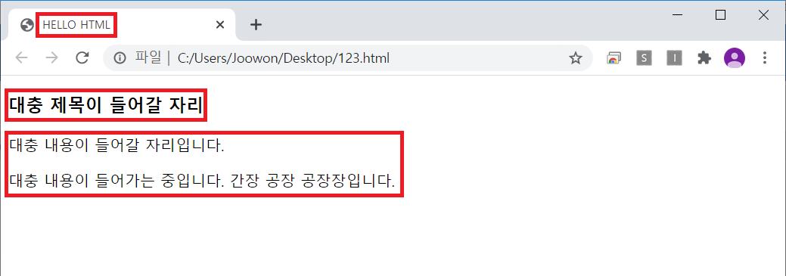
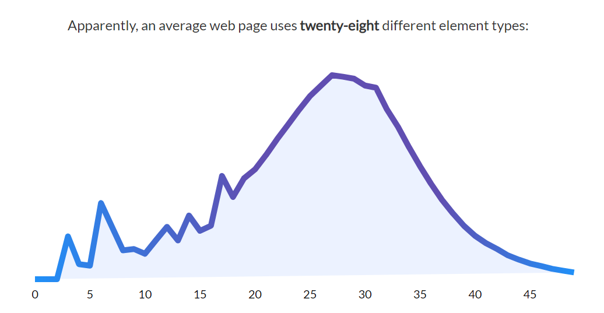
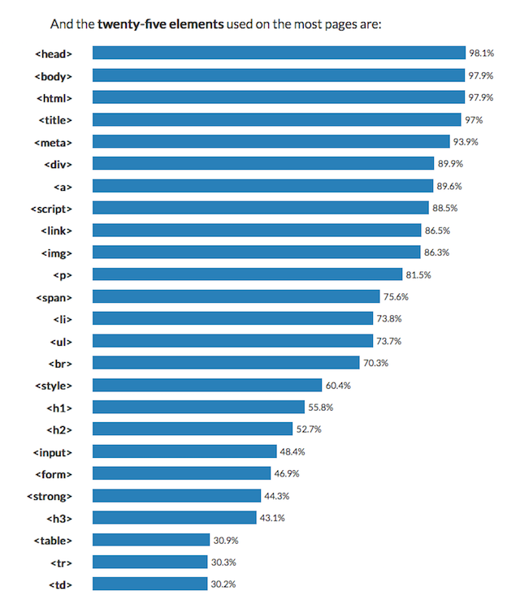

# HTML


~~프로그래머를 괴롭히는 방법~~

### 무작정 따라해보기!
일단 메모장을 켜자. 그리고 아래의 코드를 복사(ctrl+c), 붙여넣기(ctrl+v) 해보자!
```buildoutcfg
<!DOCTYPE html>
<html>
    <head>
        <title>HELLO HTML</title>
        <meta charset='utf-8'>
    </head>
    <body>
        <h3>대충 제목이 들어갈 자리</h3>
        <p>대충 내용이 들어갈 자리입니다.
        <p>대충 내용이 들어가는 중입니다. 간장 공장 공장장입니다.</p>
    </body>
</html>
```
실행해보면 아래와 같이 나올 것이다.
 
  
보면 우리가 입력했던 코드 중 &lt;title&gt;, &lt;h3&gt;, &lt;p&gt;들을 `태그`라고 하는데, 아까 경북대학교 총학의 예시를 봐도 그렇고 html 문서는 이 태그들로 이루어져 있다. 
처음 웹이 나왔을 때는 20개 정도의 태그들이 있었다고 하는데, 현재는 약 150개 이상의 태그들이 있다고 한다.
하지만 우리가 그 태그들을 다 알아야 할 필요는 없고,  
  
  
위 그래프들을 참조해 보면, 위쪽 그래프는 페이지당 평균 태그 수를, 아래쪽 그래프는 가장 많이 사용되는 25개 태그를 나타낸 것이다. 우리가 무작정 따라해봤던 태그 중 &lt;html&gt;, &lt;head&gt;, &lt;body&gt;, &lt;title&gt; 태그 등이 포함되어 있다! 아래로 걸출한 태그들이 나와 있는데,
이 태그및 다른 태그들을 활용해 간단한 예제 페이지들을 만들어 보자.
