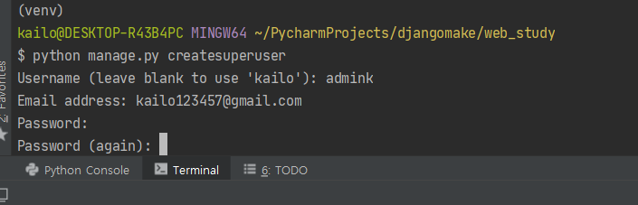

# 게시판 만들기  
이제 모든 웹사이트에 있는 게시판기능을 만들어보자.  

## 목록 페이지 만들자
게시판의 글 목록이 있는 목록페이지를 만들어보자.  
아래의 경로처럼 `blog.html`파일을 만들어주자.  
`web_study/main/templates/main/blog.html`  
```html
<html>
    <head>
        <title>Blog List</title>
    </head>
    <body>
        <h1>게시판 페이지입니다</h1>
    </body>
</html>
```  

페이지를 만들었으면 `main`디렉토리 안의 `view.py`파일을 만들어  
우리가 만든 `html`템플릿을 함수로 렌더링 한다.  
즉, 아래의 `index`라는 함수는 서버에 요청이 들어왔을 시 `index.html`을 렌더링 해서 우리에게 보여주는 역할을 한다.  
`web_study/main/views.py`
```python
from django.shortcuts import render

# index.html 페이지를 부르는 index 함수
def index(request):
    return render(request, 'main/index.html')

# blog.html 페이지를 부르는 blog 함수
def blog(request):
    return render(request, 'main/blog.html')
```

이제 이 `views.py`에서 만든 함수와 우리가 사용할 `url`을 연결해주어야 한다.  
`main/urls.py`파일을 하나 만들어서 아래와 같이 연결해주자.  

```python
from django.urls import path
from .views import *

app_name='main'

urlpatterns=[
    path('',index),
    path('blog/',blog),
]
```

메인 앱 안에서의 url은 연결했지만 전체 프로젝트와 메인 앱 간에 url을 연결해주어야한다.  
`web_study/main/urls.py`  
```python
from django.contrib import admin
from django.urls import path

urlpatterns = [
    # admin 페이지
    path('admin/', admin.site.urls),
    path('', include('main.urls'), name='index'),
]
```  

이제 연결도 다 했으니, 다시 서버를 켜보자.  
```shell script
$ python manage.py runserver
```  
게시판 페이지가 뜨면 성공!  

## `Model` 만들기   

우리는 게시판을 만들고 싶은데 게시판에는 제목, 글 내용, 작성자 등의 여러가지 정보들이 저장된다.  
그러면 이 정보들을 어떻게 서버에 저장하고, 어떻게 이용할 수 있을까?  
장고에서는 `Model`을 지원해준다.  
이 모델을 이용해 게시판에서 각각의 게시글이 데이터베이스에 어떻게 저장될지를 정해준다.  
우리가 해볼것은 제목과 내용이 존재하는 간단한 게시물이다.  
`Post`(게시글) 마다 `postname`(제목), `contents`(내용)이 존재한다.  
이를 파이썬으로 구현해보자

`web_study/main/models.py`
```python
from django.db import models

# Create your models here.
# 게시글(Post)엔 제목(postname), 내용(contents)이 존재합니다
class Post(models.Model):
    postname = models.CharField(max_length=50)
    contents = models.TextField()
```  
모델을 만들었고 이제 이 모델을 데이터베이스에 넣어 장고가 저장할 수 있도록 해준다.  
즉, `django`의 db에 `migrate`해준다.  
게시글마다 제목과 내용을 저장한다.  

#### `Ctrl + C`를 눌러 웹서버를 종료 후 `migration`

```console
$ python manage.py makemigrations 
$ python manage.py migrate
```  

### `Admin`에 권한  
관리자(`admin`)가 게시글(`Post`)에 접근할 권한을 준다.  
게시글 게시, 삭제, 수정, 저장 등 여러 작업을 할 수 있게 해준다.  

`web_study/main/admin.py`
```python
from django.contrib import admin
# 게시글(Post) Model을 불러옵니다
from .models import Post

# Register your models here.
# 관리자(admin)가 게시글(Post)에 접근 가능
admin.site.register(Post)
```  
하지만 우리는 `admin`계정이 없어서 확인할 수가 없다. 관리자 계정을 만들어보자!  

### `Superuser` 만들기
`Superuser`는 `django` 프로젝트의 모든 `app` 및 `object`를 관리하는 계정이다.  
`manage.py`를 통해 `Superuser`계정이 생성되며  
`username`, `email address`, 그리고 강한 `password`가 필요하다.  

```shell script
& python3 manage.py createsuperuser
```  

아래와 같이 `Superuser` 계정을 생성한다.  
예측하기 쉬운 비밀번호의 경우 `django`가 확인해서 재설정 해줘야한다.  
  

서버를 키고 생성한 `Superuser` 계정을 확인한다.  

```shell script
$ python3 manage.py runserver
```
`http://자신의URL:8000/admin`으로 접속한다.  
`Superuser`의 아이디와 비밀번호를 입력해 관리자 페이지로 들어간다.  

### 게시글 작성하기
`add` 버튼을 눌러 게시글을 작성해보자.  

게시글을 하나 더 작성해서 2개의 게시글을 만들어보자.  
`postname`과 `contents`를 구분하기 위해 다른 내용으로 작성하자.   

현재 코드에서 게시글을 작성하면  
게시글 제목이 나오지 않고 `Post object(1), (2)`로 나온다.  
이를 `postname`이 `Post object` 대신 들어가도록 개선해보자.  
이땐 게시글(`Post`)의 `model`을 개선하자.  

`web_study/main/models.py`
```python
from django.db import models

# Create your models here.
# 게시글(Post)엔 제목(postname), 내용(contents)이 존재합니다
class Post(models.Model):
    postname = models.CharField(max_length=50)
    contents = models.TextField()
    
    # 게시글의 제목(postname)이 Post object 대신하기
    def __str__(self):
        return self.postname
```

안의 내용을 알 수 없는 `Post Object` 대신  
게시글(`Post`)의 제목(`postname`)으로 바꾸었다.  

### 목록(`blog`)페이지에 게시판 보여주자

입력한 게시글을 페이지에 띄워보자  

`mseb_study/main/views.py`  
`View`(`blog` 함수)가 `Model`(`Post` 게시글)을 가져온다.  
```python
from django.shortcuts import render
# View에 Model(Post 게시글) 가져오기
from .models import Post

# index.html 페이지를 부르는 index 함수
def index(request):
    return render(request, 'main/index.html')

# blog.html 페이지를 부르는 blog 함수
def blog(request):
    # 모든 Post를 가져와 postlist에 저장합니다
    postlist = Post.objects.all()
    # blog.html 페이지를 열 때, 모든 Post인 postlist도 같이 가져옵니다 
    return render(request, 'main/blog.html', {'postlist':postlist})
```

`web_study/main/templates/main/blog.html`  
`Template`(`index.html`)에 `Model`(`Post` 게시글)을 붙여주자.  
```html
<html>
    <head>
        <title>Blog List</title>
    </head>
    <body>
        <h1>게시판 페이지입니다</h1>
        <!-- 게시판(postlist)의 게시글(list)을 하나씩 보여줍니다 -->
        <!--  내부엔 파이썬이 사용됩니다 -->
        <table>
        
            <ul>
                <li>{{list.postname}}</li>
                <li>{{list.contents}}</li>
            </ul>
        
        </table>
    </body>
</html>
```

제목과 글 내용을 표시할 수 있게 되었지만 아직 게시판이라 하기엔 부족한게 많다.  
게시판에 있을 만한 요소들을 추가해보자.  

### 게시글 세부페이지  
게시글마다 `postdetails`세부페이지를 만들어보자.  
`mysite/main/views.py`  
`posting.html`게시글-세부페이지에 특정 `post` 1개만 가져오자.   
```python
from django.shortcuts import render
# View에 Model(Post 게시글) 가져오기
from .models import Post

# index.html 페이지를 부르는 index 함수
def index(request):
    return render(request, 'main/index.html')

# blog.html 페이지를 부르는 blog 함수
def blog(request):
    # 모든 Post를 가져와 postlist에 저장
    postlist = Post.objects.all()
    # blog.html 페이지를 열 때, 모든 Post인 postlist도 같이 가져옴 
    return render(request, 'main/blog.html', {'postlist':postlist})

# blog의 게시글(posting)을 부르는 posting 함수
def posting(request, pk):
    # 게시글(Post) 중 pk(primary_key)를 이용해 하나의 게시글(post)를 검색
    post = Post.objects.get(pk=pk)
    # posting.html 페이지를 열 때, 찾아낸 게시글(post)을 post라는 이름으로 가져옴
    return render(request, 'main/posting.html', {'post':post})
```


`mysite/djangobootcamp/urls.py`  

첫번째 게시글 세부페이지 들어가기  
```python
from django.contrib import admin
from django.urls import path
# index는 대문, blog는 게시판
from main.views import index, blog, posting

urlpatterns = [
    path('admin/', admin.site.urls),
    # 웹사이트의 첫화면은 index 페이지이다 + URL이름은 index이다
    path('', index, name='index'),
    # URL:80/blog에 접속하면 blog 페이지 + URL이름은 blog이다
    path('blog/', blog, name='blog'),
    # URL:80/blog/숫자로 접속하면 게시글-세부페이지(posting)
    path('blog/<ink:pk>',posting, name="posting"),
]
```

개별 게시글 상세 페이지를 보여준다.  

`mysite/main/templates/main/posting.html`  
```html
<html>
    <head>
        <title>Posting!</title>
    </head>
    <body>
        <h1>게시글 개별 페이지입니다</h1>
        <p>{{post.postname}}</p>
        <p>{{post.contents}}</p>
    </body>
</html>
```  

게시글-세부페이지 완성!

### `blog.html`에서 `posting.html` 링크
`blog` 게시판에서 게시글의 제목만 남기고,  
제목을 클릭하면 `posting` 세부페이지로 가도록 만들자.  
`web_study/mysite/main/templates/main/blog.html`  
`<li>`태그에 `<a>`태그를 넣어 이동할 수 있도록 하자.  

```html
<html>
    <head>
        <title>Blog List</title>
    </head>
    <body>
        <h1>게시판 페이지입니다</h1>
        <!-- 게시판(postlist)의 게시글(list)을 하나씩 보여줍니다 -->
        <!-- {와 %로 이루어진 구문 내부엔 파이썬이 사용됩니다 -->
        <table>
        
            <!-- 게시글 클릭시 세부페이지로 넘어갑니다-->
            <ul>
                <li><a href="{{list.pk}}/">{{list.postname}}</a></li>
            </ul>
        
        </table>
    </body>
</html>
```
### `posting` 페이지에서 `blog`페이지로 링크

##### `mysite/main/templates/main/posting.html`
`<a href="/blog/">목록</a>`를 추가한다.  
`web_study/main/templates/main/posting.html`
```html
<html>
    <head>
        <title>Posting!</title>
    </head>
    <body>
        <h1>게시글 개별 페이지입니다</h1>
        <p>{{post.postname}}</p>
        <p>{{post.contents}}</p>
        <a href="/blog/">목록</a>
    </body>
</html>
```
`blog`로 가는 링크 추가!  

기본적인 게시판을 만들어봤다.  
앞에서 배웠던 프론트엔드 속성을 이용해서 예쁘게 꾸민다면  
진짜 게시판처럼 사용할 수 있을것이다.
## 다음 강의는
### [4. 이미지 업로드](https://github.com/haedal-with-knu/djangoBootcamp/blob/master/uploadImg.md)