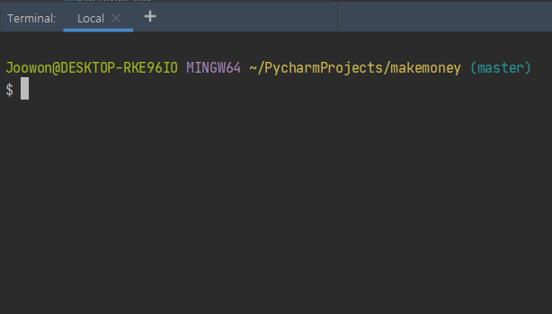
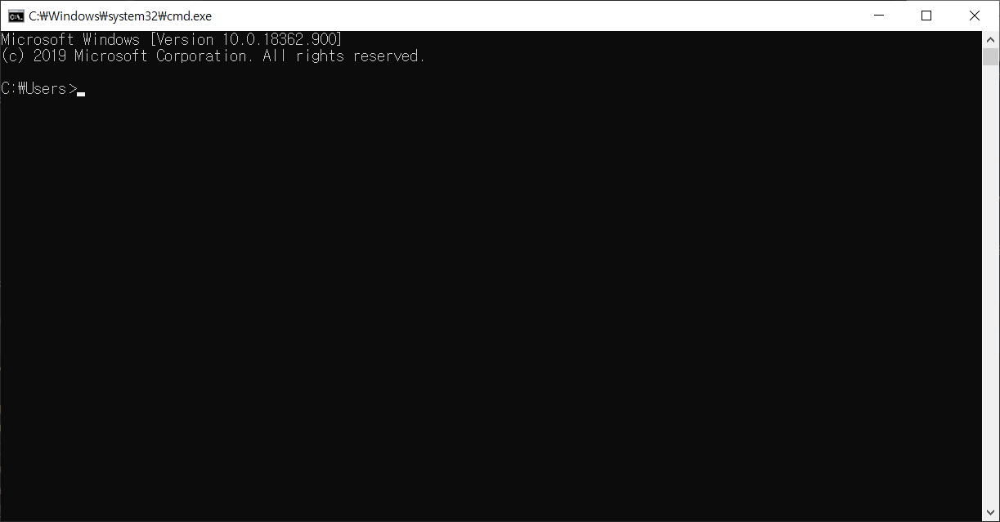
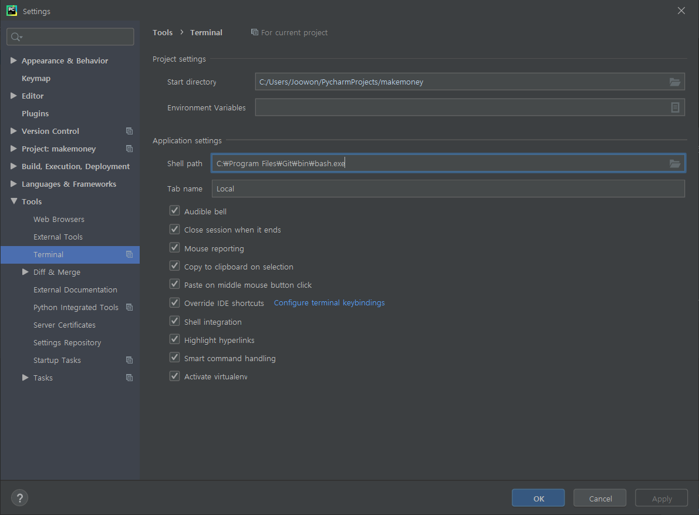

# 파이참 설치 및 세팅

## 파이참 설치
[다운로드는 여기](https://www.jetbrains.com/ko-kr/pycharm/)

먼저 위의 Jetbrains 페이지에 접속하게 되면

  
위와 같은 화면이 나오게 되는데, 여기서 화면 중간에 있는 다운로드 클릭

  
우리는 프로페셔널하지 않기 때문에 Community 아래 검은 동그라미 다운로드 클릭

  
누르고 기다리면 다운로드가 시작된다.

PATH만 추가해주면 된다.

## 파이참 세팅
### Git Bash와 command
#### Git Bash

#### Windows command

윈도우는 cmd를 사용하는데, git bash로 리눅스체제의 명령어를 윈도우에서도 사용할 수 있다.
따라서 mac이나 리눅스를 사용하는 사람은 따로 설치하지 않고 기존의 터미널을 사용해도 된다.

[다운로드는 여기](https://git-scm.com/) 에서!

중간에 다운로드 누르고 계속 진행진행 하면 된다. 모두 설치가 완료되었다면, 파이참을 열고 File-Settings-Tools-Terminal-Shell Path에 들어가주자.
거기에서 아래 사진과 같이 경로를 설정해주고, 파이참 화면에서 Terminal을 눌러주면 아래쪽의 터미널이 command에서 Git bash로 바뀌게 된다.

### [돌아가기](../11st.md)

