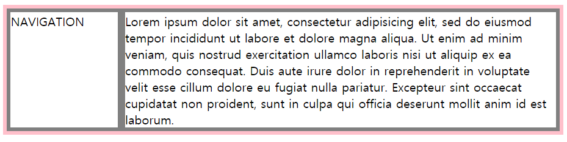
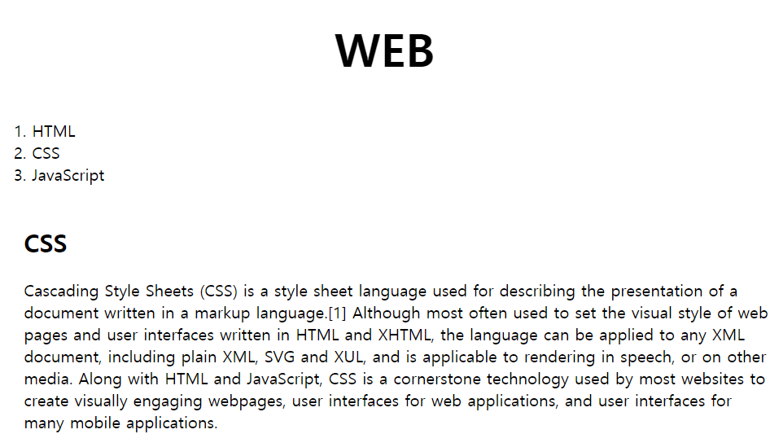
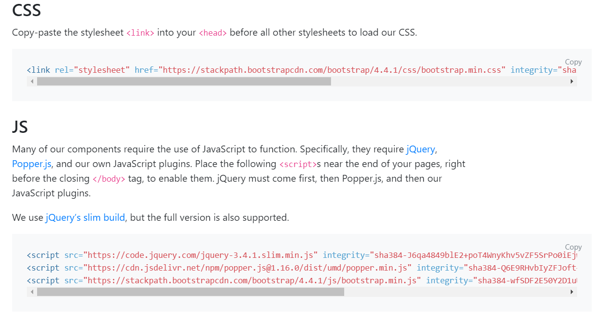
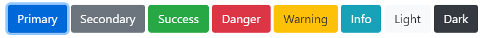

# 모바일도 대응하는 웹페이지
## 그리드
### 1)그리드 레이아웃이란?
1. 화면을 바둑판 형식으로 나누고 그에따라 배치를 하는것
2. 장점:편리하고 쉽고 다양한 레이아웃 표현
3. 단점:브라우저 호환성을 고려 해야함   [caniuse](https://caniuse.com/):브라우저에서 css 기술을 지원하는지 알려주는 사이트

### 2)요소를 나란히 배치하기 위해 그리드를 사용해 보자
1. 부모 박스가 그리드 박스의 역할을 담당하므로 자식 요소를 감싸는 부모 박스를 만들어줘야 한다 구분을 위해 부모 박스에 grid id값을 주었다
2. 디자인을 위해 사용하는 의미가 없는 태그인 div를 써주자 (div는 블록레벨이고 span은 인라인레벨이다)
3. 부모 박스를 자식 박스와 구별하기 위해 서로 다른 색상의 테두리를 그렸다 
4. 본격적으로 그리드 레이아웃을 위해 display를 grid로 설정한다 (여기까지만 해서는 아무 변화가 없다-div가 블록레벨이기 때문에 2개의 자식 박스가 줄이 바꿔진 상태로 나온다 우리의 목적은 그리드 레이아웃을 이용하여 자식 박스를 나란히 배치하는 것이다)
5. 자식 박스를 나란히 배치하기 위해 grid-template-columns 값을 설정해준다 아래 예제에서는 왼쪽 영역은 150px로 고정하고 오른쪽 영역은 1fr로 설정했다 (fr은 그리드 컨테이너의 비율이다 창 크기에 따라 가변적으로 변한다)

```
<!DOCTYPE html>
<html>
  <head>
    <meta charset="utf-8">
    <title></title>
    <style>
      #grid{
        border:5px solid pink;
        display:grid;
        grid-template-columns: 150px 1fr;
      }
      div{
        border:5px solid gray;
      }
    </style>
  </head>
  <body>
    <div id="grid">
      <div>NAVIGATION</div>
      <div>Lorem ipsum dolor sit amet, consectetur adipisicing elit, sed do eiusmod tempor incididunt ut labore et dolore magna aliqua. Ut enim ad minim veniam, quis nostrud exercitation ullamco laboris nisi ut aliquip ex ea commodo consequat. Duis aute irure dolor in reprehenderit in voluptate velit esse cillum dolore eu fugiat nulla pariatur. Excepteur sint occaecat cupidatat non proident, sunt in culpa qui officia deserunt mollit anim id est laborum.</div>
    </div>
  </body>
</html>
```


### 3)본격적으로 그리드 사용해보기
#### ol태그와 h2,p태그를 나란히 배치해 보자
1. h2태그와 p태그를 div태그를 사용하여 묶어준다
2. ol태그와 h2&p태그를 나란히 배치하기 위해 그리드 레이아웃을 사용할 것이고 그를 위해 div태그로 묶어준다(부모박스 만들기)
3. display를 grid로 설정하고 grid-template-columns 값을 설정해준다
```
<!doctype html>
<html>
<head>
  <title>WEB - CSS</title>
  <meta charset="utf-8">
  <style>
    body{
      margin:0;
    }
    a {
      color:black;
      text-decoration: none;
    }
    h1 {
      font-size:45px;
      text-align: center;
      border-bottom:1px solid gray;
      margin:0;
      padding:20px;
    }
    ol{
      border-right:1px solid gray;
      width:100px;
      margin:0;
      padding:20px;
    }
    #grid{
      display: grid;
      grid-template-columns: 150px 1fr;
    }
    #grid ol{
      padding-left:33px;
    }
    #grid #article{
      padding-left:25px;
    }
  </style>
</head>
<body>
  <h1><a href="index.html">WEB</a></h1>
  <div id="grid">
    <ol>
      <li><a href="1.html">HTML</a></li>
      <li><a href="2.html">CSS</a></li>
      <li><a href="3.html">JavaScript</a></li>
    </ol>
    <div id="article">
        <h2>CSS</h2>
        <p>
          Cascading Style Sheets (CSS) is a style sheet language used for describing the presentation of a document written in a markup language.[1] Although most often used to set the visual style of web pages and user interfaces written in HTML and XHTML, the language can be applied to any XML document, including plain XML, SVG and XUL, and is applicable to rendering in speech, or on other media. Along with HTML and JavaScript, CSS is a cornerstone technology used by most websites to create visually engaging webpages, user interfaces for web applications, and user interfaces for many mobile applications.
        </p>
      </div>
  </div>
  </body>
  </html>
```


## 반응형 디자인
### 1)반응형 디자인이란? 
1. 화면의 크기에따라 웹페이지의 요소들이 바뀌는 것이다   
2. 핸드폰,태블릿,데스크탑등 여러가지 화면에 맞는 웹 페이지를 제공한다 
### 2)미디어쿼리 소개
1. 특정 조건을 만족할때만 css를 적용한다
2. @media(조건)형식으로 사용하고 조건에는 주로 화면 크기와 관련된 내용이 들어간다
3. max-width:800px - 화면 크기가 800px이하일때 적용할 css
4. 아래 예제를 시행하면 화면 크기가 800px 이하일때는 화면에 아무것도 보이지 않는다
5. 화면 크기는 개발자모드에서 알 수 있다
```
<!DOCTYPE html>
<html>
  <head>
    <meta charset="utf-8">
    <title></title>
    <style>
      div{
        border:10px solid green;
        font-size:60px;
      }
      @media(max-width:800px) {
        div{
          display:none;
        }
      }
    </style>
  </head>
  <body>
    <div>
      Responsive
    </div>
  </body>
</html>
```
### 3)미디어 쿼리를 이용하여 반응형 웹 만들기
```그리드 2번째 예제를 바꿔보자```
1. 화면 크기가 800px보다 작아지면 화면이 바뀌게 해보자   
->@media(max-width:800px)
2. 그리드 레이아웃을 해제하고 display를 block레벨로 바꿔준다
3. 선이 보기 싫으니 없애준다   
-> ol과 h1태그의 border 값에 none 설정하기
```
<!doctype html>
<html>
<head>
  <title>WEB - CSS</title>
  <meta charset="utf-8">
  <style>
    body{
      margin:0;
    }
    a {
      color:black;
      text-decoration: none;
    }
    h1 {
      font-size:45px;
      text-align: center;
      border-bottom:1px solid gray;
      margin:0;
      padding:20px;
    }
    ol{
      border-right:1px solid gray;
      width:100px;
      margin:0;
      padding:20px;
    }
    #grid{
      display: grid;
      grid-template-columns: 150px 1fr;
    }
    #grid ol{
      padding-left:33px;
    }
    #grid #article{
      padding-left:25px;
    }
    @media(max-width:800px){
      #grid{
        display: block;
      }
      ol{
        border-right:none;
      }
      h1 {
        border-bottom:none;
      }
    }
  </style>
</head>
<body>
  <h1><a href="index.html">WEB</a></h1>
  <div id="grid">
    <ol>
      <li><a href="1.html">HTML</a></li>
      <li><a href="2.html">CSS</a></li>
      <li><a href="3.html">JavaScript</a></li>
    </ol>
    <div id="article">
        <h2>CSS</h2>
        <p>
          Cascading Style Sheets (CSS) is a style sheet language used for describing the presentation of a document written in a markup language.[1] Although most often used to set the visual style of web pages and user interfaces written in HTML and XHTML, the language can be applied to any XML document, including plain XML, SVG and XUL, and is applicable to rendering in speech, or on other media. Along with HTML and JavaScript, CSS is a cornerstone technology used by most websites to create visually engaging webpages, user interfaces for web applications, and user interfaces for many mobile applications.
        </p>
      </div>
  </div>
  </body>
  </html>
```

 
 ## CSS 코드의 재사용
 1. 스타일 태그를 복붙 할 수도 있다 
 2. 그러나 귀찮고 중복되는 내용이 많다 
 3. css 파일을 따로 만들고 head 태그 안에 <link rel="stylesheet" href="style.css">을 써준다
 4. 네트워크적인 측면에서는(트래픽) 웹페이지 안에 css를 넣는게 더 효율적이다
 5. 그러나 style.css를 캐싱할 수 있게되면 css 파일을 새로 다운받지 않고 저장된 결과를 컴퓨터에서 바로 가져와서 속도를 높일 수 있다

## Bootstrap 
### 1)Bootstrap이란?
1. 트위터 개발자가 만든 ui를 최소한의 코드를 이용하여 사용할 수 있게 해주는 ui framework를 말한다
2. 반응형 웹을 쉽게 구현할 수 있음
3. [Bootstrap](https://getbootstrap.com/):사이트에 들어가서 공부해 보자 
### 2)Bootstrap 기본 사용법
1. 홈페이지에 들어가 파일을 다운로드 하고 압축을 해제하면 css,js 폴더가 생성된다
2. 프로젝트를 생성하고 압축을 해제한 폴더들을 옮겨준다
3. 
head에 
```
<link href="css/bootstrap.min.css" rel="stylesheet">
```   
body에 
```
<script src="https://code.jquery.com/jquery-latest.js"></script>
<script src="js/booktstrap.min.js"></script>
```
넣어준다 부트스트랩이 제이쿼리 라이브러리를 기반으로 만들어졌기때문에 제이쿼리를 먼저 include 해줘야 한다

4. Bootstrap 홈페이지 Documentation에 들어가면 css,js 코드가 있는데 이걸 복사 붙여넣기 하면 파일을 다운받지 않고도 간단하게 Bootstrap을 사용할 수 있다 (다운보다 이게 나은듯?)


5. Bootstrap 사용 예시 (버튼)
```
<button type="button" class="btn btn-primary">Primary</button>
<button type="button" class="btn btn-secondary">Secondary</button>
<button type="button" class="btn btn-success">Success</button>
<button type="button" class="btn btn-danger">Danger</button>
<button type="button" class="btn btn-warning">Warning</button>
<button type="button" class="btn btn-info">Info</button>
<button type="button" class="btn btn-light">Light</button>
<button type="button" class="btn btn-dark">Dark</button>
```


### [과제 : Holy Grail Layout](https://opentutorials.org/course/2473/13570)

